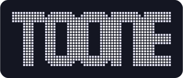
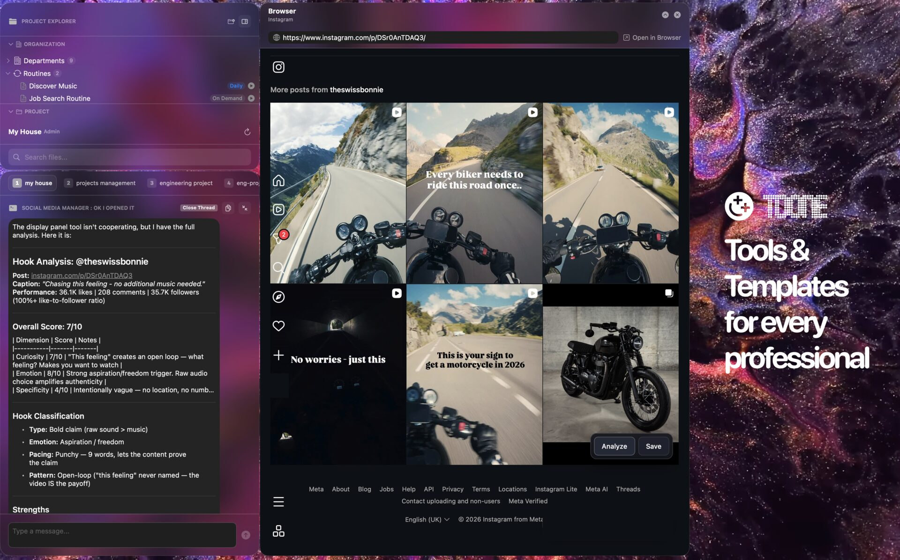
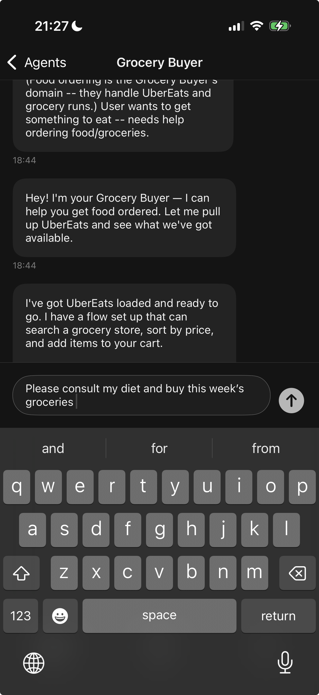
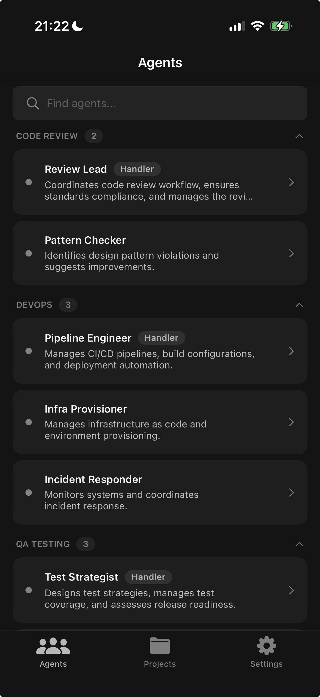
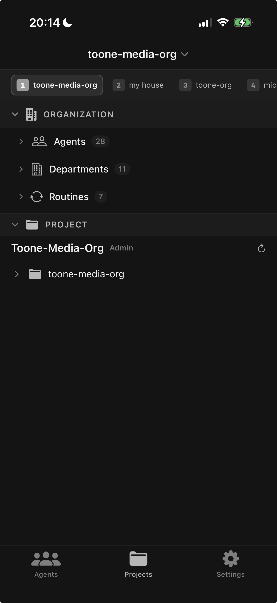

  
  &nbsp;&nbsp;
  

  <strong>AI teams that run your work.</strong>

  <a href="https://github.com/io-hexagonal/Toone/releases">Download</a> &bull;
  <a href="https://github.com/io-hexagonal/Toone/issues">Issues</a> &bull;
  <a href="CONTRIBUTING.md">Contributing</a>

---

Toone lets you build and run teams of AI agents on your Mac — organized into departments, each with defined roles, routines, and context. You bring your own AI account. Toone handles the rest.

  

## Desktop

Start here. Toone Desktop is where you set up your org, chat with agents, and get things done.

- **Agents as a team** — Departments with specialized agents that route tasks to each other and hand off context
- **Templates** — Pick a starting org or build your own from scratch
- **Calendar** — Markdown-based, baked into your org. Agents read it, propose events, schedule around conflicts
- **Browser** — Built-in browser panel. Point an agent at any website and let it work
- **Meeting capture** — Dual audio (mic + system), live transcription, straight into your chat
- **Planning** — Agents break work into steps, track progress, hand off between stages
- **Layout & hotkeys** — Customizable panel layout, global hotkeys, and menu bar integration
- **Zen mode** — Strip it down to just the chat when you need to focus

### Requirements

- macOS 14.0 (Sonoma) or later
- Anthropic or OpenAI account

### Install

Download the latest build from [Releases](https://github.com/io-hexagonal/Toone/releases). Open the app — the setup wizard walks you through connecting your AI account.

## Mobile

Once your desktop is running, grab [Toone Mobile](https://github.com/io-hexagonal/toone-mobile) to take your agents with you.

  
  &nbsp;&nbsp;
  
  &nbsp;&nbsp;
  

- **Chat** — Full conversation with any agent, markdown and code blocks included
- **Agents & departments** — Browse your whole org, switch agents, view session history
- **Project explorer** — Read-only file tree of your desktop project
- **Routines** — Trigger on-demand routines from your phone
- **Themes** — Six visual themes with matching app icons

Connects over local network or cloud relay with a 6-character pairing code.

### Requirements

- iOS 17.0+
- Toone Desktop running on your Mac

## Templates

| Template | What it does | Availability |
|----------|-------------|--------------|
| **Toone Media** | Content creation, social strategy, analytics | Free |
| **Minimal** | Lightweight starter — a few agents, no fluff | Free |
| **Toone HomeKit** | Personal life ops — trips, meals, groceries, finances | Share to unlock |

> Share Toone with a friend to unlock the HomeKit template.

## Contributing

See [CONTRIBUTING.md](CONTRIBUTING.md) for guidelines.

## License

[MIT](LICENSE)

---

  Toone is an independent product by <a href="https://hexagonal.io">Hexagonal.io</a>. Not affiliated with Anthropic or OpenAI. All trademarks belong to their respective owners.

