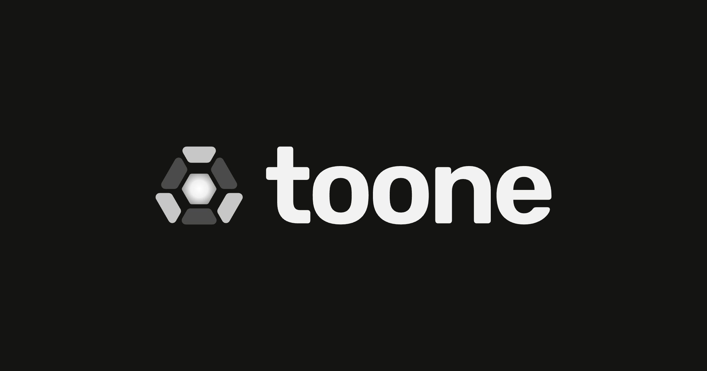

# Toone — the AI workspace for your agentic workflows

Turn recurring work into AI workflows you can run, inspect, and improve. Describe the outcome you want in a conversation, shape it into a reusable routine with an agent, then run it with the tools and context the work needs. Follow each step and review the output before the next run.

[Explore Toone](https://trytoone.com/en) · [How-to guide](https://trytoone.com/en/how-to) · [Explore workflows](https://trytoone.com/en/explore) · [Request early access](https://trytoone.com/en/request-access)

## From an idea to a repeatable result

The [product guide](https://trytoone.com/en/how-to) describes the loop behind Toone:

1. **Define the work.** Give a specialised agent a clear responsibility and the project context it should use. [Create an agent](https://trytoone.com/en/how-to/getting-started/create-an-agent).
2. **Build the workflow together.** Discuss the intent, input, steps, approvals, and expected output. Toone turns that conversation into a draft routine you can review before publishing. [Create a routine](https://trytoone.com/en/how-to/getting-started/create-a-routine).
3. **Run and observe.** Start the routine, follow its graph as steps execute, and open an agent's thread or browser session to see the work in progress. [Run and debug](https://trytoone.com/en/how-to/getting-started/run-and-debug).
4. **Review and improve.** Inspect the saved result and run history, change an instruction, and run it again. Useful outputs and project knowledge remain available for the next run. [Understand the core concepts](https://trytoone.com/en/how-to/concepts).

## What the workspace brings together

| | |
| --- | --- |
| **01 / Build** | [Natural-language routines](https://trytoone.com/en/how-to/features/routines) name inputs, responsible agents, steps, completion criteria, and outputs. Compose smaller routines into larger workflows. |
| **02 / Execute** | [Specialised agents](https://trytoone.com/en/how-to/features/orchestration) work with project files, connected tools, and [browser sessions](https://trytoone.com/en/how-to/features/browser-sessions). Follow and inspect runs while they happen. |
| **03 / Govern** | Approval points and [Project History](https://trytoone.com/en/how-to/features/project-history) help people review decisions and changes. For Claude tool results, [Safe Mode](https://trytoone.com/en/how-to/features/safe-mode) can screen and redact configured topics. |

Each project keeps its agents, routines, tools, files, and context together. You can start with one useful workflow, then [browse reusable workflows](https://trytoone.com/en/how-to/features/explore) or add more agents as the work grows.

## Start with one workflow

The [15-minute getting-started path](https://trytoone.com/en/how-to/getting-started) walks through a complete first run:

1. [Install Toone and connect an AI provider](https://trytoone.com/en/how-to/getting-started/install-and-connect). Toone supports OpenAI Codex and Anthropic Claude; bring access to the provider you choose.
2. [Create a project](https://trytoone.com/en/how-to/getting-started/create-a-project) to hold the work and its context.
3. [Create an agent](https://trytoone.com/en/how-to/getting-started/create-an-agent) with one focused responsibility.
4. [Create a routine](https://trytoone.com/en/how-to/getting-started/create-a-routine) from a useful conversation or a new draft.
5. [Run, watch, and improve it](https://trytoone.com/en/how-to/getting-started/run-and-debug) using a small, real input.

For the full product map, see [Core concepts](https://trytoone.com/en/how-to/concepts) and the [feature guide](https://trytoone.com/en/how-to/features).

## Access

Toone currently requires macOS 14 or later and is available by invitation. [Request early access](https://trytoone.com/en/request-access) to join the list. Existing account holders can [sign in](https://trytoone.com/en/signin) to obtain an installer; if you have a personal code, [redeem your invitation](https://trytoone.com/en/invite). Public installer distribution is closed.

## This repository

This repository contains the public website, product guide, and product introductions. The macOS application is proprietary; its implementation and installers are maintained separately.

### Website development

Use Node.js 24. Run `npm ci`, `npm run dev`, and `npm run build`. `npm test` validates product content, Explore behavior, and types; `npm run content:check-routes` checks built routes.

Explore pages use the server-only `EXPLORE_API_BASE_URL` and signed cache revalidation. See [Explore verification](tests/explore/README.md) for the fixture API, production HTTP tests, and manual UI edge cases.

### Sign in with Apple

The sign-in and invitation pages show a Sign in with Apple button (Apple JS, popup mode) only when both public variables are set for the environment:

| Variable | Example |
|---|---|
| `NEXT_PUBLIC_APPLE_SERVICES_ID` | `com.trytoone.web` (the Services ID; public, not a secret) |
| `NEXT_PUBLIC_APPLE_REDIRECT_URI` | `https://trytoone.com/api/auth/apple/callback` (registered Return URL, exact match) |

The button also stays hidden unless the page origin equals the return URL's origin, so set these for Production only. Its visible artwork is generated by Apple's button CDN. The browser forwards only Apple's identity token (plus first-time name and any invitation code) to `POST /auth/apple`; there is no client secret, and the authorization code is discarded. `app/api/auth/apple/callback` never reads its body and redirects to `/signin`. If a Content-Security-Policy is added, allow `https://appleid.cdn-apple.com` for scripts and images and `https://appleid.apple.com` for connections and frames; do not use `Cross-Origin-Opener-Policy: same-origin` on auth pages. Deploy this site manually through the linked Vercel project after review. Portal and server setup: `docs/operations/sign-in-with-apple.md` in the product monorepo. `npm run test:auth` covers the flow.

Questions and support: [hello@trytoone.com](mailto:hello@trytoone.com).
