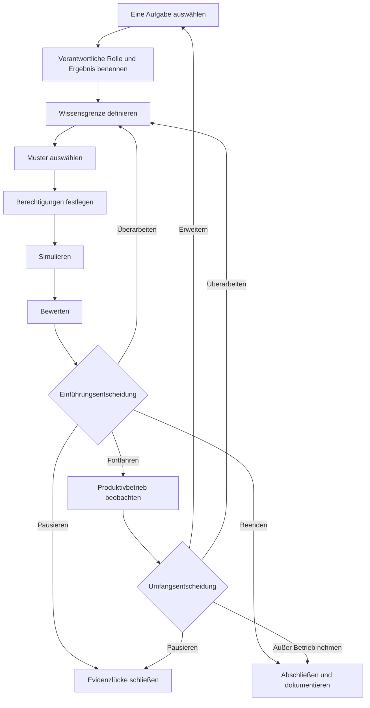

Eine Roadmap zur Einführung von KI-Agenten sollte eine klar abgegrenzte Aufgabe durch eine Reihe von Evidenz-Gates führen. An jedem Gate entscheidet eine benannte verantwortliche Rolle, ob das Vorhaben fortgesetzt, überarbeitet, pausiert oder beendet wird. Der Produktivbetrieb ist nicht das Ende des Plans. Die Roadmap muss auch Überwachung, Eingriffsmöglichkeiten, Wiederherstellung, Außerbetriebnahme und die Evidenz definieren, die vor einer Erweiterung des Agentenumfangs erforderlich ist.

Diese Struktur ist nützlicher als ein fester 30-, 60- oder 90-Tage-Kalender. Ein Kalender zeigt, wann ein Team voraussichtlich vorankommen möchte. Ein Evidenz-Gate hält fest, was das Team wissen muss, bevor es fortfährt.

## Die Roadmap im Überblick

Die Abfolge umfasst neun Phasen:

1. Eine klar abgegrenzte Aufgabe auswählen.
2. Verantwortliche Rolle, Nutzer, Ergebnis und Ausgangswert benennen.
3. Wissens- und Datengrenzen definieren.
4. Nur dann ein Agentenmuster auswählen, wenn die Aufgabe eines benötigt.
5. Grenzen für Werkzeuge, Berechtigungen und menschliche Entscheidungen festlegen.
6. Die Arbeit und ihre Fehlerpfade simulieren.
7. Ergebnisse anhand vorher festgelegter Kriterien bewerten.
8. Eine verantwortete Einführungsentscheidung treffen.
9. Den Produktivbetrieb beobachten und entscheiden, ob überarbeitet, erweitert, pausiert oder außer Betrieb genommen wird.

**Alternativtext zum Diagramm:** Die Roadmap beginnt mit einer Aufgabe, einer verantwortlichen Rolle und einem Ergebnis, einer Wissensgrenze, einem geeigneten Muster und Berechtigungen. Simulation und Bewertung führen zu einer Einführungsentscheidung. Die Entscheidung kann zum überwachten Produktivbetrieb führen, zur Überarbeitung zurückkehren, wegen fehlender Evidenz pausieren oder das Vorhaben beenden. Evidenz aus dem Produktivbetrieb stützt später eine separate Entscheidung über Erweiterung, Überarbeitung, Pause oder Außerbetriebnahme.

## Mit Evidenzstatus statt Vertrauensbegriffen beginnen

Teams verwenden oft Begriffe wie *bereit*, *sicher* und *funktioniert*, bevor sie sich darauf geeinigt haben, was diese Begriffe bedeuten. Verwenden Sie stattdessen explizite Evidenzstatus im Planungsprotokoll:

| Evidenzstatus | Bedeutung | Was er nicht bedeutet |
|---|---|---|
| `UNKNOWN` | Das Team hat nicht genug Evidenz gesammelt, um die Aussage zu beurteilen. | Fehlschlag, keine Nachfrage oder die Erlaubnis, Annahmen zu treffen. |
| `ASSERTED` | Eine Person, ein Anbieter, ein Dokument oder ein Agent hat die Aussage gemacht, und die Quelle ist dokumentiert. | Unabhängige Bestätigung. |
| `OBSERVED` | Das Team hat das Verhalten in einem benannten Test- oder Betriebskontext aufgezeichnet. | Das Verhalten lässt sich auf andere Kontexte übertragen. |
| `VERIFIED` | Das Ergebnis wurde anhand einer vorher festgelegten Methode und Akzeptanzregel geprüft. | Alle Risiken sind beseitigt oder das System ist allgemein zuverlässig. |
| `ACCEPTED` | Eine verantwortliche entscheidungsbefugte Rolle hat die verfügbare Evidenz geprüft und das Restrisiko für einen benannten Umfang und Zeitraum akzeptiert. | Dauerhafte Genehmigung oder der Beweis, dass die Entscheidung richtig war. |
| `REJECTED` | Evidenz hat ein festgelegtes Kriterium nicht erfüllt oder das Restrisiko wurde nicht akzeptiert. | Die Idee kann nie überarbeitet oder mit einem anderen Umfang getestet werden. |

Ein Evidenzstatus gehört zu einer bestimmten Aussage. "Der Agent hat 47 von 50 Testfällen im Testset v3 abgeschlossen" kann `OBSERVED` sein. "Der Agent ist für jede Finanzaufgabe bereit" kann diesen Status nicht übernehmen.

## Die neun Phasen der Einführungs-Roadmap

### 1. Eine klar abgegrenzte Aufgabe auswählen

Beginnen Sie mit einer Aufgabe, die einen erkennbaren Anfang, ein Ergebnis, eine verantwortliche Rolle und einen Empfänger hat. Halten Sie ebenso sorgfältig fest, was außerhalb der Aufgabe liegt, wie das, was dazugehört.

Fragen Sie vor der Auswahl eines Agenten, ob die Arbeit adaptive Entscheidungen, eine wechselnde Reihenfolge von Werkzeugen oder die Interpretation unvollständiger Eingaben erfordert. Die aktuelle Geschäftsplanungshilfe von Microsoft empfiehlt für strukturierte, vorhersehbare Aufgaben, die keine agentische Komplexität benötigen, normalen Code oder nicht-generative Systeme. Sie empfiehlt zudem, Anwendungsfälle zu pausieren, deren Risiken oder Schutzmaßnahmen unklar sind ([Microsoft, Business plan for AI agents](https://learn.microsoft.com/en-us/azure/cloud-adoption-framework/ai-agents/business-strategy-plan)).

- **Eingangsevidenz:** Eine reale Aufgabe und die betroffene Nutzergruppe sind benannt.
- **Ausgangsevidenz:** Aufgabengrenze, ausgeschlossene Tätigkeiten, Nicht-KI-Alternative und der Grund, weshalb ein Agent geeignet sein könnte, sind dokumentiert.
- **Stoppbedingung:** Die Aufgabe kann nicht von mehreren folgenreichen Prozessen getrennt werden, oder keine verantwortliche Rolle kann ein akzeptables Ergebnis definieren.
- **Verantwortliche Rolle für die Wiederherstellung:** Verantwortliche Rolle für den Geschäftsprozess.
- **Menschliche Entscheidung:** Die Aufgabengrenze akzeptieren oder eine enger gefasste Aufgabe beziehungsweise eine Lösung ohne Agenten wählen.

### 2. Verantwortliche Rolle, Nutzer, Ergebnis und Ausgangswert benennen

Benennen Sie die Person oder Rolle, die für das Geschäftsergebnis verantwortlich ist. Trennen Sie diese Rolle von den Personen, die das System entwickeln, betreiben, Risiken prüfen und das Ergebnis erhalten. In einem kleinen Team kann eine Person mehrere Rollen innehaben, doch die Verantwortlichkeiten sollten weiterhin sichtbar sein.

Dokumentieren Sie, wie die Aufgabe heute ausgeführt wird. Ein Ausgangswert kann Abschlussquote, Prüfaufwand, Korrekturquote, verstrichene Zeit, Kosten oder eine andere aufgabenbezogene Kennzahl umfassen. Wenn kein verlässlicher Ausgangswert vorliegt, schreiben Sie `UNKNOWN`; machen Sie aus fehlenden Daten nicht null. Sowohl Microsoft als auch OpenAI empfehlen, Erfolgskriterien und einen aktuellen Vergleichspunkt zu definieren, bevor Ergebnisse eine Erweiterung begründen ([Microsoft, Define success metrics](https://learn.microsoft.com/en-us/azure/cloud-adoption-framework/ai-agents/business-strategy-plan#define-success-metrics); [OpenAI, A business leader's guide to working with agents](https://cdn.openai.com/business-guides-and-resources/a-business-leaders-guide-to-working-with-agents.pdf)).

- **Eingangsevidenz:** Die klar abgegrenzte Aufgabe wurde akzeptiert.
- **Ausgangsevidenz:** Geschäftlich verantwortliche Rolle, Nutzer, Empfänger des Ergebnisses, Ausgangswert, gewünschtes Ergebnis und Prüfdatum sind dokumentiert.
- **Stoppbedingung:** Das gewünschte Ergebnis kann nicht gemessen oder beurteilt werden, oder betroffene Nutzer wurden nicht identifiziert.
- **Verantwortliche Rolle für die Wiederherstellung:** Geschäftlich verantwortliche Rolle gemeinsam mit der für die Messung verantwortlichen Rolle.
- **Menschliche Entscheidung:** Ergebnis und Messmethode akzeptieren, bevor die Entwicklung beginnt.

### 3. Wissens- und Datengrenzen definieren

Listen Sie jede Quelle auf, die der Agent verwenden darf, wem sie gehört, wie aktuell sie sein muss und was bei Konflikten zwischen Quellen geschieht. Dokumentieren Sie verbotene Daten, Aufbewahrungsbeschränkungen und den Pfad für eine fehlende oder veraltete Antwort. Behandeln Sie einen Ordner, einen Retrieval-Index oder einen langen Prompt nicht als Beweis dafür, dass das Wissen korrekt ist.

Das NIST AI Risk Management Framework fordert Teams dazu auf, beabsichtigten Zweck, Nutzer, Kontext, Grenzen, Aufsicht, Komponenten Dritter und mögliche Auswirkungen zu dokumentieren. Es besagt außerdem, dass Risikomanagement fortlaufend und nicht als einmalige Checkliste erfolgen sollte ([NIST, AI RMF Core](https://airc.nist.gov/airmf-resources/airmf/5-sec-core/)).

- **Eingangsevidenz:** Die Felder zu verantwortlicher Rolle, Nutzern und Ergebnis sind vollständig.
- **Ausgangsevidenz:** Zulässige Quellen, verbotene Eingaben, Aktualitätsregeln, Konfliktregeln und eine für das Wissen verantwortliche Rolle sind dokumentiert.
- **Stoppbedingung:** Rechte, Eigentum, Aktualität oder Sensitivität einer tragenden Quelle sind unbekannt.
- **Verantwortliche Rolle für die Wiederherstellung:** Die für das Wissen verantwortliche Rolle gemeinsam mit der jeweils zuständigen Datenschutz-, Rechts- oder Sicherheitsrolle, wenn die Quelle dies erfordert.
- **Menschliche Entscheidung:** Die Datengrenze und ungelöste Einschränkungen für diesen Testumfang akzeptieren.

### 4. Das Muster auswählen

Wählen Sie das am wenigsten komplexe Muster, das die klar abgegrenzte Aufgabe erledigen kann. Ein deterministischer Workflow kann ausreichen. Wenn die Arbeit einen Agenten erfordert, beginnen Sie mit einem Agenten, sofern getrennte Verantwortlichkeiten, Sicherheitsgrenzen oder Übergaben keine Trennung notwendig machen.

Der Leitfaden von OpenAI zur Entwicklung von Agenten empfiehlt, die Orchestrierung an der tatsächlichen Komplexität auszurichten und mit einem einzelnen Agenten zu beginnen, bevor bei Bedarf auf Multi-Agenten-Designs umgestellt wird ([OpenAI, A practical guide to building agents](https://cdn.openai.com/business-guides-and-resources/a-practical-guide-to-building-agents.pdf)).

- **Eingangsevidenz:** Wissens- und Datengrenzen sind explizit festgelegt.
- **Ausgangsevidenz:** Musterwahl, verworfene Alternativen, Werkzeugliste, Übergaben und erwartete Fehlermodi sind dokumentiert.
- **Stoppbedingung:** Das vorgeschlagene Muster fügt Akteure oder Werkzeuge ohne aufgabenspezifischen Grund hinzu, oder eine deterministische Alternative wurde nicht geprüft.
- **Verantwortliche Rolle für die Wiederherstellung:** Technisch verantwortliche Rolle.
- **Menschliche Entscheidung:** Das Muster und seine Betriebskosten für den klar abgegrenzten Test akzeptieren.

### 5. Berechtigungs- und Entscheidungsgrenzen festlegen

Listen Sie jede Werkzeugaktion einzeln auf. Dokumentieren Sie, ob sie liest oder schreibt, welches Konto sie verwendet, auf welche Daten sie zugreifen kann, ob die Aktion umkehrbar ist und welche maximale Auswirkung ein Fehler haben kann. Eine breite Bezeichnung wie "CRM-Zugriff" verbirgt die Entscheidung, die eine prüfende Person treffen muss.

Der Leitfaden von OpenAI schlägt vor, Werkzeuge nach Lese- oder Schreibzugriff, Umkehrbarkeit, Berechtigungen und finanziellen Auswirkungen zu beurteilen. Für folgenreiche Aktionen empfiehlt er stärkere Prüfungen oder menschliche Eingriffe. Schutzmechanismen bilden eine Ebene und sollten mit Authentifizierung, Autorisierung, Zugriffskontrollen und gängigen Sicherheitsmaßnahmen für Software kombiniert werden. Diese Praktiken beweisen nicht, dass ein System sicher ist ([OpenAI, Guardrails and human intervention](https://cdn.openai.com/business-guides-and-resources/a-practical-guide-to-building-agents.pdf)).

Verwenden Sie drei Entscheidungsgrenzen:

- **Vom Agenten entschieden:** Folgenarme, umkehrbare Aktionen innerhalb der genehmigten Aufgabe und des genehmigten Berechtigungsumfangs.
- **Durch Regeln entschieden:** Deterministische Grenzen wie Schemaprüfungen, Obergrenzen für Wiederholungsversuche, Positivlisten und Ausgabenlimits, die Arbeit stoppen oder weiterleiten, ohne Geschäftsrisiken zu interpretieren.
- **Von Menschen entschieden:** Akzeptanz der Einführung, Akzeptanz des Restrisikos, Zugriff auf sensible oder regulierte Daten, folgenreiche oder unumkehrbare Aktionen, Ausnahmen von Richtlinien, Abschluss eines Vorfalls und Erweiterung von Umfang oder Berechtigungen.

Die verantwortliche Organisation entscheidet, welche realen Aktionen zu welcher Gruppe gehören. Dieser Leitfaden nimmt für eine bestimmte Implementierung keine rechtliche, sicherheitsbezogene oder Compliance-Klassifizierung vor.

- **Eingangsevidenz:** Muster und Werkzeugbestand sind vollständig.
- **Ausgangsevidenz:** Zugriff nach dem Prinzip der geringsten Rechte, Aktionsklassen, Genehmigungspunkte, Obergrenzen für Wiederholungsversuche, Stoppkontrollen, Protokollierungsanforderungen und die für den Entzug verantwortliche Rolle sind dokumentiert.
- **Stoppbedingung:** Konto, Datenreichweite, Schreibwirkung, Umkehrbarkeit oder Entzugspfad eines Werkzeugs sind unbekannt.
- **Verantwortliche Rolle für die Wiederherstellung:** Technisch verantwortliche Rolle und für Berechtigungen verantwortliche Rolle.
- **Menschliche Entscheidung:** Die abgegrenzten Berechtigungen erteilen und jede Aktion akzeptieren, die dem Agenten oder deterministischen Regeln zugewiesen ist.

### 6. Die Arbeit und Fehlerpfade simulieren

Testen Sie die Aufgabe in einem kontrollierten Kontext von Anfang bis Ende. Berücksichtigen Sie normale Fälle, mehrdeutige Eingaben, veraltetes oder widersprüchliches Wissen, verweigerte Berechtigungen, Ausfälle von Werkzeugen, fehlerhafte Ausgaben, das Risiko doppelter Schreibvorgänge und den Zeitpunkt, an dem ein Mensch übernehmen muss. Testen Sie den schwierigsten Schritt, statt das gesamte Pilotprojekt auf einfache Beispiele zu verwenden.

Dokumentieren Sie Eingabekohorte, Umgebung, Versionen, erwartetes Ergebnis, tatsächliches Ergebnis, prüfende Rolle und alle bekannten Abweichungen zum Produktivbetrieb. Eine Simulation liefert Evidenz über die getesteten Bedingungen. Sie belegt keine Leistung außerhalb dieser Bedingungen.

- **Eingangsevidenz:** Berechtigungs- und Entscheidungsgrenzen sind für die Simulation genehmigt.
- **Ausgangsevidenz:** Testfälle, Ausgaben, Fehler, Unsicherheit, Eingriffsverhalten und Wiederherstellungsergebnisse sind dokumentiert.
- **Stoppbedingung:** Ein kritischer Fehler kann nicht eingedämmt werden, ein Schreibvorgang könnte ohne Beleg wiederholt werden, oder das Team kann die Aktionen des Agenten nicht rekonstruieren.
- **Verantwortliche Rolle für die Wiederherstellung:** Für den Test verantwortliche Rolle gemeinsam mit der für das Werkzeug oder den Vorfall verantwortlichen Rolle.
- **Menschliche Entscheidung:** Die Simulationsevidenz als ausreichend für die formelle Bewertung akzeptieren oder das System zur Überarbeitung zurückgeben.

### 7. Anhand vorher festgelegter Kriterien bewerten

Bewerten Sie das Ergebnis anhand von Kriterien, die vor der Ausführung festgelegt wurden. Berücksichtigen Sie Aufgabenkorrektheit, Vollständigkeit, Einhaltung von Richtlinien, Werkzeugverhalten, Qualität menschlicher Eingriffe, Wiederherstellung und die in Phase 2 ausgewählte Geschäftskennzahl. Behalten Sie fehlgeschlagene und unsichere Fälle im Protokoll.

NIST verlangt, dass Bewertungsmethoden, Kennzahlen, Testbedingungen, Unsicherheit und Einschränkungen dokumentiert werden und dass Systeme vor der Bereitstellung sowie während des Betriebs getestet werden. Das Framework unterscheidet außerdem zwischen Messung und der späteren Entscheidung zum Fortfahren ([NIST, AI RMF Core, Measure and Manage](https://airc.nist.gov/airmf-resources/airmf/5-sec-core/)).

- **Eingangsevidenz:** Die Simulationsprotokolle sind vollständig genug, um sie zu reproduzieren oder zu prüfen.
- **Ausgangsevidenz:** Jedes Akzeptanzkriterium hat ein Ergebnis, einen Evidenzstatus, eine Einschränkung und eine prüfende Rolle.
- **Stoppbedingung:** Ein kritisches Kriterium wird nicht erfüllt, die Testmethode kann die getroffene Aussage nicht stützen, oder wesentliche Unsicherheit wird in einer Gesamtpunktzahl verborgen.
- **Verantwortliche Rolle für die Wiederherstellung:** Für die Bewertung verantwortliche Rolle.
- **Menschliche Entscheidung:** Das Bewertungsergebnis für den exakt vorgeschlagenen Einführungsumfang akzeptieren oder ablehnen.

### 8. Die Einführungsentscheidung treffen

Bündeln Sie die Evidenz für die verantwortliche entscheidungsbefugte Rolle. Das Entscheidungsprotokoll sollte Version, Umfang, Nutzer, Berechtigungen, bekannte Einschränkungen, ungelöste Risiken, Überwachungsplan, Methode für Rollback oder Abschaltung, Prüfdatum und verwendete Evidenz benennen.

Verwenden Sie eine von vier Entscheidungen:

- `PROCEED`: Die Evidenz erfüllt die festgelegten Kriterien, und die verantwortliche Rolle akzeptiert das Restrisiko für den benannten Umfang und Prüfzeitraum.
- `REVISE`: Korrigierbare Lücken haben verantwortliche Rollen, und eine weitere abgegrenzte Bewertung ist geplant.
- `PAUSE`: Eine tragende Abhängigkeit, Berechtigung, prüfende Rolle oder Evidenz ist nicht verfügbar.
- `STOP`: Der Anwendungsfall, das Agentenmuster oder das Restrisiko ist für den beabsichtigten Kontext nicht akzeptabel.

Die Manage-Funktion von NIST fordert eine Feststellung, ob das System seinen beabsichtigten Zweck erreicht und ob Entwicklung oder Bereitstellung fortgesetzt werden sollten. Das ist eine von Evidenz gestützte Governance-Entscheidung und keine Punktzahl, die sich ein Agent selbst verleiht ([NIST, Manage 1.1](https://airc.nist.gov/airmf-resources/airmf/5-sec-core/)).

- **Eingangsevidenz:** Bewertungsergebnisse und Betriebsplan sind vollständig.
- **Ausgangsevidenz:** Eine benannte verantwortliche Rolle zeichnet eine Entscheidung für eine feste Version, einen festen Umfang und einen festen Prüfzeitraum ab.
- **Stoppbedingung:** Es gibt keine verantwortliche Rolle, Abschaltmethode, Vorfallroute oder akzeptierte Restrisikoerklärung.
- **Verantwortliche Rolle für die Wiederherstellung:** Für die Einführung verantwortliche Rolle.
- **Menschliche Entscheidung:** Die Einführungsentscheidung selbst. Ein automatisiertes Gate kann Evidenz zusammenstellen oder eine vorher festgelegte Regel durchsetzen, erweitert den genehmigten Umfang aber nicht stillschweigend.

### 9. Den Produktivbetrieb beobachten und über die nächsten Schritte entscheiden

Überwachen Sie Aufgabenergebnisse, fehlgeschlagene und übersteuerte Aktionen, Umfang menschlicher Eingriffe, Berechtigungsfehler, Aktualität von Quellen, Nutzerfeedback, Vorfälle, Wiederherstellungszeit, Kosten und die Geschäftskennzahl. Legen Sie fest, wer jedes Signal liest und welcher Schwellenwert eine Aktion auslöst.

Microsoft empfiehlt eine schrittweise Erweiterung auf Grundlage des beobachteten Nutzens statt der technischen Verfügbarkeit sowie ein fortlaufendes Lebenszyklusmanagement. NIST bezieht Überwachung, Einspruch und Eingriff, Außerbetriebnahme, Reaktion auf Vorfälle, Wiederherstellung und Änderungsmanagement in die Planung nach der Bereitstellung ein ([Microsoft, Manage AI agents across your organization](https://learn.microsoft.com/en-us/azure/cloud-adoption-framework/ai-agents/integrate-manage-operate); [NIST, Manage 4.1](https://airc.nist.gov/airmf-resources/airmf/5-sec-core/)).

- **Eingangsevidenz:** Eine Einführungsentscheidung mit festgelegtem Umfang liegt vor.
- **Ausgangsevidenz:** Das Prüffenster enthält genug beobachtete Evidenz für eine neue Entscheidung; Unbekanntes bleibt sichtbar.
- **Stoppbedingung:** Kritische Abweichung, unerwarteter Zugriff, nicht eingedämmte Schreibvorgänge, fehlende Auditevidenz, ein überschrittener Schwellenwert oder der Verlust des Abschalt- und Wiederherstellungspfads.
- **Verantwortliche Rolle für die Wiederherstellung:** Für den Betrieb verantwortliche Rolle gemeinsam mit der für den Vorfall verantwortlichen Rolle.
- **Menschliche Entscheidung:** Unverändert fortfahren, überarbeiten, eingrenzen, pausieren, erweitern oder außer Betrieb nehmen. Eine Erweiterung erzeugt eine neue klar abgegrenzte Aufgabe und kehrt zu Phase 1 zurück.

## Wiederverwendbares Planungsprotokoll für KI-Agenten

Kopieren Sie dieses Protokoll für eine Aufgabe. Ersetzen Sie fehlende Evidenz nicht durch eine optimistische Annahme.

### Identität und Umfang

| Feld | Eintrag |
|---|---|
| ID und Version des Planungsprotokolls | |
| Aufgabenname | |
| Beabsichtigte Nutzer und Empfänger des Ergebnisses | |
| Eingeschlossene Tätigkeiten | |
| Ausgeschlossene Tätigkeiten | |
| Geprüfte Nicht-KI-Alternative | |
| Geschäftlich verantwortliche Rolle | |
| Technisch verantwortliche Rolle | |
| Für Wissen und Daten verantwortliche Rolle | |
| Für Berechtigungen verantwortliche Rolle | |
| Für die Bewertung verantwortliche Rolle | |
| Für Betrieb und Wiederherstellung verantwortliche Rolle | |

### Ergebnis und Evidenz

| Feld | Eintrag | Evidenzstatus | Quelle oder Methode | Prüfdatum |
|---|---|---|---|---|
| Aktueller Ausgangswert | | | | |
| Gewünschtes Ergebnis | | | | |
| Erwünschtheit für Nutzer | | | | |
| Technische Machbarkeit | | | | |
| Bekannte Risiken und Auswirkungen | | | | |
| Nicht gemessene oder ungelöste Risiken | | `UNKNOWN` | | |

### Wissen, Muster und Berechtigungen

| Feld | Eintrag |
|---|---|
| Zulässige Wissensquellen und Aktualitätsregeln | |
| Verbotene Daten und Verwendungszwecke | |
| Verhalten bei Konflikten oder fehlendem Wissen | |
| Ausgewähltes Muster und verworfene Alternativen | |
| Werkzeuge und Kontenidentitäten | |
| Für den Agenten erlaubte Leseaktionen | |
| Für den Agenten erlaubte Schreibaktionen | |
| Deterministische Grenzen und Auslöser | |
| Aktionen mit menschlicher Genehmigung | |
| Obergrenzen für Wiederholungsversuche, Ausgaben und Aktionen | |
| Methode für Entzug und Abschaltung | |

### Phasen-Gates

| Phase | Eingangsevidenz | Ausgangsevidenz | Stoppbedingung | Verantwortliche Rolle für die Wiederherstellung | Nächste Entscheidung |
|---|---|---|---|---|---|
| Aufgabe auswählen | | | | | |
| Verantwortliche Rolle und Ergebnis benennen | | | | | |
| Wissen definieren | | | | | |
| Muster auswählen | | | | | |
| Berechtigungen festlegen | | | | | |
| Simulieren | | | | | |
| Bewerten | | | | | |
| Einführung genehmigen | | | | | |
| Beobachten und prüfen | | | | | |

### Bewertung und Einführungsentscheidung

| Feld | Eintrag |
|---|---|
| Testkohorte, Umgebung und Versionen | |
| Festgelegte Kriterien und Schwellenwerte | |
| Tatsächliche Ergebnisse, Fehler und Unsicherheit | |
| Ergebnis von Eingriff und Wiederherstellung | |
| Entscheidung | `PROCEED`, `REVISE`, `PAUSE` oder `STOP` |
| Entscheidungsverantwortliche Rolle und Datum | |
| Akzeptierter Umfang und akzeptiertes Restrisiko | |
| Überwachung und Vorfallroute | |
| Prüffenster | |
| Auslöser für Erweiterung, Überarbeitung, Pause und Außerbetriebnahme | |

## Vor einer Erweiterung

Eine Erweiterung ist eine neue Entscheidung und keine automatische Belohnung für das Erreichen des Produktivbetriebs. Fordern Sie, sofern die Aufgabe dies zulässt, Evidenz aus mehr als einem Betriebszyklus. Prüfen Sie, ob das Ergebnis weiterhin nützlich ist, ob Eingriffe und Korrekturen verstanden werden und ob die ursprünglichen Berechtigungs- und Datengrenzen noch passen.

Erweitern Sie nicht, wenn die wichtigste Evidenz aus einer Anekdote, einer Anbieteraussage, einem einzelnen erfolgreichen Durchlauf oder einer Gesamtpunktzahl besteht, die kritische Fehler verbirgt. Erweitern Sie nicht, weil die Implementierung mehr Werkzeuge erreichen kann. Erweitern Sie nur, wenn eine verantwortliche Rolle die Evidenz akzeptiert und der neue Umfang eigene Grenzen, Tests, Stoppbedingungen und einen Wiederherstellungsplan erhält.

## Nächster Schritt

Verwenden Sie das Planungsprotokoll, um eine Aufgabe zu definieren, und vergleichen Sie diese anschließend mit den verfügbaren Agenten- und Workflow-Mustern. Wenn Berechtigungen, die für das Restrisiko verantwortliche Rolle oder die Einführungsentscheidung weiterhin unklar sind, fahren Sie vor dem Aufbau des Produktivpfads mit dem [Governance-Modell für KI-Agenten, auf Englisch](/en/governance) fort.

## Methode, Urheberschaft und Einschränkungen

**Wer:** Toone Content ist der organisatorische Autor. Hexagonal.io ist der Herausgeber. Redaktionelle Verantwortung und Quellenpraxis werden in der [Redaktionsrichtlinie, auf Englisch](/en/editorial-policy) beschrieben. Richten Sie Fragen und Korrekturanfragen direkt an [Toone, auf Englisch](/en/contact). Dieser direkte Link ist ein englischer Ausweichkandidat. Es wird nicht behauptet, dass er funktioniert, bevor Technical eine öffentlich zugängliche, barrierefreie Seite unter `/en/contact` implementiert und eine öffentliche Antwort mit Status `200` verifiziert hat.

**Wie:** Dieser Leitfaden führt aktuelle Primärempfehlungen von Microsoft, NIST und OpenAI zu einer Planungsabfolge und einem wiederverwendbaren Protokoll zusammen. Automatisierte Unterstützung half dabei, die Quellen zu sammeln, zuzuordnen und zu strukturieren. Aussagen aus den Quellen wurden anhand der verlinkten Materialien geprüft, und die Synthese von Toone ist als solche gekennzeichnet. Es wird weder eine Kundenimplementierung noch eine praktische Einführung durch Toone behauptet. Grenze der Prüfung: Content Editor ist die verantwortliche redaktionelle Prüfrolle; diese organisatorisch verfasste Quelle behauptet weder eine Prüfung durch eine namentlich genannte Person noch eine fachliche, produktbezogene, rechtliche, datenschutzbezogene, sicherheitsbezogene oder implementierungsbezogene Prüfung.

**Warum:** Der Leitfaden hilft operativ Verantwortlichen und Leitungen von Funktionsteams, klar abgegrenzte Einführungsentscheidungen mit sichtbarer Evidenz, Verantwortung sowie Stopp- und Wiederherstellungspfaden zu treffen. Er ist keine Rechts-, Sicherheits-, Datenschutz- oder Compliance-Beratung. Er belegt nicht, dass ein Agent für eine bestimmte Implementierung sicher, zuverlässig oder geeignet ist. Diese Beurteilungen erfordern die verantwortlichen Personen und die Evidenz für den jeweiligen Kontext.

## Quellen

- Microsoft Learn, [Business plan for AI agents](https://learn.microsoft.com/en-us/azure/cloud-adoption-framework/ai-agents/business-strategy-plan), abgerufen am 13. August 2026.
- Microsoft Learn, [Organizational readiness for AI agents](https://learn.microsoft.com/en-us/azure/cloud-adoption-framework/ai-agents/organization-people-readiness-plan), aktualisiert am 4. Dezember 2025.
- Microsoft Learn, [Manage AI agents across your organization](https://learn.microsoft.com/en-us/azure/cloud-adoption-framework/ai-agents/integrate-manage-operate), aktualisiert am 4. Dezember 2025.
- NIST AI Resource Center, [AI Risk Management Framework Core](https://airc.nist.gov/airmf-resources/airmf/5-sec-core/), Auszug aus AI RMF 1.0; die Seite weist darauf hin, dass eine Überarbeitung läuft.
- NIST, [Artificial Intelligence Risk Management Framework: Generative Artificial Intelligence Profile](https://www.nist.gov/publications/artificial-intelligence-risk-management-framework-generative-artificial-intelligence), veröffentlicht am 26. Juli 2024; Seite aktualisiert am 8. April 2026.
- OpenAI, [A business leader's guide to working with agents](https://cdn.openai.com/business-guides-and-resources/a-business-leaders-guide-to-working-with-agents.pdf), PDF abgerufen am 13. August 2026.
- OpenAI, [A practical guide to building agents](https://cdn.openai.com/business-guides-and-resources/a-practical-guide-to-building-agents.pdf), PDF abgerufen am 13. August 2026.

## Umsetzungshinweise in Verantwortung von Content

- Das Planungsprotokoll als barrierefreie HTML-Tabellen darstellen, nicht als Bild.
- Das Roadmap-Diagramm in einer crawlbaren Form darstellen und den beschreibenden Alternativtext beibehalten.
- Die sichtbare Urheberschaft `Toone Content` und eine übereinstimmende Autorenidentität für `Article` verwenden.
- Nur korrekte strukturierte Daten für `Article` und `BreadcrumbList` verwenden.
- Kein FAQ-Markup hinzufügen, sofern keine sichtbare geeignete FAQ und aktuelle technische Entscheidung vorliegen.
- Kandidaten für interne Links außer den englischen Governance- und Redaktionsrichtlinien-Routen bleiben davon abhängig, dass ihre Zielrouten bei der Assemblierung geeignet sind.
- `/en/contact` bleibt eine Abhängigkeit von Technical. Die Assemblierung darf die Route nicht als aktiv behandeln und den englischen Ausweichlink nicht ohne öffentliche Verifizierung durch eine deutschsprachige Route ersetzen.
- Der genehmigte Messansatz ist die Verwendung des Planungsprotokolls ohne personenbezogene Daten, gefolgt vom Fortschritt zur Auswahl oder Governance nach G3. Für die Seite liegt noch kein Ausgangswert vor, und unbekannte Nachfrage darf nicht als null erfasst werden.
