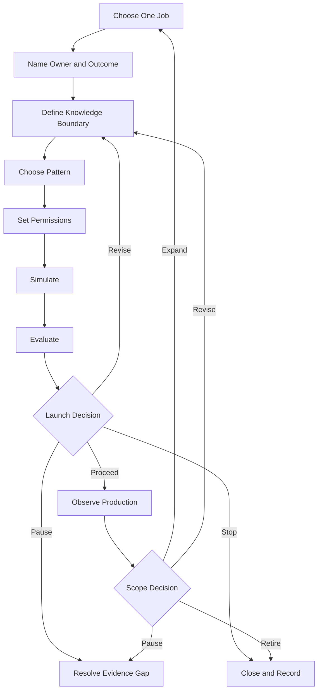

An AI agent adoption roadmap should move one well-bounded job through a series of evidence gates. At
each gate, a named owner decides whether to proceed, revise, pause, or stop. Production is not the end
of the plan. The roadmap must also define monitoring, override, recovery, retirement, and the evidence
needed before the agent's scope expands.

That structure is more useful than a fixed 30, 60, or 90-day calendar. A calendar tells a team when it
hopes to move. An evidence gate records what the team must know before it moves.

## The roadmap at a glance

The sequence has nine phases:

1. Choose one bounded job.
2. Name the owner, users, outcome, and baseline.
3. Define the knowledge and data boundary.
4. Choose an agent pattern only if the job needs one.
5. Set tool, permission, and human decision boundaries.
6. Simulate the work and its failure paths.
7. Evaluate results against declared criteria.
8. Make an accountable launch decision.
9. Observe production and decide whether to revise, expand, pause, or retire.

**Diagram alternative text:** The roadmap begins with one job, an owner and outcome, a knowledge
boundary, a suitable pattern, and permissions. Simulation and evaluation lead to a launch decision.
The decision can proceed to monitored production, return for revision, pause for missing evidence, or
stop. Production evidence later supports a separate decision to expand, revise, pause, or retire.

## Start with evidence states, not confidence language

Teams often use words such as *ready*, *safe*, and *works* before agreeing on what those words mean.
Use explicit evidence states in the planning record instead:

| Evidence state | Meaning | What it does not mean |
|---|---|---|
| `UNKNOWN` | The team has not collected enough evidence to judge the claim. | Failure, zero demand, or permission to assume. |
| `ASSERTED` | A person, vendor, document, or agent made the claim, and the source is recorded. | Independent confirmation. |
| `OBSERVED` | The team recorded the behavior in a named test or operating context. | The behavior will generalize beyond that context. |
| `VERIFIED` | The result was checked against a declared method and acceptance rule. | All risks are resolved or the system is universally reliable. |
| `ACCEPTED` | An accountable decision owner reviewed the available evidence and accepted the residual risk for a stated scope and period. | Permanent approval or proof that the decision was correct. |
| `REJECTED` | Evidence failed a declared criterion or the residual risk was not accepted. | The idea can never be revised or tested under a different scope. |

An evidence state belongs to a specific claim. “The agent completed 47 of 50 test cases in test set
v3” can be `OBSERVED`. “The agent is ready for every finance task” cannot inherit that state.

## The nine-phase adoption roadmap

### 1. Choose one bounded job

Start with a job that has a recognizable beginning, output, owner, and recipient. Write down what is
outside the job as carefully as what is inside it.

Before choosing an agent, ask whether the work needs adaptive decisions, changing tool order, or
interpretation of incomplete inputs. Microsoft's current business-planning guidance recommends using
ordinary code or nongenerative systems for structured, predictable tasks that do not need agentic
complexity. It also recommends pausing use cases whose risks or safeguards are unclear ([Microsoft,
Business plan for AI agents](https://learn.microsoft.com/en-us/azure/cloud-adoption-framework/ai-agents/business-strategy-plan)).

- **Entry evidence:** A real job and affected user group are named.
- **Exit evidence:** The job boundary, excluded tasks, non-AI alternative, and reason an agent may fit
  are recorded.
- **Stop condition:** The job cannot be separated from several high-impact processes, or no owner can
  define an acceptable output.
- **Recovery owner:** Business process owner.
- **Human decision:** Accept the job boundary or choose a narrower job or non-agent solution.

### 2. Name the owner, users, outcome, and baseline

Name the person or role accountable for the business result. Separate that role from the people who
build, operate, review risk, and receive the output. One person may hold several roles in a small
team, but the responsibilities should still be visible.

Record how the job works today. A baseline can include completion rate, review burden, correction
rate, elapsed time, cost, or another measure tied to the job. If no reliable baseline exists, write
`UNKNOWN`; do not turn missing data into zero. Both Microsoft and OpenAI recommend defining success
criteria and a current point of comparison before using results to justify expansion ([Microsoft,
Define success metrics](https://learn.microsoft.com/en-us/azure/cloud-adoption-framework/ai-agents/business-strategy-plan#define-success-metrics);
[OpenAI, A business leader's guide to working with agents](https://cdn.openai.com/business-guides-and-resources/a-business-leaders-guide-to-working-with-agents.pdf)).

- **Entry evidence:** The bounded job has been accepted.
- **Exit evidence:** Business owner, users, output recipient, baseline, desired outcome, and review
  date are recorded.
- **Stop condition:** The desired outcome cannot be measured or judged, or affected users have not
  been identified.
- **Recovery owner:** Business owner with the measurement owner.
- **Human decision:** Accept the outcome and measurement method before development begins.

### 3. Define the knowledge and data boundary

List every source the agent may use, who owns it, how fresh it must be, and what happens when sources
conflict. Record prohibited data, retention constraints, and the path for a missing or stale answer.
Do not treat a folder, retrieval index, or long prompt as proof that the knowledge is correct.

NIST's AI Risk Management Framework asks teams to document intended purpose, users, context, limits,
oversight, third-party components, and potential impacts. It also says risk management should be
continuous rather than a one-time checklist ([NIST, AI RMF
Core](https://airc.nist.gov/airmf-resources/airmf/5-sec-core/)).

- **Entry evidence:** Owner, user, and outcome fields are complete.
- **Exit evidence:** Allowed sources, prohibited inputs, freshness rules, conflict rules, and a
  knowledge owner are recorded.
- **Stop condition:** A load-bearing source has unknown rights, ownership, freshness, or sensitivity.
- **Recovery owner:** Knowledge owner, with the relevant privacy, legal, or security owner when the
  source requires it.
- **Human decision:** Accept the data boundary and unresolved limitations for this test scope.

### 4. Choose the pattern

Choose the least complex pattern that can complete the bounded job. A deterministic workflow may be
enough. If the work needs an agent, start with one agent unless distinct responsibilities, security
boundaries, or handoffs make separation necessary.

OpenAI's building guide recommends matching orchestration to actual complexity and beginning with a
single agent before moving to multi-agent designs when needed ([OpenAI, A practical guide to building
agents](https://cdn.openai.com/business-guides-and-resources/a-practical-guide-to-building-agents.pdf)).

- **Entry evidence:** Knowledge and data boundaries are explicit.
- **Exit evidence:** Pattern choice, rejected alternatives, tool list, handoffs, and expected failure
  modes are recorded.
- **Stop condition:** The proposed pattern adds actors or tools without a job-specific reason, or a
  deterministic alternative has not been considered.
- **Recovery owner:** Technical owner.
- **Human decision:** Accept the pattern and its operational cost for the bounded test.

### 5. Set permissions and decision boundaries

List each tool action separately. Record whether it reads or writes, which account it uses, what data
it can reach, whether the action is reversible, and the maximum impact of an error. A broad label such
as “CRM access” hides the decision a reviewer needs to make.

OpenAI's guide proposes assessing tools by read versus write access, reversibility, permissions, and
financial impact. It recommends stronger checks or intervention for high-impact actions. Guardrails
are one layer and should be paired with authentication, authorization, access controls, and ordinary
software security measures. These practices do not prove that a system is safe
([OpenAI, Guardrails and human intervention](https://cdn.openai.com/business-guides-and-resources/a-practical-guide-to-building-agents.pdf)).

Use three decision boundaries:

- **Agent-decided:** Low-impact, reversible actions inside the approved job and permission scope.
- **Rule-decided:** Deterministic limits such as schema checks, retry ceilings, allowlists, and spend
  caps that stop or route work without interpreting business risk.
- **Human-decided:** Launch acceptance, residual-risk acceptance, access to sensitive or regulated
  data, high-impact or irreversible actions, exceptions to policy, incident closure, and expansion of
  scope or permissions.

The accountable organization decides which real actions belong in each group. This guide does not
make a legal, security, or compliance classification for a particular deployment.

- **Entry evidence:** Pattern and tool inventory are complete.
- **Exit evidence:** Least-privilege access, action classes, approval points, retry limits, stop
  controls, logging requirements, and revocation owner are recorded.
- **Stop condition:** A tool's account, data reach, write effect, reversibility, or revocation path is
  unknown.
- **Recovery owner:** Technical owner and permission owner.
- **Human decision:** Grant the bounded permissions and accept every action assigned to the agent or
  deterministic rules.

### 6. Simulate the work and failure paths

Test the job end to end in a controlled context. Include ordinary cases, ambiguous inputs, stale or
conflicting knowledge, denied permissions, tool outages, malformed outputs, duplicate-write risk,
and the moment a person must take over. Test the hardest step rather than spending the whole pilot on
easy examples.

Record the input cohort, environment, versions, expected result, actual result, reviewer, and any
known mismatch with production. A simulation provides evidence about the tested conditions. It does
not establish performance beyond them.

- **Entry evidence:** Permission and decision boundaries are approved for the simulation.
- **Exit evidence:** Test cases, outputs, failures, uncertainty, intervention behavior, and recovery
  results are recorded.
- **Stop condition:** A critical failure cannot be contained, a write may be repeated without a
  receipt, or the team cannot reconstruct what the agent did.
- **Recovery owner:** Test owner with the tool or incident owner.
- **Human decision:** Accept the simulation evidence as sufficient for formal evaluation, or send the
  system back for revision.

### 7. Evaluate against declared criteria

Score the result against criteria written before the run. Include task correctness, completeness,
policy adherence, tool behavior, intervention quality, recovery, and the business measure selected in
phase 2. Keep failed and uncertain cases in the record.

NIST says evaluation methods, metrics, test conditions, uncertainty, and limitations should be
documented, and that systems should be tested before deployment and while operating. Its framework
also distinguishes measurement from the later decision to proceed ([NIST, AI RMF Core, Measure and
Manage](https://airc.nist.gov/airmf-resources/airmf/5-sec-core/)).

- **Entry evidence:** Simulation records are complete enough to reproduce or inspect.
- **Exit evidence:** Every acceptance criterion has a result, evidence state, limitation, and reviewer.
- **Stop condition:** A critical criterion fails, the test method cannot support the claim being made,
  or material uncertainty is hidden in an aggregate score.
- **Recovery owner:** Evaluation owner.
- **Human decision:** Accept or reject the evaluation result for the exact proposed launch scope.

### 8. Make the launch decision

Package the evidence for the accountable decision owner. The decision record should name the version,
scope, users, permissions, known limitations, unresolved risks, monitoring plan, rollback or shutdown
method, review date, and evidence used.

Use one of four decisions:

- `PROCEED`: The evidence meets the declared criteria and the owner accepts the residual risk for the
  named scope and review period.
- `REVISE`: Correctable gaps have owners and another bounded evaluation is planned.
- `PAUSE`: A load-bearing dependency, permission, reviewer, or evidence item is unavailable.
- `STOP`: The use case, agent pattern, or residual risk is unacceptable for the intended context.

NIST's Manage function calls for a determination of whether the system achieves its intended purpose
and whether development or deployment should proceed. That is a governance decision informed by
evidence, not a score an agent grants itself ([NIST, Manage
1.1](https://airc.nist.gov/airmf-resources/airmf/5-sec-core/)).

- **Entry evidence:** Evaluation results and operating plan are complete.
- **Exit evidence:** A named owner signs one decision for a fixed version, scope, and review period.
- **Stop condition:** There is no accountable owner, shutdown method, incident route, or accepted
  residual-risk statement.
- **Recovery owner:** Launch owner.
- **Human decision:** The launch decision itself. An automated gate may assemble evidence or enforce a
  prior rule, but it does not silently widen the approved scope.

### 9. Observe production and decide what happens next

Monitor task results, failed and overridden actions, intervention volume, permission errors, source
freshness, user feedback, incidents, recovery time, cost, and the business measure. Define who reads
each signal and what threshold triggers action.

Microsoft recommends phased expansion based on observed value rather than technical availability,
along with ongoing lifecycle management. NIST includes monitoring, appeal and override,
decommissioning, incident response, recovery, and change management in post-deployment planning
([Microsoft, Manage AI agents across your
organization](https://learn.microsoft.com/en-us/azure/cloud-adoption-framework/ai-agents/integrate-manage-operate);
[NIST, Manage 4.1](https://airc.nist.gov/airmf-resources/airmf/5-sec-core/)).

- **Entry evidence:** A scoped launch decision exists.
- **Exit evidence:** The review window contains enough observed evidence for a new decision, with
  unknowns left visible.
- **Stop condition:** Critical drift, unexpected access, uncontained writes, missing audit evidence,
  a breached threshold, or loss of the shutdown and recovery path.
- **Recovery owner:** Operating owner with the incident owner.
- **Human decision:** Continue unchanged, revise, narrow, pause, expand, or retire. Expansion creates a
  new bounded job and returns to phase 1.

## Reusable AI agent planning record

Copy this record for one job. Do not fill missing evidence with an optimistic assumption.

### Identity and scope

| Field | Entry |
|---|---|
| Planning record ID and version | |
| Job name | |
| Intended users and output recipient | |
| Included tasks | |
| Excluded tasks | |
| Non-AI alternative considered | |
| Accountable business owner | |
| Technical owner | |
| Knowledge and data owner | |
| Permission owner | |
| Evaluation owner | |
| Operating and recovery owner | |

### Outcome and evidence

| Field | Entry | Evidence state | Source or method | Review date |
|---|---|---|---|---|
| Current baseline | | | | |
| Desired outcome | | | | |
| User desirability | | | | |
| Technical feasibility | | | | |
| Known risks and impacts | | | | |
| Unmeasured or unresolved risks | | `UNKNOWN` | | |

### Knowledge, pattern, and permissions

| Field | Entry |
|---|---|
| Allowed knowledge sources and freshness rules | |
| Prohibited data and uses | |
| Conflict or missing-knowledge behavior | |
| Selected pattern and rejected alternatives | |
| Tools and account identities | |
| Read actions allowed to the agent | |
| Write actions allowed to the agent | |
| Deterministic limits and tripwires | |
| Human approval actions | |
| Retry, spend, and action ceilings | |
| Revocation and shutdown method | |

### Stage gates

| Phase | Entry evidence | Exit evidence | Stop condition | Recovery owner | Next decision |
|---|---|---|---|---|---|
| Choose job | | | | | |
| Name owner and outcome | | | | | |
| Define knowledge | | | | | |
| Choose pattern | | | | | |
| Set permissions | | | | | |
| Simulate | | | | | |
| Evaluate | | | | | |
| Approve launch | | | | | |
| Observe and review | | | | | |

### Evaluation and launch decision

| Field | Entry |
|---|---|
| Test cohort, environment, and versions | |
| Declared criteria and thresholds | |
| Actual results, failures, and uncertainty | |
| Intervention and recovery result | |
| Decision | `PROCEED`, `REVISE`, `PAUSE`, or `STOP` |
| Decision owner and date | |
| Accepted scope and residual risk | |
| Monitoring and incident route | |
| Review window | |
| Expansion, revision, pause, and retirement triggers | |

## Before you expand

Expansion is a new decision, not the default reward for reaching production. Require evidence across
more than one operating cycle where the job permits it. Check whether the result remains useful,
whether interventions and corrections are understood, and whether the original permission and data
boundaries still fit.

Do not expand when the main evidence is an anecdote, a vendor claim, a single successful run, or an
aggregate score that hides critical failures. Do not expand because the implementation can reach
more tools. Expand only when an accountable owner accepts the evidence and the new scope receives its
own boundaries, tests, stop conditions, and recovery plan.

## Next step

Use the planning record to define one job, then compare the job with the available agent and workflow
patterns. If the permissions, residual-risk owner, or launch decision is still unclear, continue with
the [AI agent governance model](/en/governance) before building the production path.

## Method, authorship, and limitations

**Who:** Toone Content is the organizational author. Hexagonal.io is the publisher. Editorial
ownership and sourcing practice are described in the [editorial policy](/en/editorial-policy).
Questions and correction requests can [contact Toone](/en/contact).

**How:** This guide synthesizes current primary guidance from Microsoft, NIST, and OpenAI into a
planning sequence and reusable record. Automated assistance helped collect, map, and structure the
sources. The source claims were checked against the linked materials, and Toone synthesis is labelled
as such. No customer deployment or hands-on Toone rollout is claimed. Review boundary: Content
Editor is the accountable editorial-review role; this organizationally authored source does not
claim a named-human or subject-matter review.

**Why:** The guide helps operators and functional leads make bounded adoption decisions with visible
evidence, ownership, stop, and recovery paths. It is not legal, security, privacy, or compliance
advice. It does not establish that an agent is safe, reliable, or suitable for a specific deployment.
Those judgments require the responsible people and evidence for that context.

## Sources

- Microsoft Learn, [Business plan for AI agents](https://learn.microsoft.com/en-us/azure/cloud-adoption-framework/ai-agents/business-strategy-plan), accessed August 13, 2026.
- Microsoft Learn, [Organizational readiness for AI agents](https://learn.microsoft.com/en-us/azure/cloud-adoption-framework/ai-agents/organization-people-readiness-plan), updated December 4, 2025.
- Microsoft Learn, [Manage AI agents across your organization](https://learn.microsoft.com/en-us/azure/cloud-adoption-framework/ai-agents/integrate-manage-operate), updated December 4, 2025.
- NIST AI Resource Center, [AI Risk Management Framework Core](https://airc.nist.gov/airmf-resources/airmf/5-sec-core/), AI RMF 1.0 excerpt; the page notes a revision is in progress.
- NIST, [Artificial Intelligence Risk Management Framework: Generative Artificial Intelligence Profile](https://www.nist.gov/publications/artificial-intelligence-risk-management-framework-generative-artificial-intelligence), published July 26, 2024; page updated April 8, 2026.
- OpenAI, [A business leader's guide to working with agents](https://cdn.openai.com/business-guides-and-resources/a-business-leaders-guide-to-working-with-agents.pdf), PDF accessed August 13, 2026.
- OpenAI, [A practical guide to building agents](https://cdn.openai.com/business-guides-and-resources/a-practical-guide-to-building-agents.pdf), PDF accessed August 13, 2026.

## Content-owned implementation notes

- Render the planning record as accessible HTML tables, not an image.
- Render the roadmap diagram in a crawlable form and retain its descriptive alternative text.
- Use visible `Toone Content` authorship and matching Article author identity.
- Use only accurate `Article` and `BreadcrumbList` structured data.
- Do not add FAQ markup unless a visible eligible FAQ and current technical decision exist.
- Internal-link candidates other than the live governance and editorial-policy routes remain
  conditional on their target routes being eligible at assembly.
- The approved measurement hook is non-PII planning-record use followed by progression to selection
  or governance after G3. No page baseline exists yet, and unknown demand must not be recorded as zero.
