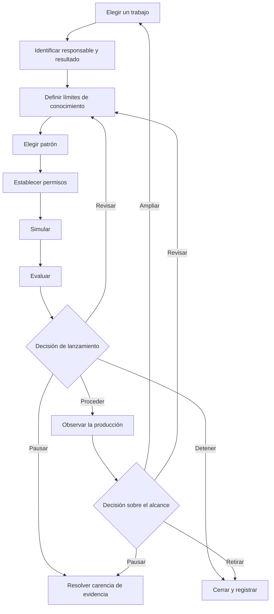

Una hoja de ruta para adoptar agentes de IA debe llevar un trabajo bien delimitado por una serie de controles de evidencia. En cada control, un responsable identificado decide si se debe proceder, revisar, pausar o detener. La producción no pone fin al plan. La hoja de ruta también debe definir la supervisión, la intervención, la recuperación, la retirada y la evidencia necesaria antes de ampliar el alcance del agente.

Esta estructura resulta más útil que un calendario fijo de 30, 60 o 90 días. Un calendario indica cuándo espera avanzar un equipo. Un control de evidencia registra lo que el equipo debe saber antes de avanzar.

## La hoja de ruta de un vistazo

La secuencia tiene nueve fases:

1. Elegir un trabajo delimitado.
2. Identificar al responsable, los usuarios, el resultado y la referencia de base.
3. Definir los límites de conocimiento y datos.
4. Elegir un patrón de agente solo si el trabajo lo necesita.
5. Establecer los límites de las herramientas, los permisos y las decisiones humanas.
6. Simular el trabajo y sus rutas de fallo.
7. Evaluar los resultados según criterios declarados.
8. Tomar una decisión de lanzamiento con una responsabilidad definida.
9. Observar la producción y decidir si se debe revisar, ampliar, pausar o retirar.

**Texto alternativo del diagrama:** La hoja de ruta comienza con un trabajo, un responsable y un resultado, unos límites de conocimiento, un patrón adecuado y permisos. La simulación y la evaluación conducen a una decisión de lanzamiento. La decisión puede llevar a una producción supervisada, volver para revisión, pausar por falta de evidencia o detenerse. Más adelante, la evidencia de producción sustenta una decisión independiente de ampliar, revisar, pausar o retirar.

## Empiece por los estados de evidencia, no por expresiones de confianza

Los equipos suelen usar palabras como *preparado*, *seguro* y *funciona* antes de acordar qué significan. Utilice estados de evidencia explícitos en el registro de planificación:

| Estado de evidencia | Significado | Lo que no significa |
|---|---|---|
| `UNKNOWN` | El equipo no ha recopilado suficiente evidencia para evaluar la afirmación. | Fallo, demanda cero o permiso para suponer. |
| `ASSERTED` | Una persona, un proveedor, un documento o un agente formuló la afirmación, y la fuente está registrada. | Confirmación independiente. |
| `OBSERVED` | El equipo registró el comportamiento en una prueba o un contexto operativo identificado. | Que el comportamiento se generalizará más allá de ese contexto. |
| `VERIFIED` | El resultado se comprobó mediante un método y una regla de aceptación declarados. | Que todos los riesgos estén resueltos o que el sistema sea fiable en cualquier contexto. |
| `ACCEPTED` | Un responsable de la decisión revisó la evidencia disponible y aceptó el riesgo residual para un alcance y un periodo definidos. | Aprobación permanente o prueba de que la decisión era correcta. |
| `REJECTED` | La evidencia no cumplió un criterio declarado o no se aceptó el riesgo residual. | Que la idea nunca pueda revisarse o probarse con un alcance distinto. |

Un estado de evidencia pertenece a una afirmación concreta. «El agente completó 47 de 50 casos en el conjunto de pruebas v3» puede tener el estado `OBSERVED`. «El agente está preparado para todas las tareas financieras» no puede heredar ese estado.

## Hoja de ruta de adopción en nueve fases

### 1. Elegir un trabajo delimitado

Empiece por un trabajo que tenga un comienzo, un resultado, un responsable y un destinatario reconocibles. Registre lo que queda fuera del trabajo con el mismo cuidado que lo que queda dentro.

Antes de elegir un agente, pregunte si el trabajo requiere decisiones adaptativas, cambios en el orden de las herramientas o interpretación de entradas incompletas. La orientación actual de Microsoft sobre planificación empresarial recomienda usar código convencional o sistemas no generativos para tareas estructuradas y predecibles que no necesitan la complejidad de un agente. También recomienda pausar los casos de uso cuyos riesgos o salvaguardas no estén claros ([Microsoft, Business plan for AI agents](https://learn.microsoft.com/en-us/azure/cloud-adoption-framework/ai-agents/business-strategy-plan)).

- **Evidencia de entrada:** Se han identificado un trabajo real y el grupo de usuarios afectado.
- **Evidencia de salida:** Se han registrado los límites del trabajo, las tareas excluidas, la alternativa sin IA y la razón por la que un agente puede ser adecuado.
- **Condición de parada:** El trabajo no puede separarse de varios procesos de alto impacto, o ningún responsable puede definir un resultado aceptable.
- **Responsable de la recuperación:** Responsable del proceso empresarial.
- **Decisión humana:** Aceptar los límites del trabajo o elegir un trabajo más restringido o una solución sin agente.

### 2. Identificar al responsable, los usuarios, el resultado y la referencia de base

Identifique a la persona o función responsable del resultado empresarial. Separe esa función de las personas que crean, operan, revisan el riesgo y reciben el resultado. Una persona puede desempeñar varias funciones en un equipo pequeño, pero las responsabilidades deben seguir siendo visibles.

Registre cómo se realiza el trabajo hoy. Una referencia de base puede incluir la tasa de finalización, la carga de revisión, la tasa de corrección, el tiempo transcurrido, el costo u otra medida vinculada al trabajo. Si no existe una referencia de base fiable, escriba `UNKNOWN`; no convierta la ausencia de datos en cero. Tanto Microsoft como OpenAI recomiendan definir los criterios de éxito y un punto actual de comparación antes de usar los resultados para justificar una ampliación ([Microsoft, Define success metrics](https://learn.microsoft.com/en-us/azure/cloud-adoption-framework/ai-agents/business-strategy-plan#define-success-metrics); [OpenAI, A business leader's guide to working with agents](https://cdn.openai.com/business-guides-and-resources/a-business-leaders-guide-to-working-with-agents.pdf)).

- **Evidencia de entrada:** Se ha aceptado el trabajo delimitado.
- **Evidencia de salida:** Se han registrado el responsable empresarial, los usuarios, el destinatario del resultado, la referencia de base, el resultado deseado y la fecha de revisión.
- **Condición de parada:** El resultado deseado no puede medirse ni evaluarse, o no se han identificado los usuarios afectados.
- **Responsable de la recuperación:** Responsable empresarial junto con el responsable de la medición.
- **Decisión humana:** Aceptar el resultado y el método de medición antes de iniciar el desarrollo.

### 3. Definir los límites de conocimiento y datos

Enumere todas las fuentes que el agente puede usar, quién es responsable de ellas, qué vigencia deben tener y qué ocurre cuando entran en conflicto. Registre los datos prohibidos, las restricciones de conservación y la ruta que se seguirá cuando falte una respuesta o esté desactualizada. No trate una carpeta, un índice de recuperación o un prompt largo como prueba de que el conocimiento es correcto.

El NIST AI Risk Management Framework pide a los equipos que documenten la finalidad prevista, los usuarios, el contexto, los límites, la supervisión, los componentes de terceros y los posibles impactos. También indica que la gestión de riesgos debe ser continua, no una lista de comprobación de una sola vez ([NIST, AI RMF Core](https://airc.nist.gov/airmf-resources/airmf/5-sec-core/)).

El NIST AI Risk Management Framework es una orientación contextual voluntaria. No constituye una certificación ni demuestra conformidad, y su aplicación no prueba que un agente sea seguro, fiable, privado, esté protegido o sea adecuado.

- **Evidencia de entrada:** Los campos de responsable, usuario y resultado están completos.
- **Evidencia de salida:** Se han registrado las fuentes permitidas, las entradas prohibidas, las reglas de vigencia, las reglas de conflicto y un responsable del conocimiento.
- **Condición de parada:** Una fuente esencial tiene derechos, responsabilidad, vigencia o sensibilidad desconocidos.
- **Responsable de la recuperación:** Responsable del conocimiento, junto con el responsable pertinente de privacidad, asuntos jurídicos o seguridad cuando la fuente lo requiera.
- **Decisión humana:** Aceptar los límites de los datos y las limitaciones sin resolver para el alcance de esta prueba.

### 4. Elegir el patrón

Elija el patrón menos complejo que pueda completar el trabajo delimitado. Un flujo de trabajo determinista puede ser suficiente. Si el trabajo necesita un agente, empiece con uno, salvo que distintas responsabilidades, límites de seguridad o transferencias hagan necesaria la separación.

La guía de OpenAI para crear agentes recomienda ajustar la orquestación a la complejidad real y empezar con un solo agente antes de pasar a diseños multiagente cuando sea necesario ([OpenAI, A practical guide to building agents](https://cdn.openai.com/business-guides-and-resources/a-practical-guide-to-building-agents.pdf)).

- **Evidencia de entrada:** Los límites de conocimiento y datos son explícitos.
- **Evidencia de salida:** Se han registrado el patrón elegido, las alternativas descartadas, la lista de herramientas, las transferencias y los modos de fallo previstos.
- **Condición de parada:** El patrón propuesto añade actores o herramientas sin una razón específica para el trabajo, o no se ha considerado una alternativa determinista.
- **Responsable de la recuperación:** Responsable técnico.
- **Decisión humana:** Aceptar el patrón y su costo operativo para la prueba delimitada.

### 5. Establecer permisos y límites de decisión

Enumere por separado cada acción de las herramientas. Registre si lee o escribe, qué cuenta utiliza, a qué datos puede acceder, si la acción es reversible y cuál es el impacto máximo de un error. Una etiqueta amplia como «acceso al CRM» oculta la decisión que debe tomar un revisor.

La guía de OpenAI propone evaluar las herramientas según su acceso de lectura o escritura, reversibilidad, permisos e impacto financiero. Recomienda comprobaciones o intervenciones más estrictas para las acciones de alto impacto. Las barreras de protección son una capa y deben combinarse con autenticación, autorización, controles de acceso y medidas habituales de seguridad del software. Estas prácticas no prueban que un sistema sea seguro ([OpenAI, Guardrails and human intervention](https://cdn.openai.com/business-guides-and-resources/a-practical-guide-to-building-agents.pdf)).

Utilice tres límites de decisión:

- **Decisión del agente:** Acciones reversibles y de bajo impacto dentro del trabajo y el alcance de permisos aprobados.
- **Decisión por regla:** Límites deterministas, como comprobaciones de esquemas, límites de reintentos, listas de permisos y topes de gasto, que detienen o derivan el trabajo sin interpretar el riesgo empresarial.
- **Decidido por una persona:** Aceptación del lanzamiento, aceptación del riesgo residual, acceso a datos sensibles o regulados, acciones irreversibles o de alto impacto, excepciones a las políticas, cierre de incidentes y ampliación del alcance o los permisos.

La organización responsable decide a qué grupo pertenece cada acción real. Esta guía no hace una clasificación jurídica, de seguridad o de conformidad para un despliegue concreto.

- **Evidencia de entrada:** El patrón y el inventario de herramientas están completos.
- **Evidencia de salida:** Se han registrado el acceso de privilegios mínimos, las clases de acciones, los puntos de aprobación, los límites de reintentos, los controles de parada, los requisitos de registro y el responsable de la revocación.
- **Condición de parada:** Se desconoce la cuenta de una herramienta, el alcance de los datos, el efecto de escritura, la reversibilidad o la ruta de revocación.
- **Responsable de la recuperación:** Responsable técnico y responsable de los permisos.
- **Decisión humana:** Conceder los permisos delimitados y aceptar cada acción asignada al agente o a las reglas deterministas.

### 6. Simular el trabajo y las rutas de fallo

Pruebe el trabajo de principio a fin en un contexto controlado. Incluya casos habituales, entradas ambiguas, conocimiento desactualizado o contradictorio, permisos denegados, interrupciones de herramientas, resultados mal formados, riesgo de escritura duplicada y el momento en que una persona debe asumir el control. Pruebe el paso más difícil en lugar de dedicar todo el piloto a ejemplos sencillos.

Registre la cohorte de entradas, el entorno, las versiones, el resultado esperado, el resultado real, el revisor y cualquier diferencia conocida respecto de la producción. Una simulación aporta evidencia sobre las condiciones probadas. No demuestra un rendimiento fuera de ellas.

- **Evidencia de entrada:** Los límites de permisos y decisiones están aprobados para la simulación.
- **Evidencia de salida:** Se han registrado los casos de prueba, los resultados, los fallos, la incertidumbre, el comportamiento de la intervención y los resultados de la recuperación.
- **Condición de parada:** Un fallo crítico no puede contenerse, una escritura puede repetirse sin un comprobante, o el equipo no puede reconstruir lo que hizo el agente.
- **Responsable de la recuperación:** Responsable de la prueba junto con el responsable de la herramienta o del incidente.
- **Decisión humana:** Aceptar la evidencia de la simulación como suficiente para una evaluación formal o devolver el sistema para su revisión.

### 7. Evaluar según criterios declarados

Evalúe el resultado según criterios escritos antes de la ejecución. Incluya la corrección y la integridad de la tarea, el cumplimiento de las políticas, el comportamiento de las herramientas, la calidad de la intervención, la recuperación y la medida empresarial seleccionada en la fase 2. Mantenga los casos fallidos e inciertos en el registro.

El NIST indica que deben documentarse los métodos de evaluación, las métricas, las condiciones de prueba, la incertidumbre y las limitaciones, y que los sistemas deben probarse antes del despliegue y durante su operación. Su marco también distingue la medición de la decisión posterior de proceder ([NIST, AI RMF Core, Measure and Manage](https://airc.nist.gov/airmf-resources/airmf/5-sec-core/)).

- **Evidencia de entrada:** Los registros de la simulación están suficientemente completos para reproducirlos o inspeccionarlos.
- **Evidencia de salida:** Cada criterio de aceptación tiene un resultado, un estado de evidencia, una limitación y un revisor.
- **Condición de parada:** Falla un criterio crítico, el método de prueba no puede respaldar la afirmación formulada, o una incertidumbre material queda oculta en una puntuación agregada.
- **Responsable de la recuperación:** Responsable de la evaluación.
- **Decisión humana:** Aceptar o rechazar el resultado de la evaluación para el alcance exacto del lanzamiento propuesto.

### 8. Tomar la decisión de lanzamiento

Reúna la evidencia para el responsable de la decisión. El registro de la decisión debe identificar la versión, el alcance, los usuarios, los permisos, las limitaciones conocidas, los riesgos sin resolver, el plan de supervisión, el método de reversión o apagado, la fecha de revisión y la evidencia utilizada.

Utilice una de estas cuatro decisiones:

- `PROCEED`: La evidencia cumple los criterios declarados y el responsable acepta el riesgo residual para el alcance y el periodo de revisión identificados.
- `REVISE`: Las carencias corregibles tienen responsables y se ha planificado otra evaluación delimitada.
- `PAUSE`: No está disponible una dependencia, un permiso, un revisor o un elemento de evidencia esencial.
- `STOP`: El caso de uso, el patrón del agente o el riesgo residual no son aceptables para el contexto previsto.

La función Manage del NIST pide determinar si el sistema cumple su finalidad prevista y si el desarrollo o el despliegue deben continuar. Es una decisión de gobernanza basada en evidencia, no una puntuación que un agente se concede a sí mismo ([NIST, Manage 1.1](https://airc.nist.gov/airmf-resources/airmf/5-sec-core/)).

- **Evidencia de entrada:** Los resultados de la evaluación y el plan operativo están completos.
- **Evidencia de salida:** Un responsable identificado firma una decisión para una versión, un alcance y un periodo de revisión fijos.
- **Condición de parada:** No existe un responsable, un método de apagado, una ruta de incidentes o una declaración aceptada de riesgo residual.
- **Responsable de la recuperación:** Responsable del lanzamiento.
- **Decisión humana:** La propia decisión de lanzamiento. Un control automatizado puede reunir evidencia o aplicar una regla previa, pero no amplía silenciosamente el alcance aprobado.

### 9. Observar la producción y decidir qué ocurre después

Supervise los resultados de las tareas, las acciones fallidas y anuladas, el volumen de intervenciones, los errores de permisos, la vigencia de las fuentes, los comentarios de los usuarios, los incidentes, el tiempo de recuperación, el costo y la medida empresarial. Defina quién lee cada señal y qué umbral activa una acción.

Microsoft recomienda una ampliación por fases basada en el valor observado, no en la disponibilidad técnica, junto con una gestión continua del ciclo de vida. El NIST incluye la supervisión, la apelación y la intervención, la retirada, la respuesta a incidentes, la recuperación y la gestión del cambio en la planificación posterior al despliegue ([Microsoft, Manage AI agents across your organization](https://learn.microsoft.com/en-us/azure/cloud-adoption-framework/ai-agents/integrate-manage-operate); [NIST, Manage 4.1](https://airc.nist.gov/airmf-resources/airmf/5-sec-core/)).

- **Evidencia de entrada:** Existe una decisión de lanzamiento delimitada.
- **Evidencia de salida:** El periodo de revisión contiene suficiente evidencia observada para una nueva decisión, y las incógnitas siguen visibles.
- **Condición de parada:** Desviación crítica, acceso inesperado, escrituras no contenidas, falta de evidencia de auditoría, incumplimiento de un umbral o pérdida de la ruta de apagado y recuperación.
- **Responsable de la recuperación:** Responsable de operaciones junto con el responsable del incidente.
- **Decisión humana:** Continuar sin cambios, revisar, reducir, pausar, ampliar o retirar. La ampliación crea un nuevo trabajo delimitado y vuelve a la fase 1.

## Registro reutilizable de planificación de agentes de IA

Copie este registro para un trabajo. No complete la evidencia que falta con una suposición optimista.

### Identidad y alcance

| Campo | Entrada |
|---|---|
| ID y versión del registro de planificación | |
| Nombre del trabajo | |
| Usuarios previstos y destinatario del resultado | |
| Tareas incluidas | |
| Tareas excluidas | |
| Alternativa sin IA considerada | |
| Responsable empresarial | |
| Responsable técnico | |
| Responsable del conocimiento y los datos | |
| Responsable de los permisos | |
| Responsable de la evaluación | |
| Responsable de operaciones y recuperación | |

### Resultado y evidencia

| Campo | Entrada | Estado de evidencia | Fuente o método | Fecha de revisión |
|---|---|---|---|---|
| Referencia de base actual | | | | |
| Resultado deseado | | | | |
| Interés de los usuarios | | | | |
| Viabilidad técnica | | | | |
| Riesgos e impactos conocidos | | | | |
| Riesgos no medidos o sin resolver | | `UNKNOWN` | | |

### Conocimiento, patrón y permisos

| Campo | Entrada |
|---|---|
| Fuentes de conocimiento permitidas y reglas de vigencia | |
| Datos y usos prohibidos | |
| Comportamiento ante conflictos o conocimiento ausente | |
| Patrón seleccionado y alternativas descartadas | |
| Herramientas e identidades de las cuentas | |
| Acciones de lectura permitidas al agente | |
| Acciones de escritura permitidas al agente | |
| Límites deterministas y condiciones de activación | |
| Acciones que requieren aprobación humana | |
| Límites de reintentos, gasto y acciones | |
| Método de revocación y apagado | |

### Controles de las fases

| Fase | Evidencia de entrada | Evidencia de salida | Condición de parada | Responsable de la recuperación | Siguiente decisión |
|---|---|---|---|---|---|
| Elegir el trabajo | | | | | |
| Identificar responsable y resultado | | | | | |
| Definir el conocimiento | | | | | |
| Elegir el patrón | | | | | |
| Establecer permisos | | | | | |
| Simular | | | | | |
| Evaluar | | | | | |
| Aprobar el lanzamiento | | | | | |
| Observar y revisar | | | | | |

### Evaluación y decisión de lanzamiento

| Campo | Entrada |
|---|---|
| Cohorte de prueba, entorno y versiones | |
| Criterios y umbrales declarados | |
| Resultados reales, fallos e incertidumbre | |
| Resultado de la intervención y la recuperación | |
| Decisión | `PROCEED`, `REVISE`, `PAUSE` o `STOP` |
| Responsable de la decisión y fecha | |
| Alcance y riesgo residual aceptados | |
| Ruta de supervisión e incidentes | |
| Periodo de revisión | |
| Condiciones de ampliación, revisión, pausa y retirada | |

## Antes de ampliar

La ampliación es una nueva decisión, no la recompensa predeterminada por llegar a producción. Exija evidencia de más de un ciclo operativo cuando el trabajo lo permita. Compruebe si el resultado sigue siendo útil, si se entienden las intervenciones y correcciones, y si los límites originales de permisos y datos siguen siendo adecuados.

No amplíe cuando la evidencia principal sea una anécdota, una afirmación de un proveedor, una sola ejecución satisfactoria o una puntuación agregada que oculte fallos críticos. No amplíe porque la implementación pueda acceder a más herramientas. Amplíe solo cuando un responsable acepte la evidencia y el nuevo alcance tenga sus propios límites, pruebas, condiciones de parada y plan de recuperación.

## Siguiente paso

Utilice el registro de planificación para definir un trabajo y compárelo después con los patrones disponibles de agentes y flujos de trabajo. Si los permisos, el responsable del riesgo residual o la decisión de lanzamiento siguen sin estar claros, consulte el [modelo de gobernanza de agentes de IA, en inglés](/en/governance) antes de crear la ruta de producción.

## Método, autoría y limitaciones

**Quién:** Toone Content es el autor organizacional. Hexagonal.io es el editor. La responsabilidad editorial y las prácticas de selección de fuentes se describen en la [política editorial, en inglés](/en/editorial-policy). Para preguntas y solicitudes de corrección, puede [contactar con Toone, en inglés](/en/contact). Este enlace directo es una opción alternativa candidata en inglés: no se afirma que funcione hasta que el equipo Technical implemente una página pública accesible en `/en/contact` y verifique una respuesta pública `200`.

**Cómo:** Esta guía sintetiza orientaciones primarias actuales de Microsoft, NIST y OpenAI en una secuencia de planificación y un registro reutilizable. La asistencia automatizada ayudó a recopilar, mapear y estructurar las fuentes. Las afirmaciones de las fuentes se comprobaron con los materiales enlazados, y la síntesis de Toone está identificada como tal. No se afirma ningún despliegue de clientes ni una adopción práctica de Toone. Límite de revisión: Content Editor es la función responsable de la revisión editorial; esta fuente de autoría organizacional no afirma que haya habido revisión por una persona identificada ni revisión especializada en la materia, de producto, jurídica, de privacidad, de seguridad o de despliegue.

**Por qué:** La guía ayuda a operadores y responsables de equipos funcionales a tomar decisiones de adopción delimitadas con evidencia, responsabilidad y rutas de parada y recuperación visibles. No es asesoramiento jurídico ni de seguridad, privacidad o conformidad. No demuestra que un agente sea seguro, fiable o adecuado para un despliegue concreto. Esos juicios requieren las personas responsables y la evidencia del contexto correspondiente.

## Fuentes

- Microsoft Learn, [Business plan for AI agents](https://learn.microsoft.com/en-us/azure/cloud-adoption-framework/ai-agents/business-strategy-plan), consultado el 13 de agosto de 2026.
- Microsoft Learn, [Organizational readiness for AI agents](https://learn.microsoft.com/en-us/azure/cloud-adoption-framework/ai-agents/organization-people-readiness-plan), actualizado el 4 de diciembre de 2025.
- Microsoft Learn, [Manage AI agents across your organization](https://learn.microsoft.com/en-us/azure/cloud-adoption-framework/ai-agents/integrate-manage-operate), actualizado el 4 de diciembre de 2025.
- NIST AI Resource Center, [AI Risk Management Framework Core](https://airc.nist.gov/airmf-resources/airmf/5-sec-core/), extracto del AI RMF 1.0; la página indica que hay una revisión en curso.
- NIST, [Artificial Intelligence Risk Management Framework: Generative Artificial Intelligence Profile](https://www.nist.gov/publications/artificial-intelligence-risk-management-framework-generative-artificial-intelligence), publicado el 26 de julio de 2024; página actualizada el 8 de abril de 2026.
- OpenAI, [A business leader's guide to working with agents](https://cdn.openai.com/business-guides-and-resources/a-business-leaders-guide-to-working-with-agents.pdf), PDF consultado el 13 de agosto de 2026.
- OpenAI, [A practical guide to building agents](https://cdn.openai.com/business-guides-and-resources/a-practical-guide-to-building-agents.pdf), PDF consultado el 13 de agosto de 2026.

## Notas de implementación bajo responsabilidad de Content

- Presente el registro de planificación como tablas HTML accesibles, no como una imagen.
- Presente el diagrama de la hoja de ruta en un formato rastreable y conserve su texto alternativo descriptivo.
- Utilice la autoría visible `Toone Content` y una identidad de autor correspondiente en el tipo `Article`.
- Utilice solo datos estructurados `Article` y `BreadcrumbList` correctos.
- No añada marcado FAQ salvo que exista una FAQ visible y apta y una decisión técnica vigente.
- Los candidatos a enlaces internos distintos de las rutas en inglés de gobernanza y política editorial siguen condicionados a que sus destinos sean aptos durante el montaje.
- `/en/contact` sigue siendo una dependencia de Technical: el montaje no debe tratarla como una ruta activa ni sustituir la alternativa en inglés por una ruta de la configuración regional sin verificación pública.
- El indicador de medición aprobado es el uso sin datos personales identificables del registro de planificación, seguido del avance hacia la selección o la gobernanza después de G3. Todavía no existe una referencia de base para la página, y la demanda desconocida no debe registrarse como cero.
