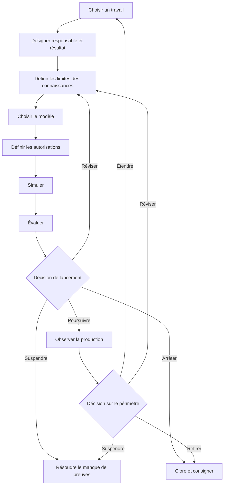

Une feuille de route pour l’adoption d’agents d’IA doit faire progresser un travail bien circonscrit à travers une série de jalons de preuve. À chaque jalon, un responsable désigné décide s’il faut poursuivre, réviser, suspendre ou arrêter. La mise en production ne clôt pas le plan. La feuille de route doit aussi définir la surveillance, la reprise en main, le rétablissement, le retrait et les preuves nécessaires avant toute extension du périmètre de l’agent.

Cette structure est plus utile qu’un calendrier fixe de 30, 60 ou 90 jours. Un calendrier indique quand une équipe espère avancer. Un jalon de preuve consigne ce que l’équipe doit savoir avant d’avancer.

## Vue d’ensemble de la feuille de route

La séquence comporte neuf phases :

1. Choisir un travail circonscrit.
2. Désigner le responsable, les utilisateurs, le résultat et la référence de départ.
3. Définir les limites des connaissances et des données.
4. Choisir un modèle d’agent seulement si le travail en nécessite un.
5. Définir les limites des outils, des autorisations et des décisions humaines.
6. Simuler le travail et ses scénarios d’échec.
7. Évaluer les résultats selon les critères déclarés.
8. Prendre une décision de lancement dont la responsabilité est clairement attribuée.
9. Observer la production et décider s’il faut réviser, étendre, suspendre ou retirer.

**Texte alternatif du diagramme:** La feuille de route commence par un travail, un responsable et un résultat, des limites de connaissances, un modèle adapté et des autorisations. La simulation et l’évaluation conduisent à une décision de lancement. Cette décision peut mener à une production surveillée, renvoyer à une révision, suspendre le projet faute de preuves ou l’arrêter. Les preuves recueillies en production servent ensuite à prendre une décision distincte d’extension, de révision, de suspension ou de retrait.

## Commencer par les états de preuve, pas par un langage de confiance

Les équipes emploient souvent des termes comme *prêt*, *sûr* ou *fonctionne* avant de s’accorder sur leur signification. Utilisez plutôt des états de preuve explicites dans le registre de planification :

| État de preuve | Signification | Ce qu’il ne signifie pas |
|---|---|---|
| `UNKNOWN` | L’équipe n’a pas recueilli assez de preuves pour évaluer l’affirmation. | Un échec, une demande nulle ou l’autorisation de supposer. |
| `ASSERTED` | Une personne, un fournisseur, un document ou un agent a formulé l’affirmation, et la source est consignée. | Une confirmation indépendante. |
| `OBSERVED` | L’équipe a consigné le comportement dans un test ou un contexte d’exploitation désigné. | Que le comportement se généralisera au-delà de ce contexte. |
| `VERIFIED` | Le résultat a été contrôlé selon une méthode et une règle d’acceptation déclarées. | Que tous les risques sont résolus ou que le système est fiable dans tous les contextes. |
| `ACCEPTED` | Un responsable de la décision a examiné les preuves disponibles et accepté le risque résiduel pour un périmètre et une période définis. | Une approbation permanente ou la preuve que la décision était correcte. |
| `REJECTED` | Les preuves n’ont pas satisfait un critère déclaré ou le risque résiduel n’a pas été accepté. | Que l’idée ne pourra jamais être révisée ou testée dans un autre périmètre. |

Un état de preuve s’applique à une affirmation précise. « L’agent a terminé 47 des 50 cas du jeu de tests v3 » peut être `OBSERVED`. « L’agent est prêt pour toutes les tâches financières » ne peut pas hériter de cet état.

## La feuille de route d’adoption en neuf phases

### 1. Choisir un travail circonscrit

Commencez par un travail dont le début, le résultat, le responsable et le destinataire sont identifiables. Consignez ce qui n’en fait pas partie avec autant de soin que ce qui en fait partie.

Avant de choisir un agent, demandez-vous si le travail exige des décisions adaptatives, un ordre d’utilisation des outils qui varie ou l’interprétation d’entrées incomplètes. Les recommandations actuelles de Microsoft sur la planification métier préconisent du code classique ou des systèmes non génératifs pour les tâches structurées et prévisibles qui ne nécessitent pas la complexité d’un agent. Elles recommandent aussi de suspendre les cas d’usage dont les risques ou les mesures de protection ne sont pas clairs ([Microsoft, Business plan for AI agents](https://learn.microsoft.com/en-us/azure/cloud-adoption-framework/ai-agents/business-strategy-plan)).

- **Preuve d’entrée:** Un travail réel et le groupe d’utilisateurs concerné sont désignés.
- **Preuve de sortie:** Les limites du travail, les tâches exclues, l’alternative sans IA et la raison pour laquelle un agent pourrait convenir sont consignées.
- **Condition d’arrêt:** Le travail ne peut pas être séparé de plusieurs processus à fort impact, ou aucun responsable ne peut définir un résultat acceptable.
- **Responsable du rétablissement:** Responsable du processus métier.
- **Décision humaine:** Accepter les limites du travail ou choisir un travail plus restreint ou une solution sans agent.

### 2. Désigner le responsable, les utilisateurs, le résultat et la référence de départ

Désignez la personne ou la fonction responsable du résultat métier. Distinguez cette fonction des personnes qui construisent et exploitent le système, examinent les risques et reçoivent le résultat. Dans une petite équipe, une personne peut cumuler plusieurs fonctions, mais les responsabilités doivent rester visibles.

Consignez la façon dont le travail est effectué aujourd’hui. Une référence de départ peut comprendre le taux d’achèvement, la charge de révision, le taux de correction, le délai écoulé, le coût ou une autre mesure liée au travail. Si aucune référence fiable n’existe, inscrivez `UNKNOWN`; ne transformez pas l’absence de données en zéro. Microsoft et OpenAI recommandent de définir les critères de réussite et un point de comparaison actuel avant d’utiliser les résultats pour justifier une extension ([Microsoft, Define success metrics](https://learn.microsoft.com/en-us/azure/cloud-adoption-framework/ai-agents/business-strategy-plan#define-success-metrics); [OpenAI, A business leader's guide to working with agents](https://cdn.openai.com/business-guides-and-resources/a-business-leaders-guide-to-working-with-agents.pdf)).

- **Preuve d’entrée:** Le travail circonscrit a été accepté.
- **Preuve de sortie:** Le responsable métier, les utilisateurs, le destinataire du résultat, la référence de départ, le résultat souhaité et la date de révision sont consignés.
- **Condition d’arrêt:** Le résultat souhaité ne peut pas être mesuré ni évalué, ou les utilisateurs concernés n’ont pas été identifiés.
- **Responsable du rétablissement:** Responsable métier avec le responsable de la mesure.
- **Décision humaine:** Accepter le résultat et la méthode de mesure avant le début du développement.

### 3. Définir les limites des connaissances et des données

Répertoriez chaque source que l’agent peut utiliser, son responsable, la fraîcheur requise et la conduite à tenir en cas de conflit entre les sources. Consignez les données interdites, les contraintes de conservation et le traitement prévu en cas de réponse manquante ou obsolète. Ne considérez pas qu’un dossier, un index de récupération ou un long prompt prouve l’exactitude des connaissances.

Le NIST AI Risk Management Framework demande aux équipes de documenter l’objectif prévu, les utilisateurs, le contexte, les limites, la supervision, les composants tiers et les impacts possibles. Il précise aussi que la gestion des risques doit être continue et non réduite à une liste de contrôle ponctuelle ([NIST, AI RMF Core](https://airc.nist.gov/airmf-resources/airmf/5-sec-core/)).

Le NIST AI Risk Management Framework est une orientation contextuelle volontaire. Il ne constitue ni une certification ni une preuve de conformité, et son application ne prouve pas qu’un agent est sûr, fiable, respectueux de la vie privée, sécurisé ou adapté.

- **Preuve d’entrée:** Les champs relatifs au responsable, aux utilisateurs et au résultat sont remplis.
- **Preuve de sortie:** Les sources autorisées, les entrées interdites, les règles de fraîcheur, les règles de conflit et un responsable des connaissances sont consignés.
- **Condition d’arrêt:** Les droits, la responsabilité, la fraîcheur ou la sensibilité d’une source essentielle sont inconnus.
- **Responsable du rétablissement:** Responsable des connaissances, avec le responsable compétent en matière de vie privée, de droit ou de sécurité lorsque la source l’exige.
- **Décision humaine:** Accepter les limites des données et les restrictions non résolues pour le périmètre de ce test.

### 4. Choisir le modèle

Choisissez le modèle le moins complexe qui puisse accomplir le travail circonscrit. Un flux de travail déterministe peut suffire. Si le travail nécessite un agent, commencez par un seul agent, sauf si des responsabilités distinctes, des limites de sécurité ou des transferts imposent une séparation.

Le guide d’OpenAI sur la création d’agents recommande d’adapter l’orchestration à la complexité réelle et de commencer avec un seul agent avant de passer, si nécessaire, à des architectures multi-agents ([OpenAI, A practical guide to building agents](https://cdn.openai.com/business-guides-and-resources/a-practical-guide-to-building-agents.pdf)).

- **Preuve d’entrée:** Les limites des connaissances et des données sont explicites.
- **Preuve de sortie:** Le modèle retenu, les solutions écartées, la liste des outils, les transferts et les modes d’échec prévus sont consignés.
- **Condition d’arrêt:** Le modèle proposé ajoute des acteurs ou des outils sans raison propre au travail, ou une solution déterministe n’a pas été envisagée.
- **Responsable du rétablissement:** Responsable technique.
- **Décision humaine:** Accepter le modèle et son coût d’exploitation pour le test circonscrit.

### 5. Définir les autorisations et les limites de décision

Énumérez séparément chaque action permise aux outils. Indiquez si elle lit ou écrit, quel compte elle utilise, à quelles données elle peut accéder, si elle est réversible et quel serait l’impact maximal d’une erreur. Une désignation générale comme « accès au CRM » masque la décision qu’une personne chargée de la révision doit prendre.

Le guide d’OpenAI propose d’évaluer les outils selon leurs accès en lecture ou en écriture, leur réversibilité, leurs autorisations et leur impact financier. Il recommande des contrôles ou une intervention renforcés pour les actions à fort impact. Les garde-fous ne constituent qu’une couche et doivent s’accompagner de l’authentification, de l’autorisation, de contrôles d’accès et des mesures habituelles de sécurité logicielle. Ces pratiques ne prouvent pas qu’un système est sûr ([OpenAI, Guardrails and human intervention](https://cdn.openai.com/business-guides-and-resources/a-practical-guide-to-building-agents.pdf)).

Utilisez trois limites de décision :

- **Décidé par l’agent:** Actions réversibles et à faible impact, à l’intérieur du travail et du périmètre d’autorisations approuvés.
- **Décidé par règle:** Limites déterministes, comme les contrôles de schéma, les plafonds de nouvelle tentative, les listes d’autorisation et les plafonds de dépenses, qui arrêtent ou redirigent le travail sans interpréter le risque métier.
- **Décidé par une personne:** Acceptation du lancement, acceptation du risque résiduel, accès aux données sensibles ou réglementées, actions à fort impact ou irréversibles, exceptions aux règles internes, clôture des incidents et extension du périmètre ou des autorisations.

L’organisation responsable détermine la catégorie de chaque action réelle. Ce guide n’établit aucune classification juridique, de sécurité ou de conformité pour un déploiement particulier.

- **Preuve d’entrée:** Le modèle et l’inventaire des outils sont complets.
- **Preuve de sortie:** Les accès selon le principe du moindre privilège, les catégories d’actions, les points d’approbation, les limites de nouvelle tentative, les contrôles d’arrêt, les exigences de journalisation et le responsable de la révocation sont consignés.
- **Condition d’arrêt:** Le compte d’un outil, la portée de son accès aux données, l’effet d’une écriture, sa réversibilité ou le processus de révocation est inconnu.
- **Responsable du rétablissement:** Responsable technique et responsable des autorisations.
- **Décision humaine:** Accorder les autorisations circonscrites et accepter chaque action confiée à l’agent ou aux règles déterministes.

### 6. Simuler le travail et les scénarios d’échec

Testez le travail de bout en bout dans un contexte contrôlé. Incluez les cas courants, les entrées ambiguës, les connaissances obsolètes ou contradictoires, les autorisations refusées, les indisponibilités d’outils, les sorties mal formées, le risque d’écriture en double et le moment où une personne doit reprendre la main. Testez l’étape la plus difficile au lieu de consacrer tout le pilote à des exemples faciles.

Consignez la cohorte d’entrées, l’environnement, les versions, le résultat attendu, le résultat réel, la personne chargée de la révision et tout écart connu avec la production. Une simulation fournit des preuves sur les conditions testées. Elle n’établit pas les performances au-delà de ces conditions.

- **Preuve d’entrée:** Les limites d’autorisation et de décision sont approuvées pour la simulation.
- **Preuve de sortie:** Les cas de test, les sorties, les échecs, les incertitudes, le comportement lors de l’intervention et les résultats du rétablissement sont consignés.
- **Condition d’arrêt:** Un échec critique ne peut pas être contenu, une écriture risque d’être répétée sans reçu, ou l’équipe ne peut pas reconstituer les actions de l’agent.
- **Responsable du rétablissement:** Responsable du test avec le responsable de l’outil ou de l’incident.
- **Décision humaine:** Accepter les preuves de la simulation comme suffisantes pour une évaluation formelle, ou renvoyer le système en révision.

### 7. Évaluer selon les critères déclarés

Évaluez le résultat selon des critères écrits avant l’exécution. Incluez l’exactitude et l’exhaustivité de la tâche, le respect des règles internes, le comportement des outils, la qualité de l’intervention, le rétablissement et la mesure métier choisie à la phase 2. Conservez les cas d’échec et d’incertitude dans le registre.

Le NIST indique que les méthodes d’évaluation, les mesures, les conditions de test, les incertitudes et les limites doivent être documentées, et que les systèmes doivent être testés avant le déploiement puis pendant leur exploitation. Son cadre distingue aussi la mesure de la décision ultérieure de poursuivre ([NIST, AI RMF Core, Measure and Manage](https://airc.nist.gov/airmf-resources/airmf/5-sec-core/)).

- **Preuve d’entrée:** Les registres de simulation sont assez complets pour permettre une reproduction ou une inspection.
- **Preuve de sortie:** Chaque critère d’acceptation possède un résultat, un état de preuve, une limite et une personne chargée de la révision.
- **Condition d’arrêt:** Un critère critique échoue, la méthode de test ne permet pas d’étayer l’affirmation formulée, ou une incertitude substantielle est masquée par un score agrégé.
- **Responsable du rétablissement:** Responsable de l’évaluation.
- **Décision humaine:** Accepter ou rejeter le résultat de l’évaluation pour le périmètre exact du lancement proposé.

### 8. Prendre la décision de lancement

Rassemblez les preuves pour le responsable de la décision. Le registre de décision doit indiquer la version, le périmètre, les utilisateurs, les autorisations, les limites connues, les risques non résolus, le plan de surveillance, la méthode de retour en arrière ou d’arrêt, la date de révision et les preuves utilisées.

Utilisez l’une des quatre décisions suivantes :

- `PROCEED`: Les preuves satisfont aux critères déclarés et le responsable accepte le risque résiduel pour le périmètre et la période de révision désignés.
- `REVISE`: Les lacunes qui peuvent être corrigées ont des responsables, et une nouvelle évaluation circonscrite est planifiée.
- `PAUSE`: Une dépendance, une autorisation, une personne chargée de la révision ou un élément de preuve essentiel n’est pas disponible.
- `STOP`: Le cas d’usage, le modèle d’agent ou le risque résiduel est inacceptable dans le contexte prévu.

La fonction Manage du NIST demande de déterminer si le système atteint son objectif prévu et si son développement ou son déploiement doit se poursuivre. Il s’agit d’une décision de gouvernance éclairée par les preuves, et non d’un score que l’agent s’attribue lui-même ([NIST, Manage 1.1](https://airc.nist.gov/airmf-resources/airmf/5-sec-core/)).

- **Preuve d’entrée:** Les résultats de l’évaluation et le plan d’exploitation sont complets.
- **Preuve de sortie:** Un responsable désigné signe une décision pour une version, un périmètre et une période de révision fixes.
- **Condition d’arrêt:** Il n’existe aucun responsable, aucune méthode d’arrêt, aucun processus de traitement des incidents ou aucune déclaration acceptée de risque résiduel.
- **Responsable du rétablissement:** Responsable du lancement.
- **Décision humaine:** La décision de lancement elle-même. Un jalon automatisé peut rassembler des preuves ou appliquer une règle préalable, mais il n’élargit pas silencieusement le périmètre approuvé.

### 9. Observer la production et décider de la suite

Surveillez les résultats des tâches, les actions échouées et annulées, le volume d’interventions, les erreurs d’autorisation, la fraîcheur des sources, les retours des utilisateurs, les incidents, le délai de rétablissement, le coût et la mesure métier. Définissez qui consulte chaque signal et quel seuil déclenche une action.

Microsoft recommande une extension par étapes fondée sur la valeur observée plutôt que sur la disponibilité technique, ainsi qu’une gestion continue du cycle de vie. Le NIST inclut la surveillance, la contestation et la reprise en main, le retrait, la réponse aux incidents, le rétablissement et la gestion des changements dans la planification postérieure au déploiement ([Microsoft, Manage AI agents across your organization](https://learn.microsoft.com/en-us/azure/cloud-adoption-framework/ai-agents/integrate-manage-operate); [NIST, Manage 4.1](https://airc.nist.gov/airmf-resources/airmf/5-sec-core/)).

- **Preuve d’entrée:** Une décision de lancement circonscrite existe.
- **Preuve de sortie:** La période de révision contient assez de preuves observées pour permettre une nouvelle décision, et les inconnues restent visibles.
- **Condition d’arrêt:** Dérive critique, accès inattendu, écritures non contenues, absence de preuves d’audit, dépassement d’un seuil ou perte des moyens d’arrêt et de rétablissement.
- **Responsable du rétablissement:** Responsable de l’exploitation avec le responsable de l’incident.
- **Décision humaine:** Continuer sans modification, réviser, réduire, suspendre, étendre ou retirer. L’extension crée un nouveau travail circonscrit et revient à la phase 1.

## Registre réutilisable de planification d’un agent d’IA

Copiez ce registre pour un travail. Ne remplacez pas les preuves manquantes par une hypothèse optimiste.

### Identité et périmètre

| Champ | Entrée |
|---|---|
| ID et version du registre de planification | |
| Nom du travail | |
| Utilisateurs prévus et destinataire du résultat | |
| Tâches incluses | |
| Tâches exclues | |
| Alternative sans IA envisagée | |
| Responsable métier | |
| Responsable technique | |
| Responsable des connaissances et des données | |
| Responsable des autorisations | |
| Responsable de l’évaluation | |
| Responsable de l’exploitation et du rétablissement | |

### Résultat et preuves

| Champ | Entrée | État de preuve | Source ou méthode | Date de révision |
|---|---|---|---|---|
| Référence de départ actuelle | | | | |
| Résultat souhaité | | | | |
| Intérêt des utilisateurs | | | | |
| Faisabilité technique | | | | |
| Risques et impacts connus | | | | |
| Risques non mesurés ou non résolus | | `UNKNOWN` | | |

### Connaissances, modèle et autorisations

| Champ | Entrée |
|---|---|
| Sources de connaissances autorisées et règles de fraîcheur | |
| Données et usages interdits | |
| Comportement en cas de conflit ou de connaissances manquantes | |
| Modèle retenu et solutions écartées | |
| Outils et identités des comptes | |
| Actions de lecture autorisées à l’agent | |
| Actions d’écriture autorisées à l’agent | |
| Limites déterministes et seuils de déclenchement | |
| Actions soumises à une approbation humaine | |
| Plafonds de nouvelle tentative, de dépenses et d’actions | |
| Méthode de révocation et d’arrêt | |

### Jalons des phases

| Phase | Preuve d’entrée | Preuve de sortie | Condition d’arrêt | Responsable du rétablissement | Décision suivante |
|---|---|---|---|---|---|
| Choisir le travail | | | | | |
| Désigner responsable et résultat | | | | | |
| Définir les connaissances | | | | | |
| Choisir le modèle | | | | | |
| Définir les autorisations | | | | | |
| Simuler | | | | | |
| Évaluer | | | | | |
| Approuver le lancement | | | | | |
| Observer et réexaminer | | | | | |

### Évaluation et décision de lancement

| Champ | Entrée |
|---|---|
| Cohorte de test, environnement et versions | |
| Critères et seuils déclarés | |
| Résultats réels, échecs et incertitudes | |
| Résultat de l’intervention et du rétablissement | |
| Décision | `PROCEED`, `REVISE`, `PAUSE` ou `STOP` |
| Responsable de la décision et date | |
| Périmètre et risque résiduel acceptés | |
| Processus de surveillance et de traitement des incidents | |
| Période de révision | |
| Déclencheurs d’extension, de révision, de suspension et de retrait | |

## Avant toute extension

L’extension est une nouvelle décision, et non la récompense par défaut pour une mise en production. Exigez des preuves couvrant plusieurs cycles d’exploitation lorsque le travail le permet. Vérifiez si le résultat reste utile, si les interventions et les corrections sont comprises et si les limites initiales d’autorisation et de données restent adaptées.

N’étendez pas le périmètre lorsque les principales preuves se résument à une anecdote, une affirmation d’un fournisseur, une seule exécution réussie ou un score agrégé qui masque des échecs critiques. Ne l’étendez pas parce que la mise en œuvre peut accéder à davantage d’outils. Étendez-le seulement lorsqu’un responsable accepte les preuves et que le nouveau périmètre reçoit ses propres limites, tests, conditions d’arrêt et plan de rétablissement.

## Étape suivante

Utilisez le registre de planification pour définir un travail, puis comparez-le aux modèles d’agents et de flux de travail disponibles. Si les autorisations, le responsable du risque résiduel ou la décision de lancement ne sont toujours pas clairs, consultez le [modèle de gouvernance des agents d’IA, en anglais](/en/governance) avant de construire le parcours de production.

## Méthode, auteur et limites

**Qui:** Toone Content est l’auteur organisationnel. Hexagonal.io est l’éditeur. La responsabilité éditoriale et les pratiques de sélection des sources sont décrites dans la [politique éditoriale, en anglais](/en/editorial-policy). Pour toute question ou demande de correction, vous pouvez [contacter Toone, en anglais](/en/contact). Ce lien direct est un candidat de repli en anglais : il n’est pas présenté comme fonctionnel tant que l’équipe Technical n’a pas mis en œuvre une page publique accessible à l’adresse `/en/contact` et vérifié une réponse publique `200`.

**Comment:** Ce guide synthétise les recommandations primaires actuelles de Microsoft, du NIST et d’OpenAI dans une séquence de planification et un registre réutilisable. Une assistance automatisée a aidé à recueillir, organiser et structurer les sources. Les affirmations issues des sources ont été vérifiées à partir des documents liés, et la synthèse de Toone est indiquée comme telle. Aucun déploiement client ni déploiement pratique de Toone n’est revendiqué. Limite de révision : Content Editor est la fonction responsable de la révision éditoriale; cette source dont l’auteur est l’organisation ne prétend pas avoir fait l’objet d’une révision par une personne nommément désignée, ni d’une révision spécialisée, produit, juridique, relative à la vie privée, à la sécurité ou au déploiement.

**Pourquoi:** Le guide aide les opérateurs et les responsables d’équipes fonctionnelles à prendre des décisions d’adoption circonscrites, avec des preuves, des responsabilités et des parcours d’arrêt et de rétablissement visibles. Il ne constitue pas un conseil juridique, de sécurité, de confidentialité ou de conformité. Il n’établit pas qu’un agent est sûr, fiable ou adapté à un déploiement précis. Ces jugements exigent les personnes responsables et les preuves propres à ce contexte.

## Sources

- Microsoft Learn, [Business plan for AI agents](https://learn.microsoft.com/en-us/azure/cloud-adoption-framework/ai-agents/business-strategy-plan), consulté le 13 août 2026.
- Microsoft Learn, [Organizational readiness for AI agents](https://learn.microsoft.com/en-us/azure/cloud-adoption-framework/ai-agents/organization-people-readiness-plan), mis à jour le 4 décembre 2025.
- Microsoft Learn, [Manage AI agents across your organization](https://learn.microsoft.com/en-us/azure/cloud-adoption-framework/ai-agents/integrate-manage-operate), mis à jour le 4 décembre 2025.
- NIST AI Resource Center, [AI Risk Management Framework Core](https://airc.nist.gov/airmf-resources/airmf/5-sec-core/), extrait du AI RMF 1.0; la page indique qu’une révision est en cours.
- NIST, [Artificial Intelligence Risk Management Framework: Generative Artificial Intelligence Profile](https://www.nist.gov/publications/artificial-intelligence-risk-management-framework-generative-artificial-intelligence), publié le 26 juillet 2024; page mise à jour le 8 avril 2026.
- OpenAI, [A business leader's guide to working with agents](https://cdn.openai.com/business-guides-and-resources/a-business-leaders-guide-to-working-with-agents.pdf), PDF consulté le 13 août 2026.
- OpenAI, [A practical guide to building agents](https://cdn.openai.com/business-guides-and-resources/a-practical-guide-to-building-agents.pdf), PDF consulté le 13 août 2026.

## Notes de mise en œuvre sous la responsabilité de Content

- Afficher le registre de planification sous forme de tableaux HTML accessibles, et non comme une image.
- Afficher le diagramme de la feuille de route dans un format explorable par les moteurs de recherche et conserver son texte alternatif descriptif.
- Afficher l’auteur `Toone Content` et utiliser la même identité d’auteur dans le type `Article`.
- Utiliser uniquement des données structurées `Article` et `BreadcrumbList` exactes.
- Ne pas ajouter de balisage FAQ sauf s’il existe une FAQ visible et admissible ainsi qu’une décision technique actuelle.
- Les liens internes candidats autres que les routes anglaises actives de gouvernance et de politique éditoriale restent conditionnés à l’admissibilité de leurs destinations lors de l’assemblage.
- `/en/contact` reste une dépendance de Technical : l’assemblage ne doit pas considérer cette route comme active ni remplacer le lien de repli anglais par une route de langue sans vérification publique.
- L’indicateur de mesure approuvé est l’utilisation du registre de planification sans données personnelles identifiables, suivie d’une progression vers la sélection ou la gouvernance après G3. Il n’existe pas encore de référence de départ pour la page, et une demande inconnue ne doit pas être consignée comme nulle.
