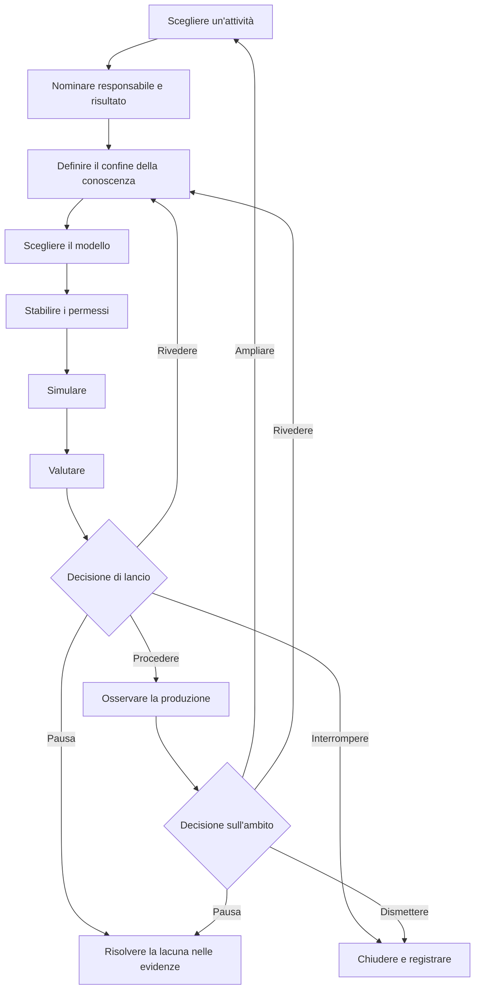

Una roadmap per l'adozione di un agente AI dovrebbe far avanzare un'attività ben circoscritta attraverso una serie di gate basati sulle evidenze. A ogni gate, un responsabile nominato decide se procedere, rivedere, mettere in pausa o interrompere. La produzione non è la fine del piano. La roadmap deve definire anche monitoraggio, intervento, recupero, dismissione e le evidenze necessarie prima di ampliare l'ambito dell'agente.

Questa struttura è più utile di un calendario fisso di 30, 60 o 90 giorni. Un calendario indica quando un team spera di avanzare. Un gate basato sulle evidenze registra ciò che il team deve sapere prima di avanzare.

## La roadmap in sintesi

La sequenza comprende nove fasi:

1. Scegliere un'attività circoscritta.
2. Nominare il responsabile, gli utenti, il risultato e il valore di riferimento.
3. Definire il confine della conoscenza e dei dati.
4. Scegliere un modello di agente solo se l'attività ne richiede uno.
5. Stabilire i confini per strumenti, permessi e decisioni umane.
6. Simulare il lavoro e i relativi percorsi di errore.
7. Valutare i risultati rispetto a criteri dichiarati.
8. Prendere una decisione di lancio responsabile.
9. Osservare la produzione e decidere se rivedere, ampliare, mettere in pausa o dismettere.

**Testo alternativo del diagramma:** La roadmap inizia con un'attività, un responsabile e un risultato, un confine della conoscenza, un modello adatto e i permessi. La simulazione e la valutazione conducono a una decisione di lancio. La decisione può portare alla produzione monitorata, tornare alla revisione, mettere in pausa per evidenze mancanti o interrompere. In seguito, le evidenze di produzione sostengono una decisione separata per ampliare, rivedere, mettere in pausa o dismettere.

## Iniziare dagli stati delle evidenze, non da espressioni di fiducia

I team usano spesso parole come *pronto*, *sicuro* e *funziona* prima di concordare che cosa significhino. Nel registro di pianificazione, usare invece stati delle evidenze espliciti:

| Stato delle evidenze | Significato | Che cosa non significa |
|---|---|---|
| `UNKNOWN` | Il team non ha raccolto evidenze sufficienti per valutare l'affermazione. | Fallimento, domanda pari a zero o permesso di fare supposizioni. |
| `ASSERTED` | Una persona, un fornitore, un documento o un agente ha formulato l'affermazione e la fonte è registrata. | Conferma indipendente. |
| `OBSERVED` | Il team ha registrato il comportamento in un test o contesto operativo specificato. | Il comportamento si generalizzerà oltre quel contesto. |
| `VERIFIED` | Il risultato è stato controllato rispetto a un metodo dichiarato e a una regola di accettazione. | Tutti i rischi sono risolti o il sistema è universalmente affidabile. |
| `ACCEPTED` | Un responsabile della decisione ha esaminato le evidenze disponibili e accettato il rischio residuo per un ambito e un periodo dichiarati. | Approvazione permanente o prova che la decisione fosse corretta. |
| `REJECTED` | Le evidenze non hanno soddisfatto un criterio dichiarato oppure il rischio residuo non è stato accettato. | L'idea non potrà mai essere rivista o testata con un ambito diverso. |

Uno stato delle evidenze appartiene a una specifica affermazione. “L'agente ha completato 47 casi di test su 50 nel set di test v3” può essere `OBSERVED`. “L'agente è pronto per ogni attività finanziaria” non può ereditare quello stato.

## Le nove fasi della roadmap di adozione

### 1. Scegliere un'attività circoscritta

Iniziare con un'attività che abbia un inizio, un risultato, un responsabile e un destinatario riconoscibili. Annotare ciò che è escluso dall'attività con la stessa cura riservata a ciò che è incluso.

Prima di scegliere un agente, chiedersi se il lavoro richieda decisioni adattive, un ordine variabile degli strumenti o l'interpretazione di input incompleti. Le attuali indicazioni di Microsoft per la pianificazione aziendale raccomandano di usare codice ordinario o sistemi non generativi per attività strutturate e prevedibili che non richiedono la complessità di un agente. Raccomandano inoltre di sospendere i casi d'uso per i quali rischi o misure di tutela non sono chiari ([Microsoft, Business plan for AI agents](https://learn.microsoft.com/en-us/azure/cloud-adoption-framework/ai-agents/business-strategy-plan)).

- **Evidenza di ingresso:** Sono indicati un'attività reale e il gruppo di utenti interessato.
- **Evidenza di uscita:** Sono registrati il confine dell'attività, le attività escluse, l'alternativa senza AI e il motivo per cui un agente potrebbe essere adatto.
- **Condizione di arresto:** L'attività non può essere separata da diversi processi ad alto impatto oppure nessun responsabile può definire un risultato accettabile.
- **Responsabile del recupero:** Responsabile del processo aziendale.
- **Decisione umana:** Accettare il confine dell'attività oppure scegliere un'attività più circoscritta o una soluzione senza agente.

### 2. Nominare il responsabile, gli utenti, il risultato e il valore di riferimento

Nominare la persona o il ruolo responsabile del risultato aziendale. Distinguere tale ruolo dalle persone che sviluppano, gestiscono, esaminano i rischi e ricevono il risultato. In un team piccolo, una persona può ricoprire più ruoli, ma le responsabilità devono comunque essere visibili.

Registrare come viene svolta oggi l'attività. Un valore di riferimento può includere tasso di completamento, carico di revisione, tasso di correzione, tempo trascorso, costo o un'altra misura legata all'attività. Se non esiste un valore di riferimento affidabile, scrivere `UNKNOWN`; non trasformare l'assenza di dati in zero. Microsoft e OpenAI raccomandano entrambe di definire criteri di successo e un punto di confronto attuale prima di usare i risultati per giustificare un'espansione ([Microsoft, Define success metrics](https://learn.microsoft.com/en-us/azure/cloud-adoption-framework/ai-agents/business-strategy-plan#define-success-metrics); [OpenAI, A business leader's guide to working with agents](https://cdn.openai.com/business-guides-and-resources/a-business-leaders-guide-to-working-with-agents.pdf)).

- **Evidenza di ingresso:** L'attività circoscritta è stata accettata.
- **Evidenza di uscita:** Sono registrati responsabile aziendale, utenti, destinatario del risultato, valore di riferimento, risultato desiderato e data di revisione.
- **Condizione di arresto:** Il risultato desiderato non può essere misurato o valutato oppure gli utenti interessati non sono stati identificati.
- **Responsabile del recupero:** Responsabile aziendale insieme al responsabile della misurazione.
- **Decisione umana:** Accettare il risultato e il metodo di misurazione prima che inizi lo sviluppo.

### 3. Definire il confine della conoscenza e dei dati

Elencare ogni fonte che l'agente può usare, chi ne è responsabile, quanto deve essere aggiornata e che cosa accade quando le fonti sono in conflitto. Registrare i dati vietati, i vincoli di conservazione e il percorso da seguire per una risposta mancante o obsoleta. Non trattare una cartella, un indice di recupero o un prompt lungo come prova della correttezza della conoscenza.

Il NIST AI Risk Management Framework chiede ai team di documentare scopo previsto, utenti, contesto, limiti, supervisione, componenti di terze parti e possibili impatti. Afferma inoltre che la gestione del rischio deve essere continua e non una lista di controllo una tantum ([NIST, AI RMF Core](https://airc.nist.gov/airmf-resources/airmf/5-sec-core/)).

Il NIST AI Risk Management Framework è una guida contestuale volontaria. Non costituisce una certificazione né una prova di conformità e la sua applicazione non dimostra che un agente sia sicuro, affidabile, rispettoso della privacy, protetto sul piano della sicurezza o adatto.

- **Evidenza di ingresso:** I campi relativi a responsabile, utente e risultato sono completi.
- **Evidenza di uscita:** Sono registrati fonti consentite, input vietati, regole di aggiornamento, regole sui conflitti e un responsabile della conoscenza.
- **Condizione di arresto:** Una fonte essenziale presenta diritti, proprietà, aggiornamento o sensibilità sconosciuti.
- **Responsabile del recupero:** Responsabile della conoscenza, insieme al responsabile pertinente per privacy, questioni legali o sicurezza quando la fonte lo richiede.
- **Decisione umana:** Accettare il confine dei dati e i limiti irrisolti per questo ambito di test.

### 4. Scegliere il modello

Scegliere il modello meno complesso in grado di completare l'attività circoscritta. Un workflow deterministico potrebbe essere sufficiente. Se il lavoro richiede un agente, iniziare con un solo agente, a meno che responsabilità distinte, confini di sicurezza o passaggi di consegne rendano necessaria la separazione.

La guida di OpenAI alla creazione di agenti raccomanda di adeguare l'orchestrazione alla complessità reale e di iniziare con un solo agente prima di passare, se necessario, a configurazioni multiagente ([OpenAI, A practical guide to building agents](https://cdn.openai.com/business-guides-and-resources/a-practical-guide-to-building-agents.pdf)).

- **Evidenza di ingresso:** I confini della conoscenza e dei dati sono espliciti.
- **Evidenza di uscita:** Sono registrati il modello scelto, le alternative scartate, l'elenco degli strumenti, i passaggi di consegne e le modalità di errore previste.
- **Condizione di arresto:** Il modello proposto aggiunge attori o strumenti senza una motivazione specifica per l'attività oppure non è stata considerata un'alternativa deterministica.
- **Responsabile del recupero:** Responsabile tecnico.
- **Decisione umana:** Accettare il modello e il relativo costo operativo per il test circoscritto.

### 5. Stabilire i permessi e i confini decisionali

Elencare separatamente ogni azione degli strumenti. Registrare se legge o scrive, quale account usa, quali dati può raggiungere, se l'azione è reversibile e l'impatto massimo di un errore. Un'etichetta generica come “accesso al CRM” nasconde la decisione che un revisore deve prendere.

La guida di OpenAI propone di valutare gli strumenti in base ad accesso in lettura o scrittura, reversibilità, permessi e impatto finanziario. Raccomanda controlli o interventi più rigorosi per le azioni ad alto impatto. Le misure di protezione costituiscono un livello e devono essere affiancate da autenticazione, autorizzazione, controlli degli accessi e normali misure di sicurezza del software. Queste pratiche non dimostrano che un sistema sia sicuro ([OpenAI, Guardrails and human intervention](https://cdn.openai.com/business-guides-and-resources/a-practical-guide-to-building-agents.pdf)).

Usare tre confini decisionali:

- **Decisioni dell'agente:** Azioni a basso impatto e reversibili all'interno dell'attività e dell'ambito di permessi approvati.
- **Decisioni determinate da regole:** Limiti deterministici, come controlli dello schema, limiti ai tentativi, liste di elementi consentiti e tetti di spesa, che bloccano o indirizzano il lavoro senza interpretare il rischio aziendale.
- **Decisioni umane:** Accettazione del lancio, accettazione del rischio residuo, accesso a dati sensibili o regolamentati, azioni ad alto impatto o irreversibili, eccezioni alle politiche, chiusura degli incidenti ed espansione dell'ambito o dei permessi.

L'organizzazione responsabile decide quali azioni reali appartengono a ciascun gruppo. Questa guida non formula una classificazione legale, di sicurezza o di conformità per una specifica implementazione.

- **Evidenza di ingresso:** Il modello e l'inventario degli strumenti sono completi.
- **Evidenza di uscita:** Sono registrati accesso con privilegi minimi, classi di azioni, punti di approvazione, limiti ai tentativi, controlli di arresto, requisiti di registrazione e responsabile della revoca.
- **Condizione di arresto:** Non sono noti l'account di uno strumento, la portata sui dati, l'effetto di scrittura, la reversibilità o il percorso di revoca.
- **Responsabile del recupero:** Responsabile tecnico e responsabile dei permessi.
- **Decisione umana:** Concedere i permessi circoscritti e accettare ogni azione assegnata all'agente o alle regole deterministiche.

### 6. Simulare il lavoro e i percorsi di errore

Testare l'attività dall'inizio alla fine in un contesto controllato. Includere casi ordinari, input ambigui, conoscenza obsoleta o conflittuale, permessi negati, indisponibilità degli strumenti, output malformati, rischio di scritture duplicate e il momento in cui una persona deve subentrare. Testare il passaggio più difficile anziché dedicare l'intero progetto pilota a esempi facili.

Registrare la coorte di input, l'ambiente, le versioni, il risultato previsto, il risultato effettivo, il revisore e ogni differenza nota rispetto alla produzione. Una simulazione fornisce evidenze sulle condizioni testate. Non dimostra prestazioni al di fuori di esse.

- **Evidenza di ingresso:** I confini relativi a permessi e decisioni sono approvati per la simulazione.
- **Evidenza di uscita:** Sono registrati casi di test, output, errori, incertezza, comportamento di intervento e risultati del recupero.
- **Condizione di arresto:** Un errore critico non può essere contenuto, una scrittura potrebbe essere ripetuta senza ricevuta oppure il team non riesce a ricostruire ciò che ha fatto l'agente.
- **Responsabile del recupero:** Responsabile del test insieme al responsabile dello strumento o dell'incidente.
- **Decisione umana:** Accettare le evidenze della simulazione come sufficienti per la valutazione formale oppure rinviare il sistema alla revisione.

### 7. Valutare rispetto a criteri dichiarati

Valutare il risultato rispetto a criteri scritti prima dell'esecuzione. Includere correttezza e completezza dell'attività, rispetto delle politiche, comportamento degli strumenti, qualità dell'intervento, recupero e la misura aziendale scelta nella fase 2. Conservare nel registro i casi falliti e incerti.

NIST afferma che metodi di valutazione, metriche, condizioni di test, incertezza e limiti devono essere documentati e che i sistemi devono essere testati prima dell'implementazione e durante l'operatività. Il suo framework distingue inoltre la misurazione dalla successiva decisione di procedere ([NIST, AI RMF Core, Measure and Manage](https://airc.nist.gov/airmf-resources/airmf/5-sec-core/)).

- **Evidenza di ingresso:** I registri della simulazione sono abbastanza completi da poter essere riprodotti o esaminati.
- **Evidenza di uscita:** Ogni criterio di accettazione ha un risultato, uno stato delle evidenze, un limite e un revisore.
- **Condizione di arresto:** Un criterio critico non è soddisfatto, il metodo di test non può sostenere l'affermazione formulata oppure un punteggio aggregato nasconde un'incertezza sostanziale.
- **Responsabile del recupero:** Responsabile della valutazione.
- **Decisione umana:** Accettare o rifiutare il risultato della valutazione per l'esatto ambito di lancio proposto.

### 8. Prendere la decisione di lancio

Preparare le evidenze per il responsabile della decisione. Il registro della decisione deve indicare versione, ambito, utenti, permessi, limiti noti, rischi irrisolti, piano di monitoraggio, metodo di rollback o arresto, data di revisione ed evidenze utilizzate.

Usare una delle quattro decisioni:

- `PROCEED`: Le evidenze soddisfano i criteri dichiarati e il responsabile accetta il rischio residuo per l'ambito e il periodo di revisione indicati.
- `REVISE`: Le lacune correggibili hanno dei responsabili ed è pianificata un'altra valutazione circoscritta.
- `PAUSE`: Una dipendenza essenziale, un permesso, un revisore o un elemento probatorio non è disponibile.
- `STOP`: Il caso d'uso, il modello di agente o il rischio residuo è inaccettabile per il contesto previsto.

La funzione Manage del NIST richiede di stabilire se il sistema raggiunge lo scopo previsto e se lo sviluppo o l'implementazione debbano procedere. Si tratta di una decisione di governance fondata sulle evidenze, non di un punteggio che un agente si attribuisce ([NIST, Manage 1.1](https://airc.nist.gov/airmf-resources/airmf/5-sec-core/)).

- **Evidenza di ingresso:** I risultati della valutazione e il piano operativo sono completi.
- **Evidenza di uscita:** Un responsabile nominato firma una decisione per una versione, un ambito e un periodo di revisione fissi.
- **Condizione di arresto:** Non esistono un responsabile, un metodo di arresto, un percorso per gli incidenti o una dichiarazione accettata sul rischio residuo.
- **Responsabile del recupero:** Responsabile del lancio.
- **Decisione umana:** La decisione di lancio stessa. Un gate automatizzato può raccogliere le evidenze o applicare una regola precedente, ma non amplia tacitamente l'ambito approvato.

### 9. Osservare la produzione e decidere che cosa accade dopo

Monitorare risultati delle attività, azioni non riuscite e sottoposte a override, volume degli interventi, errori di autorizzazione, aggiornamento delle fonti, feedback degli utenti, incidenti, tempo di recupero, costi e misura aziendale. Definire chi legge ciascun segnale e quale soglia attiva un'azione.

Microsoft raccomanda un'espansione graduale basata sul valore osservato anziché sulla disponibilità tecnica, insieme a una gestione continua del ciclo di vita. NIST include monitoraggio, ricorso e intervento, dismissione, risposta agli incidenti, recupero e gestione delle modifiche nella pianificazione successiva all'implementazione ([Microsoft, Manage AI agents across your organization](https://learn.microsoft.com/en-us/azure/cloud-adoption-framework/ai-agents/integrate-manage-operate); [NIST, Manage 4.1](https://airc.nist.gov/airmf-resources/airmf/5-sec-core/)).

- **Evidenza di ingresso:** Esiste una decisione di lancio circoscritta.
- **Evidenza di uscita:** La finestra di revisione contiene evidenze osservate sufficienti per una nuova decisione, con le incognite ancora visibili.
- **Condizione di arresto:** Deriva critica, accesso imprevisto, scritture non contenute, evidenze di audit mancanti, superamento di una soglia o perdita del percorso di arresto e recupero.
- **Responsabile del recupero:** Responsabile operativo insieme al responsabile dell'incidente.
- **Decisione umana:** Continuare senza modifiche, rivedere, restringere, mettere in pausa, ampliare o dismettere. L'espansione crea una nuova attività circoscritta e riporta alla fase 1.

## Registro riutilizzabile per la pianificazione di un agente AI

Copiare questo registro per una sola attività. Non colmare le evidenze mancanti con un'ipotesi ottimistica.

### Identità e ambito

| Campo | Voce |
|---|---|
| ID e versione del registro di pianificazione | |
| Nome dell'attività | |
| Utenti previsti e destinatario del risultato | |
| Attività incluse | |
| Attività escluse | |
| Alternativa senza AI considerata | |
| Responsabile aziendale | |
| Responsabile tecnico | |
| Responsabile della conoscenza e dei dati | |
| Responsabile dei permessi | |
| Responsabile della valutazione | |
| Responsabile operativo e del recupero | |

### Risultato ed evidenze

| Campo | Voce | Stato delle evidenze | Fonte o metodo | Data di revisione |
|---|---|---|---|---|
| Valore di riferimento attuale | | | | |
| Risultato desiderato | | | | |
| Desiderabilità per gli utenti | | | | |
| Fattibilità tecnica | | | | |
| Rischi e impatti noti | | | | |
| Rischi non misurati o irrisolti | | `UNKNOWN` | | |

### Conoscenza, modello e permessi

| Campo | Voce |
|---|---|
| Fonti di conoscenza consentite e regole di aggiornamento | |
| Dati e usi vietati | |
| Comportamento in caso di conflitto o conoscenza mancante | |
| Modello selezionato e alternative scartate | |
| Strumenti e identità degli account | |
| Azioni di lettura consentite all'agente | |
| Azioni di scrittura consentite all'agente | |
| Limiti deterministici e segnali di arresto | |
| Azioni che richiedono approvazione umana | |
| Limiti a tentativi, spesa e azioni | |
| Metodo di revoca e arresto | |

### Gate di fase

| Fase | Evidenza di ingresso | Evidenza di uscita | Condizione di arresto | Responsabile del recupero | Decisione successiva |
|---|---|---|---|---|---|
| Scegliere l'attività | | | | | |
| Nominare responsabile e risultato | | | | | |
| Definire la conoscenza | | | | | |
| Scegliere il modello | | | | | |
| Stabilire i permessi | | | | | |
| Simulare | | | | | |
| Valutare | | | | | |
| Approvare il lancio | | | | | |
| Osservare e riesaminare | | | | | |

### Valutazione e decisione di lancio

| Campo | Voce |
|---|---|
| Coorte di test, ambiente e versioni | |
| Criteri e soglie dichiarati | |
| Risultati effettivi, errori e incertezza | |
| Risultato dell'intervento e del recupero | |
| Decisione | `PROCEED`, `REVISE`, `PAUSE` o `STOP` |
| Responsabile della decisione e data | |
| Ambito accettato e rischio residuo | |
| Monitoraggio e percorso per gli incidenti | |
| Finestra di revisione | |
| Condizioni per espansione, revisione, pausa e dismissione | |

## Prima di ampliare

L'espansione è una nuova decisione, non la ricompensa predefinita per il raggiungimento della produzione. Se l'attività lo consente, richiedere evidenze relative a più di un ciclo operativo. Verificare che il risultato rimanga utile, che interventi e correzioni siano compresi e che i confini originali dei permessi e dei dati siano ancora adeguati.

Non ampliare quando le evidenze principali sono un aneddoto, un'affermazione del fornitore, una singola esecuzione riuscita o un punteggio aggregato che nasconde errori critici. Non ampliare perché l'implementazione può raggiungere più strumenti. Ampliare solo quando un responsabile accetta le evidenze e il nuovo ambito riceve confini, test, condizioni di arresto e piano di recupero propri.

## Passaggio successivo

Usare il registro di pianificazione per definire un'attività, quindi confrontarla con i modelli di agente e workflow disponibili. Se i permessi, il responsabile del rischio residuo o la decisione di lancio non sono ancora chiari, proseguire con il [modello di governance per agenti AI, in inglese](/en/governance) prima di creare il percorso di produzione.

## Metodo, attribuzione e limiti

**Chi:** Toone Content è l'autore organizzativo. Hexagonal.io è l'editore. La responsabilità editoriale e le pratiche relative alle fonti sono descritte nella [politica editoriale, in inglese](/en/editorial-policy). Per domande e richieste di correzione è possibile [contattare Toone, in inglese](/en/contact). Questo link diretto è un candidato inglese di ripiego. Non si dichiara che funzioni finché Technical non avrà implementato una pagina pubblica e accessibile su `/en/contact` e verificato una risposta pubblica con stato `200`.

**Come:** Questa guida sintetizza le attuali indicazioni primarie di Microsoft, NIST e OpenAI in una sequenza di pianificazione e in un registro riutilizzabile. L'assistenza automatizzata ha contribuito a raccogliere, mappare e strutturare le fonti. Le affermazioni delle fonti sono state controllate rispetto ai materiali collegati e la sintesi di Toone è indicata come tale. Non si dichiara alcuna implementazione presso clienti né un'adozione pratica da parte di Toone. Confine della revisione: Content Editor è il ruolo responsabile della revisione editoriale; questa fonte redatta a livello organizzativo non dichiara una revisione da parte di una persona identificata per nome, né una revisione di esperti della materia, di prodotto, legale, di privacy, di sicurezza o di deployment.

**Perché:** La guida aiuta operatori e responsabili di team funzionali a prendere decisioni di adozione circoscritte con evidenze, responsabilità e percorsi di arresto e recupero visibili. Non costituisce consulenza legale, di sicurezza, privacy o conformità. Non dimostra che un agente sia sicuro, affidabile o adatto a una specifica implementazione. Tali valutazioni richiedono le persone responsabili e le evidenze pertinenti a quel contesto.

## Fonti

- Microsoft Learn, [Business plan for AI agents](https://learn.microsoft.com/en-us/azure/cloud-adoption-framework/ai-agents/business-strategy-plan), consultato il 13 agosto 2026.
- Microsoft Learn, [Organizational readiness for AI agents](https://learn.microsoft.com/en-us/azure/cloud-adoption-framework/ai-agents/organization-people-readiness-plan), aggiornato il 4 dicembre 2025.
- Microsoft Learn, [Manage AI agents across your organization](https://learn.microsoft.com/en-us/azure/cloud-adoption-framework/ai-agents/integrate-manage-operate), aggiornato il 4 dicembre 2025.
- NIST AI Resource Center, [AI Risk Management Framework Core](https://airc.nist.gov/airmf-resources/airmf/5-sec-core/), estratto da AI RMF 1.0; la pagina segnala che è in corso una revisione.
- NIST, [Artificial Intelligence Risk Management Framework: Generative Artificial Intelligence Profile](https://www.nist.gov/publications/artificial-intelligence-risk-management-framework-generative-artificial-intelligence), pubblicato il 26 luglio 2024; pagina aggiornata l'8 aprile 2026.
- OpenAI, [A business leader's guide to working with agents](https://cdn.openai.com/business-guides-and-resources/a-business-leaders-guide-to-working-with-agents.pdf), PDF consultato il 13 agosto 2026.
- OpenAI, [A practical guide to building agents](https://cdn.openai.com/business-guides-and-resources/a-practical-guide-to-building-agents.pdf), PDF consultato il 13 agosto 2026.

## Note di implementazione sotto la responsabilità di Content

- Rappresentare il registro di pianificazione come tabelle HTML accessibili, non come immagine.
- Rappresentare il diagramma della roadmap in una forma scansionabile dai crawler e conservarne il testo alternativo descrittivo.
- Usare l'attribuzione visibile `Toone Content` e un'identità autore corrispondente per `Article`.
- Usare solo dati strutturati corretti per `Article` e `BreadcrumbList`.
- Non aggiungere markup FAQ a meno che non esistano una FAQ visibile e idonea e una decisione tecnica attuale.
- I candidati per link interni diversi dai percorsi inglesi attivi relativi a governance e politica editoriale restano subordinati all'idoneità dei percorsi di destinazione al momento dell'assemblaggio.
- `/en/contact` resta una dipendenza di Technical. L'assemblaggio non deve trattare il percorso come attivo né sostituire il link inglese di ripiego con un percorso italiano senza una verifica pubblica.
- Il concetto di misurazione approvato è l'uso del registro di pianificazione senza dati personali, seguito dall'avanzamento verso la selezione o la governance dopo G3. Non esiste ancora un valore di riferimento per la pagina e la domanda sconosciuta non deve essere registrata come zero.
