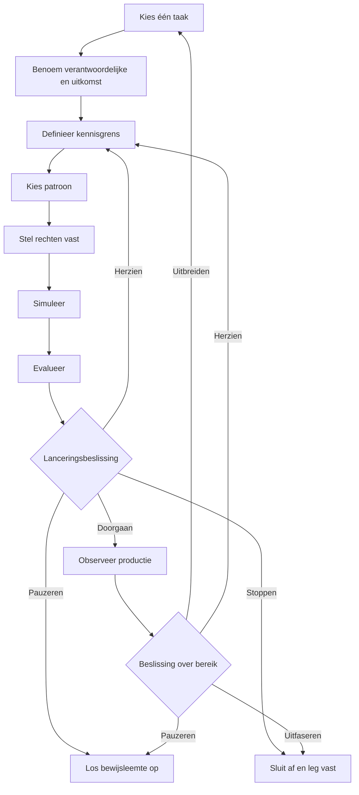

Een routekaart voor de adoptie van een AI-agent moet één goed afgebakende taak door een reeks bewijsbeslispunten leiden. Bij elk beslispunt bepaalt een aangewezen verantwoordelijke of het werk doorgaat, wordt herzien, wordt gepauzeerd of stopt. Productie is niet het einde van het plan. De routekaart moet ook monitoring, het overrulen van handelingen of besluiten, herstel, uitfasering en het bewijs definiëren dat nodig is voordat het bereik van de agent wordt uitgebreid.

Die structuur is nuttiger dan een vaste kalender van 30, 60 of 90 dagen. Een kalender geeft aan wanneer een team hoopt verder te gaan. Een bewijsbeslispunt legt vast wat het team moet weten voordat het verdergaat.

## De routekaart in één oogopslag

De volgorde bestaat uit negen fasen:

1. Kies één afgebakende taak.
2. Benoem de verantwoordelijke, gebruikers, uitkomst en nulmeting.
3. Definieer de grens voor kennis en gegevens.
4. Kies alleen een agentpatroon als de taak dat nodig heeft.
5. Stel grenzen voor hulpmiddelen, rechten en menselijke beslissingen vast.
6. Simuleer het werk en de foutpaden.
7. Evalueer de resultaten aan de hand van vooraf vastgelegde criteria.
8. Neem een verantwoordelijke lanceringsbeslissing.
9. Observeer de productie en beslis of herziening, uitbreiding, pauzering of uitfasering nodig is.

**Alternatieve tekst voor het diagram:** De routekaart begint met één taak, een verantwoordelijke en uitkomst, een kennisgrens, een passend patroon en rechten. Simulatie en evaluatie leiden tot een lanceringsbeslissing. De beslissing kan doorgaan naar gemonitorde productie, teruggaan voor herziening, pauzeren vanwege ontbrekend bewijs of stoppen. Productiebewijs ondersteunt later een afzonderlijke beslissing om uit te breiden, te herzien, te pauzeren of uit te faseren.

## Begin met bewijsstatussen, niet met termen over vertrouwen

Teams gebruiken vaak woorden als *gereed*, *veilig* en *werkt* voordat ze hebben afgesproken wat die woorden betekenen. Gebruik in het planningsdocument in plaats daarvan expliciete bewijsstatussen:

| Bewijsstatus | Betekenis | Wat dit niet betekent |
|---|---|---|
| `UNKNOWN` | Het team heeft niet genoeg bewijs verzameld om de claim te beoordelen. | Mislukking, geen vraag of toestemming om iets aan te nemen. |
| `ASSERTED` | Een persoon, leverancier, document of agent heeft de claim gedaan en de bron is vastgelegd. | Onafhankelijke bevestiging. |
| `OBSERVED` | Het team heeft het gedrag vastgelegd in een benoemde test- of uitvoeringscontext. | Dat het gedrag ook buiten die context geldt. |
| `VERIFIED` | Het resultaat is gecontroleerd aan de hand van een vooraf vastgelegde methode en acceptatieregel. | Dat alle risico's zijn opgelost of het systeem universeel betrouwbaar is. |
| `ACCEPTED` | Een verantwoordelijke beslisser heeft het beschikbare bewijs beoordeeld en het restrisico voor een vastgesteld bereik en een vastgestelde periode geaccepteerd. | Permanente goedkeuring of bewijs dat de beslissing juist was. |
| `REJECTED` | Het bewijs voldeed niet aan een vooraf vastgelegd criterium of het restrisico is niet geaccepteerd. | Dat het idee nooit kan worden herzien of binnen een ander bereik kan worden getest. |

Een bewijsstatus hoort bij één specifieke claim. “De agent voltooide 47 van de 50 testgevallen in testset v3” kan `OBSERVED` zijn. “De agent is gereed voor elke financiële taak” kan die status niet overnemen.

## De negen fasen van de adoptieroutekaart

### 1. Kies één afgebakende taak

Begin met een taak met een herkenbaar begin, resultaat, verantwoordelijke en ontvanger. Leg net zo zorgvuldig vast wat buiten de taak valt als wat erbinnen valt.

Vraag voordat u een agent kiest of het werk adaptieve beslissingen, een veranderende volgorde van hulpmiddelen of interpretatie van onvolledige invoer nodig heeft. De actuele bedrijfsplanningsrichtlijnen van Microsoft bevelen gewone code of niet-generatieve systemen aan voor gestructureerde, voorspelbare taken die geen agentcomplexiteit nodig hebben. Microsoft raadt ook aan toepassingen te pauzeren waarvan de risico's of beveiligingsmaatregelen onduidelijk zijn ([Microsoft, Business plan for AI agents](https://learn.microsoft.com/en-us/azure/cloud-adoption-framework/ai-agents/business-strategy-plan)).

- **Bewijs bij aanvang:** Een echte taak en de betrokken gebruikersgroep zijn benoemd.
- **Bewijs bij afronding:** De taakgrens, uitgesloten taken, het alternatief zonder AI en de reden waarom een agent passend kan zijn, zijn vastgelegd.
- **Stopvoorwaarde:** De taak kan niet worden gescheiden van meerdere processen met grote gevolgen, of geen verantwoordelijke kan een aanvaardbaar resultaat definiëren.
- **Herstelverantwoordelijke:** Verantwoordelijke voor het bedrijfsproces.
- **Menselijke beslissing:** Accepteer de taakgrens of kies een smallere taak of een oplossing zonder agent.

### 2. Benoem de verantwoordelijke, gebruikers, uitkomst en nulmeting

Benoem de persoon of rol die verantwoordelijk is voor het bedrijfsresultaat. Houd die rol apart van de mensen die bouwen, uitvoeren, risico's beoordelen en het resultaat ontvangen. In een klein team kan één persoon meerdere rollen vervullen, maar de verantwoordelijkheden moeten zichtbaar blijven.

Leg vast hoe de taak nu wordt uitgevoerd. Een nulmeting kan het voltooiingspercentage, de beoordelingslast, het correctiepercentage, de doorlooptijd, de kosten of een andere aan de taak gekoppelde maatstaf omvatten. Als er geen betrouwbare nulmeting bestaat, schrijf dan `UNKNOWN`; maak van ontbrekende gegevens geen nul. Zowel Microsoft als OpenAI bevelen aan om succescriteria en een actueel vergelijkingspunt te definiëren voordat resultaten worden gebruikt om uitbreiding te rechtvaardigen ([Microsoft, Define success metrics](https://learn.microsoft.com/en-us/azure/cloud-adoption-framework/ai-agents/business-strategy-plan#define-success-metrics); [OpenAI, A business leader's guide to working with agents](https://cdn.openai.com/business-guides-and-resources/a-business-leaders-guide-to-working-with-agents.pdf)).

- **Bewijs bij aanvang:** De afgebakende taak is geaccepteerd.
- **Bewijs bij afronding:** De bedrijfsverantwoordelijke, gebruikers, ontvanger van het resultaat, nulmeting, gewenste uitkomst en beoordelingsdatum zijn vastgelegd.
- **Stopvoorwaarde:** De gewenste uitkomst kan niet worden gemeten of beoordeeld, of de betrokken gebruikers zijn niet geïdentificeerd.
- **Herstelverantwoordelijke:** De bedrijfsverantwoordelijke samen met de meetverantwoordelijke.
- **Menselijke beslissing:** Accepteer de uitkomst en meetmethode voordat de ontwikkeling begint.

### 3. Definieer de grens voor kennis en gegevens

Noem elke bron die de agent mag gebruiken, wie ervoor verantwoordelijk is, hoe actueel de bron moet zijn en wat er gebeurt als bronnen elkaar tegenspreken. Leg verboden gegevens, bewaarbeperkingen en de route voor een ontbrekend of verouderd antwoord vast. Beschouw een map, zoekindex of lange prompt niet als bewijs dat de kennis juist is.

Het NIST AI Risk Management Framework vraagt teams om het beoogde doel, de gebruikers, context, grenzen, het toezicht, onderdelen van derden en mogelijke gevolgen te documenteren. Het stelt ook dat risicobeheer doorlopend moet zijn en geen eenmalige controlelijst ([NIST, AI RMF Core](https://airc.nist.gov/airmf-resources/airmf/5-sec-core/)).

Het NIST AI Risk Management Framework is een vrijwillige contextuele leidraad. Het is geen certificering of bewijs van naleving. Toepassing ervan bewijst evenmin dat een agent veilig of betrouwbaar is, privacy waarborgt, beveiligd is of geschikt is.

- **Bewijs bij aanvang:** De velden voor verantwoordelijke, gebruiker en uitkomst zijn volledig.
- **Bewijs bij afronding:** Toegestane bronnen, verboden invoer, actualiteitsregels, conflictregels en een kennisverantwoordelijke zijn vastgelegd.
- **Stopvoorwaarde:** Van een essentiële bron zijn rechten, eigenaarschap, actualiteit of gevoeligheid onbekend.
- **Herstelverantwoordelijke:** De kennisverantwoordelijke, samen met de relevante privacy-, juridische of beveiligingsverantwoordelijke wanneer de bron dat vereist.
- **Menselijke beslissing:** Accepteer de gegevensgrens en onopgeloste beperkingen voor dit testbereik.

### 4. Kies het patroon

Kies het minst complexe patroon waarmee de afgebakende taak kan worden voltooid. Een deterministische werkstroom kan voldoende zijn. Als het werk een agent nodig heeft, begin dan met één agent, tenzij afzonderlijke verantwoordelijkheden, beveiligingsgrenzen of overdrachten een scheiding noodzakelijk maken.

De bouwgids van OpenAI beveelt aan de orkestratie af te stemmen op de werkelijke complexiteit en te beginnen met één agent voordat, indien nodig, wordt overgestapt op ontwerpen met meerdere agents ([OpenAI, A practical guide to building agents](https://cdn.openai.com/business-guides-and-resources/a-practical-guide-to-building-agents.pdf)).

- **Bewijs bij aanvang:** De grenzen voor kennis en gegevens zijn expliciet.
- **Bewijs bij afronding:** De patroonkeuze, verworpen alternatieven, lijst met hulpmiddelen, overdrachten en verwachte foutvormen zijn vastgelegd.
- **Stopvoorwaarde:** Het voorgestelde patroon voegt actoren of hulpmiddelen toe zonder taakspecifieke reden, of een deterministisch alternatief is niet overwogen.
- **Herstelverantwoordelijke:** Technisch verantwoordelijke.
- **Menselijke beslissing:** Accepteer het patroon en de uitvoeringskosten ervan voor de afgebakende test.

### 5. Stel grenzen voor rechten en beslissingen vast

Vermeld elke handeling van een hulpmiddel afzonderlijk. Leg vast of deze leest of schrijft, welk account wordt gebruikt, welke gegevens bereikbaar zijn, of de handeling omkeerbaar is en wat de maximale gevolgen van een fout zijn. Een breed label als “CRM-toegang” verbergt de beslissing die een beoordelaar moet nemen.

De gids van OpenAI stelt voor hulpmiddelen te beoordelen op lees- of schrijftoegang, omkeerbaarheid, rechten en financiële gevolgen. De gids beveelt strengere controles of ingrijpen aan voor handelingen met grote gevolgen. Beveiligingsmaatregelen vormen één laag en moeten worden gecombineerd met authenticatie, autorisatie, toegangsbeheer en gangbare maatregelen voor softwarebeveiliging. Deze werkwijzen bewijzen niet dat een systeem veilig is ([OpenAI, Guardrails and human intervention](https://cdn.openai.com/business-guides-and-resources/a-practical-guide-to-building-agents.pdf)).

Gebruik drie beslissingsgrenzen:

- **Door de agent beslist:** Handelingen met geringe gevolgen die omkeerbaar zijn en binnen de goedgekeurde taak en rechten vallen.
- **Door een regel beslist:** Deterministische grenzen, zoals schemacontroles, limieten voor nieuwe pogingen, toelatingslijsten en uitgavenlimieten, die werk stoppen of doorsturen zonder bedrijfsrisico te interpreteren.
- **Door een mens beslist:** Acceptatie van de lancering, acceptatie van restrisico, toegang tot gevoelige of gereguleerde gegevens, handelingen met grote gevolgen of onomkeerbare handelingen, beleidsuitzonderingen, afsluiting van incidenten en uitbreiding van bereik of rechten.

De verantwoordelijke organisatie bepaalt welke echte handelingen in elke groep thuishoren. Deze gids maakt geen juridische, beveiligings- of nalevingsclassificatie voor een specifieke implementatie.

- **Bewijs bij aanvang:** Het patroon en de inventaris van hulpmiddelen zijn volledig.
- **Bewijs bij afronding:** Minimale toegangsrechten, handelingsklassen, goedkeuringspunten, limieten voor nieuwe pogingen, stopmechanismen, logvereisten en de verantwoordelijke voor intrekking zijn vastgelegd.
- **Stopvoorwaarde:** Het account, gegevensbereik, schrijfeffect, de omkeerbaarheid of intrekkingsroute van een hulpmiddel is onbekend.
- **Herstelverantwoordelijke:** De technisch verantwoordelijke en de rechtenverantwoordelijke.
- **Menselijke beslissing:** Verleen de afgebakende rechten en accepteer elke handeling die aan de agent of deterministische regels is toegewezen.

### 6. Simuleer het werk en de foutpaden

Test de taak van begin tot eind in een beheerste context. Neem gewone gevallen, dubbelzinnige invoer, verouderde of tegenstrijdige kennis, geweigerde rechten, uitval van hulpmiddelen, onjuist gevormde uitvoer, het risico op dubbele schrijfacties en het moment waarop een persoon het moet overnemen mee. Test de moeilijkste stap in plaats van de hele proef aan eenvoudige voorbeelden te besteden.

Leg het invoercohort, de omgeving, versies, het verwachte resultaat, werkelijke resultaat, de beoordelaar en bekende verschillen met productie vast. Een simulatie levert bewijs over de geteste omstandigheden. Zij toont geen prestaties buiten die omstandigheden aan.

- **Bewijs bij aanvang:** De grenzen voor rechten en beslissingen zijn goedgekeurd voor de simulatie.
- **Bewijs bij afronding:** Testgevallen, resultaten, fouten, onzekerheid, gedrag bij ingrijpen en herstelresultaten zijn vastgelegd.
- **Stopvoorwaarde:** Een kritieke fout kan niet worden ingedamd, een schrijfactie kan zonder ontvangstbewijs worden herhaald of het team kan niet reconstrueren wat de agent heeft gedaan.
- **Herstelverantwoordelijke:** De testverantwoordelijke samen met de verantwoordelijke voor het hulpmiddel of incident.
- **Menselijke beslissing:** Accepteer het bewijs uit de simulatie als voldoende voor formele evaluatie, of stuur het systeem terug voor herziening.

### 7. Evalueer aan de hand van vooraf vastgelegde criteria

Beoordeel het resultaat aan de hand van criteria die vóór de uitvoering zijn vastgelegd. Neem juistheid en volledigheid van de taak, naleving van beleid, gedrag van hulpmiddelen, kwaliteit van ingrijpen, herstel en de in fase 2 gekozen bedrijfsmaatstaf mee. Bewaar mislukte en onzekere gevallen in het document.

NIST stelt dat evaluatiemethoden, maatstaven, testomstandigheden, onzekerheid en beperkingen moeten worden gedocumenteerd en dat systemen vóór implementatie en tijdens de uitvoering moeten worden getest. Het raamwerk maakt ook onderscheid tussen meting en de latere beslissing om door te gaan ([NIST, AI RMF Core, Measure and Manage](https://airc.nist.gov/airmf-resources/airmf/5-sec-core/)).

- **Bewijs bij aanvang:** De simulatiedocumenten zijn volledig genoeg om de test te reproduceren of te inspecteren.
- **Bewijs bij afronding:** Elk acceptatiecriterium heeft een resultaat, bewijsstatus, beperking en beoordelaar.
- **Stopvoorwaarde:** Een kritiek criterium faalt, de testmethode kan de gedane claim niet ondersteunen of wezenlijke onzekerheid is verborgen in een totaalscore.
- **Herstelverantwoordelijke:** Evaluatieverantwoordelijke.
- **Menselijke beslissing:** Accepteer of verwerp het evaluatieresultaat voor het exacte voorgestelde lanceringsbereik.

### 8. Neem de lanceringsbeslissing

Bundel het bewijs voor de verantwoordelijke beslisser. Het beslissingsdocument moet de versie, het bereik, de gebruikers, rechten, bekende beperkingen, onopgeloste risico's, het monitoringplan, de methode voor terugdraaien of uitschakelen, beoordelingsdatum en het gebruikte bewijs noemen.

Gebruik één van vier beslissingen:

- `PROCEED`: Het bewijs voldoet aan de vooraf vastgelegde criteria en de verantwoordelijke accepteert het restrisico voor het benoemde bereik en de beoordelingsperiode.
- `REVISE`: Oplosbare tekortkomingen hebben een verantwoordelijke en er staat een nieuwe afgebakende evaluatie gepland.
- `PAUSE`: Een essentiële afhankelijkheid, recht, beoordelaar of bewijsstuk is niet beschikbaar.
- `STOP`: De toepassing, het agentpatroon of het restrisico is onaanvaardbaar voor de beoogde context.

De functie Manage van NIST vraagt om vast te stellen of het systeem zijn beoogde doel bereikt en of ontwikkeling of implementatie moet doorgaan. Dat is een bestuursbeslissing op basis van bewijs, geen score die een agent zichzelf geeft ([NIST, Manage 1.1](https://airc.nist.gov/airmf-resources/airmf/5-sec-core/)).

- **Bewijs bij aanvang:** De evaluatieresultaten en het uitvoeringsplan zijn volledig.
- **Bewijs bij afronding:** Een aangewezen verantwoordelijke ondertekent één beslissing voor een vaste versie, een vast bereik en een vaste beoordelingsperiode.
- **Stopvoorwaarde:** Er is geen verantwoordelijke beslisser, uitschakelmethode, incidentroute of geaccepteerde verklaring over restrisico.
- **Herstelverantwoordelijke:** Verantwoordelijke voor de lancering.
- **Menselijke beslissing:** De lanceringsbeslissing zelf. Een geautomatiseerd beslispunt mag bewijs bundelen of een eerdere regel afdwingen, maar verbreedt het goedgekeurde bereik niet stilzwijgend.

### 9. Observeer de productie en beslis wat daarna gebeurt

Monitor taakresultaten, mislukte handelingen en handelingen die zijn overruled, het aantal interventies, fouten met rechten, actualiteit van bronnen, gebruikersfeedback, incidenten, hersteltijd, kosten en de bedrijfsmaatstaf. Definieer wie elk signaal leest en welke drempel tot actie leidt.

Microsoft beveelt gefaseerde uitbreiding aan op basis van waargenomen waarde in plaats van technische beschikbaarheid, samen met doorlopend levenscyclusbeheer. NIST neemt monitoring, bezwaar en het overrulen van handelingen of besluiten, buitengebruikstelling, incidentrespons, herstel en wijzigingsbeheer op in de planning na implementatie ([Microsoft, Manage AI agents across your organization](https://learn.microsoft.com/en-us/azure/cloud-adoption-framework/ai-agents/integrate-manage-operate); [NIST, Manage 4.1](https://airc.nist.gov/airmf-resources/airmf/5-sec-core/)).

- **Bewijs bij aanvang:** Er bestaat een lanceringsbeslissing met een vastgesteld bereik.
- **Bewijs bij afronding:** Het beoordelingsvenster bevat genoeg waargenomen bewijs voor een nieuwe beslissing, waarbij onbekende punten zichtbaar blijven.
- **Stopvoorwaarde:** Kritieke afwijking, onverwachte toegang, niet-ingedamde schrijfacties, ontbrekend controlebewijs, overschrijding van een drempel of verlies van de uitschakel- en herstelroute.
- **Herstelverantwoordelijke:** De uitvoeringsverantwoordelijke samen met de incidentverantwoordelijke.
- **Menselijke beslissing:** Ongewijzigd doorgaan, herzien, beperken, pauzeren, uitbreiden of uitfaseren. Uitbreiding creëert een nieuwe afgebakende taak en keert terug naar fase 1.

## Herbruikbaar planningsdocument voor een AI-agent

Kopieer dit document voor één taak. Vul ontbrekend bewijs niet aan met een optimistische aanname.

### Identiteit en bereik

| Veld | Invoer |
|---|---|
| ID en versie van het planningsdocument | |
| Taaknaam | |
| Beoogde gebruikers en ontvanger van het resultaat | |
| Opgenomen taken | |
| Uitgesloten taken | |
| Overwogen alternatief zonder AI | |
| Verantwoordelijke voor het bedrijfsresultaat | |
| Technisch verantwoordelijke | |
| Verantwoordelijke voor kennis en gegevens | |
| Verantwoordelijke voor rechten | |
| Evaluatieverantwoordelijke | |
| Verantwoordelijke voor uitvoering en herstel | |

### Uitkomst en bewijs

| Veld | Invoer | Bewijsstatus | Bron of methode | Beoordelingsdatum |
|---|---|---|---|---|
| Actuele nulmeting | | | | |
| Gewenste uitkomst | | | | |
| Wenselijkheid voor gebruikers | | | | |
| Technische haalbaarheid | | | | |
| Bekende risico's en gevolgen | | | | |
| Niet-gemeten of onopgeloste risico's | | `UNKNOWN` | | |

### Kennis, patroon en rechten

| Veld | Invoer |
|---|---|
| Toegestane kennisbronnen en actualiteitsregels | |
| Verboden gegevens en toepassingen | |
| Gedrag bij conflicten of ontbrekende kennis | |
| Geselecteerd patroon en verworpen alternatieven | |
| Hulpmiddelen en accountidentiteiten | |
| Leeshandelingen die de agent mag uitvoeren | |
| Schrijfhandelingen die de agent mag uitvoeren | |
| Deterministische grenzen en uitschakeldrempels | |
| Handelingen waarvoor menselijke goedkeuring nodig is | |
| Limieten voor nieuwe pogingen, uitgaven en handelingen | |
| Methode voor intrekking en uitschakeling | |

### Fasebeslispunten

| Fase | Bewijs bij aanvang | Bewijs bij afronding | Stopvoorwaarde | Herstelverantwoordelijke | Volgende beslissing |
|---|---|---|---|---|---|
| Kies taak | | | | | |
| Benoem verantwoordelijke en uitkomst | | | | | |
| Definieer kennis | | | | | |
| Kies patroon | | | | | |
| Stel rechten vast | | | | | |
| Simuleer | | | | | |
| Evalueer | | | | | |
| Keur lancering goed | | | | | |
| Observeer en beoordeel | | | | | |

### Evaluatie en lanceringsbeslissing

| Veld | Invoer |
|---|---|
| Testcohort, omgeving en versies | |
| Vooraf vastgelegde criteria en drempels | |
| Werkelijke resultaten, fouten en onzekerheid | |
| Resultaat van ingrijpen en herstel | |
| Beslissing | `PROCEED`, `REVISE`, `PAUSE` of `STOP` |
| Verantwoordelijke voor de beslissing en datum | |
| Geaccepteerd bereik en restrisico | |
| Monitoring en incidentroute | |
| Beoordelingsvenster | |
| Aanleidingen voor uitbreiding, herziening, pauzering en uitfasering | |

## Voordat u uitbreidt

Uitbreiding is een nieuwe beslissing en geen automatische beloning voor het bereiken van productie. Vereis bewijs uit meer dan één uitvoeringscyclus als de taak dat toelaat. Controleer of het resultaat nuttig blijft, of interventies en correcties worden begrepen en of de oorspronkelijke grenzen voor rechten en gegevens nog passen.

Breid niet uit wanneer het belangrijkste bewijs bestaat uit een anekdote, een leveranciersclaim, één geslaagde uitvoering of een totaalscore die kritieke fouten verbergt. Breid niet uit omdat de implementatie meer hulpmiddelen kan bereiken. Breid alleen uit wanneer een verantwoordelijke het bewijs accepteert en het nieuwe bereik eigen grenzen, tests, stopvoorwaarden en een herstelplan krijgt.

## Volgende stap

Gebruik het planningsdocument om één taak te definiëren en vergelijk de taak vervolgens met de beschikbare agent- en werkstroompatronen. Als de rechten, de verantwoordelijke voor het restrisico of de lanceringsbeslissing nog onduidelijk zijn, ga dan vóór het bouwen van het productiepad verder met het [governancemodel voor AI-agents, in het Engels](/en/governance).

## Methode, auteurschap en beperkingen

**Wie:** Toone Content is de organisatorische auteur. Hexagonal.io is de uitgever. Het redactionele eigenaarschap en de werkwijze voor bronnen staan beschreven in het [redactionele beleid, in het Engels](/en/editorial-policy). Vragen en correctieverzoeken kunnen [rechtstreeks aan Toone worden gestuurd, in het Engels](/en/contact). Deze rechtstreekse link is een Engelse terugvalkandidaat. Er wordt niet beweerd dat de link werkt totdat Technical een toegankelijke openbare pagina op `/en/contact` heeft geïmplementeerd en een openbare respons met status `200` heeft geverifieerd.

**Hoe:** Deze gids brengt actuele primaire richtlijnen van Microsoft, NIST en OpenAI samen in een planningsvolgorde en een herbruikbaar document. Geautomatiseerde ondersteuning hielp bij het verzamelen, in kaart brengen en structureren van de bronnen. De bronclaims zijn gecontroleerd aan de hand van het gekoppelde materiaal en de synthese van Toone is als zodanig aangeduid. Er wordt geen implementatie bij een klant of praktische uitrol door Toone geclaimd. Grens van de beoordeling: Content Editor is de verantwoordelijke rol voor redactionele beoordeling; deze organisatorisch geschreven bron claimt geen beoordeling door een bij naam genoemde persoon en geen inhoudelijke, product-, juridische, privacy-, beveiligings- of implementatiebeoordeling.

**Waarom:** De gids helpt operators en leidinggevenden van functionele teams om afgebakende adoptiebeslissingen te nemen met zichtbaar bewijs, verantwoordelijken en stop- en herstelroutes. Dit is geen juridisch, beveiligings-, privacy- of nalevingsadvies. De gids toont niet aan dat een agent veilig, betrouwbaar of geschikt is voor een specifieke implementatie. Voor die oordelen zijn de verantwoordelijke mensen en het bewijs voor die context nodig.

## Bronnen

- Microsoft Learn, [Business plan for AI agents](https://learn.microsoft.com/en-us/azure/cloud-adoption-framework/ai-agents/business-strategy-plan), geraadpleegd op 13 augustus 2026.
- Microsoft Learn, [Organizational readiness for AI agents](https://learn.microsoft.com/en-us/azure/cloud-adoption-framework/ai-agents/organization-people-readiness-plan), bijgewerkt op 4 december 2025.
- Microsoft Learn, [Manage AI agents across your organization](https://learn.microsoft.com/en-us/azure/cloud-adoption-framework/ai-agents/integrate-manage-operate), bijgewerkt op 4 december 2025.
- NIST AI Resource Center, [AI Risk Management Framework Core](https://airc.nist.gov/airmf-resources/airmf/5-sec-core/), fragment uit AI RMF 1.0; de pagina meldt dat een herziening in uitvoering is.
- NIST, [Artificial Intelligence Risk Management Framework: Generative Artificial Intelligence Profile](https://www.nist.gov/publications/artificial-intelligence-risk-management-framework-generative-artificial-intelligence), gepubliceerd op 26 juli 2024; pagina bijgewerkt op 8 april 2026.
- OpenAI, [A business leader's guide to working with agents](https://cdn.openai.com/business-guides-and-resources/a-business-leaders-guide-to-working-with-agents.pdf), PDF geraadpleegd op 13 augustus 2026.
- OpenAI, [A practical guide to building agents](https://cdn.openai.com/business-guides-and-resources/a-practical-guide-to-building-agents.pdf), PDF geraadpleegd op 13 augustus 2026.

## Implementatienotities onder verantwoordelijkheid van Content

- Geef het planningsdocument weer als toegankelijke HTML-tabellen, niet als afbeelding.
- Geef het routekaartdiagram weer in een doorzoekbare vorm en behoud de beschrijvende alternatieve tekst.
- Gebruik zichtbaar auteurschap van `Toone Content` en een overeenkomende auteuridentiteit voor `Article`.
- Gebruik alleen juiste gestructureerde gegevens voor `Article` en `BreadcrumbList`.
- Voeg geen FAQ-opmaak toe tenzij er een zichtbare, geschikte FAQ en een actuele technische beslissing bestaan.
- Kandidaten voor interne links naast de actieve Engelse routes voor governance en redactioneel beleid blijven afhankelijk van de geschiktheid van hun bestemmingsroutes tijdens assemblage.
- `/en/contact` blijft een afhankelijkheid van Technical. Assemblage mag de route niet als actief behandelen en de Engelse terugvallink niet vervangen door een Nederlandse route zonder openbare verificatie.
- Het goedgekeurde meetconcept is gebruik van het planningsdocument zonder persoonsgegevens, gevolgd door voortgang naar selectie of governance na G3. Er bestaat nog geen nulmeting voor de pagina en onbekende vraag mag niet als nul worden vastgelegd.
