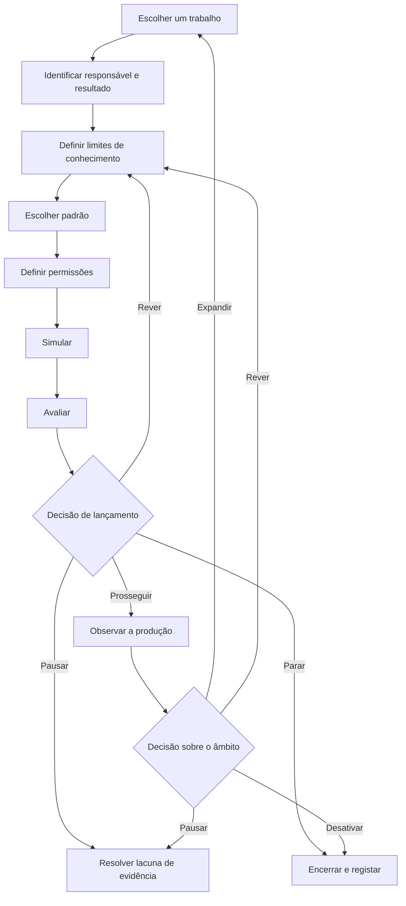

Um roteiro de adoção de agentes de IA deve conduzir um trabalho bem delimitado através de uma série de pontos de decisão baseados em evidência. Em cada ponto, um responsável identificado decide se deve prosseguir, rever, pausar ou parar. A produção não encerra o plano. O roteiro também deve definir monitorização, intervenção, recuperação, desativação e a evidência necessária antes de expandir o âmbito do agente.

Esta estrutura é mais útil do que um calendário fixo de 30, 60 ou 90 dias. Um calendário indica quando uma organização espera avançar. Um ponto de decisão baseado em evidência regista o que a organização precisa de saber antes de avançar.

## Visão geral do roteiro

A sequência tem nove fases:

1. Escolher um trabalho delimitado.
2. Identificar o responsável, os utilizadores, o resultado e a referência de base.
3. Definir os limites de conhecimento e dados.
4. Escolher um padrão de agente apenas se o trabalho precisar de um.
5. Definir os limites das ferramentas, das permissões e das decisões humanas.
6. Simular o trabalho e os seus percursos de falha.
7. Avaliar os resultados segundo critérios declarados.
8. Tomar uma decisão de lançamento com responsabilidade definida.
9. Observar a produção e decidir se deve rever, expandir, pausar ou desativar.

**Texto alternativo do diagrama:** O roteiro começa com um trabalho, um responsável e um resultado, limites de conhecimento, um padrão adequado e permissões. A simulação e a avaliação levam a uma decisão de lançamento. A decisão pode prosseguir para uma produção monitorizada, voltar para revisão, pausar devido à falta de evidência ou parar. Mais tarde, a evidência de produção sustenta uma decisão separada de expandir, rever, pausar ou desativar.

## Comece pelos estados de evidência, não por linguagem de confiança

É comum usar palavras como *pronto*, *seguro* e *funciona* antes de acordar o que significam. Use antes estados de evidência explícitos no registo de planeamento:

| Estado de evidência | Significado | O que não significa |
|---|---|---|
| `UNKNOWN` | A organização ainda não recolheu evidência suficiente para avaliar a alegação. | Falha, procura zero ou permissão para presumir. |
| `ASSERTED` | Uma pessoa, fornecedor, documento ou agente fez a alegação, e a fonte está registada. | Confirmação independente. |
| `OBSERVED` | A organização registou o comportamento num teste ou contexto operacional identificado. | Que o comportamento se generalizará para além desse contexto. |
| `VERIFIED` | O resultado foi verificado segundo um método e uma regra de aceitação declarados. | Que todos os riscos foram resolvidos ou que o sistema é universalmente fiável. |
| `ACCEPTED` | Um responsável pela decisão analisou a evidência disponível e aceitou o risco residual para um âmbito e período definidos. | Aprovação permanente ou prova de que a decisão estava correta. |
| `REJECTED` | A evidência não cumpriu um critério declarado ou o risco residual não foi aceite. | Que a ideia nunca poderá ser revista ou testada noutro âmbito. |

Um estado de evidência pertence a uma alegação específica. «O agente concluiu 47 de 50 casos de teste no conjunto de testes v3» pode estar no estado `OBSERVED`. «O agente está pronto para todas as tarefas financeiras» não pode herdar esse estado.

## O roteiro de adoção em nove fases

### 1. Escolher um trabalho delimitado

Comece com um trabalho que tenha um início, resultado, responsável e destinatário reconhecíveis. Registe o que fica fora do trabalho com o mesmo cuidado dedicado ao que fica dentro.

Antes de escolher um agente, pergunte se o trabalho exige decisões adaptativas, alteração da ordem das ferramentas ou interpretação de entradas incompletas. As orientações atuais da Microsoft para o planeamento empresarial recomendam código convencional ou sistemas não generativos para tarefas estruturadas e previsíveis que não precisam da complexidade de um agente. Também recomendam pausar casos de uso cujos riscos ou salvaguardas não sejam claros ([Microsoft, Business plan for AI agents](https://learn.microsoft.com/en-us/azure/cloud-adoption-framework/ai-agents/business-strategy-plan)).

- **Evidência de entrada:** Estão identificados um trabalho real e o grupo de utilizadores afetado.
- **Evidência de saída:** Estão registados os limites do trabalho, as tarefas excluídas, a alternativa sem IA e o motivo pelo qual um agente pode ser adequado.
- **Condição de paragem:** O trabalho não pode ser separado de vários processos de alto impacto, ou nenhum responsável consegue definir um resultado aceitável.
- **Responsável pela recuperação:** Responsável pelo processo de negócio.
- **Decisão humana:** Aceitar os limites do trabalho ou escolher um trabalho mais restrito ou uma solução sem agente.

### 2. Identificar o responsável, os utilizadores, o resultado e a referência de base

Identifique a pessoa ou função responsável pelo resultado de negócio. Separe essa função das pessoas que criam, operam, analisam o risco e recebem o resultado. Numa organização pequena, uma pessoa pode desempenhar várias funções, mas as responsabilidades devem continuar visíveis.

Registe como o trabalho é feito atualmente. Uma referência de base pode incluir a taxa de conclusão, a carga de revisão, a taxa de correção, o tempo decorrido, o custo ou outra medida ligada ao trabalho. Se não existir uma referência de base fiável, escreva `UNKNOWN`; não transforme a ausência de dados em zero. Tanto a Microsoft como a OpenAI recomendam definir critérios de sucesso e um ponto atual de comparação antes de usar resultados para justificar uma expansão ([Microsoft, Define success metrics](https://learn.microsoft.com/en-us/azure/cloud-adoption-framework/ai-agents/business-strategy-plan#define-success-metrics); [OpenAI, A business leader's guide to working with agents](https://cdn.openai.com/business-guides-and-resources/a-business-leaders-guide-to-working-with-agents.pdf)).

- **Evidência de entrada:** O trabalho delimitado foi aceite.
- **Evidência de saída:** Estão registados o responsável de negócio, os utilizadores, o destinatário do resultado, a referência de base, o resultado pretendido e a data de revisão.
- **Condição de paragem:** O resultado pretendido não pode ser medido nem avaliado, ou os utilizadores afetados não foram identificados.
- **Responsável pela recuperação:** Responsável de negócio em conjunto com o responsável pela medição.
- **Decisão humana:** Aceitar o resultado e o método de medição antes de iniciar o desenvolvimento.

### 3. Definir os limites de conhecimento e dados

Enumere todas as fontes que o agente pode usar, quem é responsável por elas, qual deve ser a sua atualidade e o que acontece quando entram em conflito. Registe dados proibidos, restrições de retenção e o percurso a seguir quando uma resposta estiver ausente ou desatualizada. Não trate uma pasta, um índice de recuperação de informação ou um prompt longo como prova de que o conhecimento está correto.

O NIST AI Risk Management Framework pede às organizações que documentem a finalidade prevista, os utilizadores, o contexto, os limites, a supervisão, os componentes de terceiros e os impactos potenciais. Também indica que a gestão do risco deve ser contínua, em vez de uma lista de verificação usada uma única vez ([NIST, AI RMF Core](https://airc.nist.gov/airmf-resources/airmf/5-sec-core/)).

O NIST AI Risk Management Framework é uma orientação contextual voluntária. Não constitui certificação nem prova de conformidade, e a sua aplicação não prova que um agente seja seguro, fiável, privado, protegido ou adequado.

- **Evidência de entrada:** Os campos de responsável, utilizador e resultado estão completos.
- **Evidência de saída:** Estão registadas as fontes permitidas, as entradas proibidas, as regras de atualidade, as regras de conflito e um responsável pelo conhecimento.
- **Condição de paragem:** Uma fonte essencial tem direitos, responsabilidade, atualidade ou sensibilidade desconhecidos.
- **Responsável pela recuperação:** Responsável pelo conhecimento, em conjunto com o responsável pertinente por privacidade, assuntos jurídicos ou segurança quando a fonte assim o exigir.
- **Decisão humana:** Aceitar os limites dos dados e as limitações não resolvidas para o âmbito deste teste.

### 4. Escolher o padrão

Escolha o padrão menos complexo capaz de concluir o trabalho delimitado. Um fluxo de trabalho determinístico pode ser suficiente. Se o trabalho precisar de um agente, comece com um agente, salvo se responsabilidades, limites de segurança ou transferências distintas exigirem separação.

O guia da OpenAI para a criação de agentes recomenda adequar a orquestração à complexidade real e começar com um único agente antes de passar para estruturas multiagente, quando necessário ([OpenAI, A practical guide to building agents](https://cdn.openai.com/business-guides-and-resources/a-practical-guide-to-building-agents.pdf)).

- **Evidência de entrada:** Os limites de conhecimento e dados estão explícitos.
- **Evidência de saída:** Estão registados o padrão escolhido, as alternativas rejeitadas, a lista de ferramentas, as transferências e os modos de falha esperados.
- **Condição de paragem:** O padrão proposto acrescenta intervenientes ou ferramentas sem um motivo específico do trabalho, ou não foi considerada uma alternativa determinística.
- **Responsável pela recuperação:** Responsável técnico.
- **Decisão humana:** Aceitar o padrão e o seu custo operacional para o teste delimitado.

### 5. Definir permissões e limites de decisão

Enumere cada ação de ferramenta separadamente. Registe se lê ou escreve, que conta usa, a que dados consegue aceder, se a ação é reversível e qual é o impacto máximo de um erro. Uma designação ampla como «acesso ao CRM» oculta a decisão que um revisor precisa de tomar.

O guia da OpenAI propõe avaliar as ferramentas segundo o acesso de leitura ou escrita, a reversibilidade, as permissões e o impacto financeiro. Recomenda verificações ou intervenção mais fortes para ações de alto impacto. As salvaguardas são uma camada e devem ser combinadas com autenticação, autorização, controlos de acesso e medidas comuns de segurança de software. Estas práticas não provam que um sistema é seguro ([OpenAI, Guardrails and human intervention](https://cdn.openai.com/business-guides-and-resources/a-practical-guide-to-building-agents.pdf)).

Use três limites de decisão:

- **Decidido pelo agente:** Ações reversíveis e de baixo impacto dentro do trabalho e do âmbito de permissões aprovados.
- **Decidido por regra:** Limites determinísticos, como validações de esquema, limites de repetição, listas de permissões e tetos de despesa, que interrompem ou encaminham o trabalho sem interpretar o risco de negócio.
- **Decidido por uma pessoa:** Aceitação do lançamento, aceitação do risco residual, acesso a dados sensíveis ou regulados, ações de alto impacto ou irreversíveis, exceções às políticas, encerramento de incidentes e expansão do âmbito ou das permissões.

A organização responsável decide a que grupo pertence cada ação real. Este guia não faz uma classificação jurídica, de segurança ou de conformidade para uma implementação específica.

- **Evidência de entrada:** O padrão e o inventário de ferramentas estão completos.
- **Evidência de saída:** Estão registados os acessos de privilégio mínimo, as classes de ações, os pontos de aprovação, os limites de repetição, os controlos de paragem, os requisitos de registo e o responsável pela revogação.
- **Condição de paragem:** A conta de uma ferramenta, o alcance dos dados, o efeito de escrita, a reversibilidade ou o percurso de revogação são desconhecidos.
- **Responsável pela recuperação:** Responsável técnico e responsável pelas permissões.
- **Decisão humana:** Conceder as permissões delimitadas e aceitar cada ação atribuída ao agente ou às regras determinísticas.

### 6. Simular o trabalho e os percursos de falha

Teste o trabalho de ponta a ponta num contexto controlado. Inclua casos comuns, entradas ambíguas, conhecimento desatualizado ou contraditório, permissões negadas, indisponibilidade de ferramentas, resultados malformados, risco de escrita duplicada e o momento em que uma pessoa deve assumir o controlo. Teste a etapa mais difícil em vez de dedicar todo o piloto a exemplos fáceis.

Registe o grupo de entradas, o ambiente, as versões, o resultado esperado, o resultado real, o revisor e qualquer diferença conhecida em relação à produção. Uma simulação fornece evidência sobre as condições testadas. Não estabelece desempenho para além delas.

- **Evidência de entrada:** Os limites de permissões e decisões estão aprovados para a simulação.
- **Evidência de saída:** Estão registados os casos de teste, os resultados, as falhas, a incerteza, o comportamento de intervenção e os resultados da recuperação.
- **Condição de paragem:** Uma falha crítica não pode ser contida, uma escrita pode ser repetida sem comprovativo, ou a organização não consegue reconstruir o que o agente fez.
- **Responsável pela recuperação:** Responsável pelo teste em conjunto com o responsável pela ferramenta ou pelo incidente.
- **Decisão humana:** Aceitar a evidência da simulação como suficiente para uma avaliação formal ou devolver o sistema para revisão.

### 7. Avaliar segundo critérios declarados

Avalie o resultado segundo critérios definidos antes da execução. Inclua a correção e a completude da tarefa, o cumprimento das políticas, o comportamento das ferramentas, a qualidade da intervenção, a recuperação e a medida de negócio selecionada na fase 2. Mantenha no registo os casos de falha e de incerteza.

O NIST indica que os métodos de avaliação, as métricas, as condições de teste, a incerteza e as limitações devem ser documentados, e que os sistemas devem ser testados antes da implementação e durante a operação. O seu quadro também distingue a medição da decisão posterior de prosseguir ([NIST, AI RMF Core, Measure and Manage](https://airc.nist.gov/airmf-resources/airmf/5-sec-core/)).

- **Evidência de entrada:** Os registos da simulação estão suficientemente completos para reprodução ou inspeção.
- **Evidência de saída:** Cada critério de aceitação tem um resultado, estado de evidência, limitação e revisor.
- **Condição de paragem:** Um critério crítico falha, o método de teste não consegue sustentar a alegação feita, ou uma incerteza relevante fica oculta numa pontuação agregada.
- **Responsável pela recuperação:** Responsável pela avaliação.
- **Decisão humana:** Aceitar ou rejeitar o resultado da avaliação para o âmbito exato de lançamento proposto.

### 8. Tomar a decisão de lançamento

Reúna a evidência para o responsável pela decisão. O registo da decisão deve identificar a versão, o âmbito, os utilizadores, as permissões, as limitações conhecidas, os riscos não resolvidos, o plano de monitorização, o método de reversão ou encerramento, a data de revisão e a evidência usada.

Use uma de quatro decisões:

- `PROCEED`: A evidência cumpre os critérios declarados e o responsável aceita o risco residual para o âmbito e período de revisão identificados.
- `REVISE`: As lacunas corrigíveis têm responsáveis e está planeada outra avaliação delimitada.
- `PAUSE`: Uma dependência, permissão, revisor ou elemento de evidência essencial está indisponível.
- `STOP`: O caso de uso, o padrão do agente ou o risco residual é inaceitável para o contexto pretendido.

A função Manage do NIST exige determinar se o sistema cumpre a finalidade prevista e se o desenvolvimento ou a implementação devem prosseguir. Esta é uma decisão de governação informada por evidência, não uma pontuação que um agente atribui a si próprio ([NIST, Manage 1.1](https://airc.nist.gov/airmf-resources/airmf/5-sec-core/)).

- **Evidência de entrada:** Os resultados da avaliação e o plano operacional estão completos.
- **Evidência de saída:** Um responsável identificado assina uma decisão para uma versão, âmbito e período de revisão fixos.
- **Condição de paragem:** Não existe responsável, método de encerramento, percurso de incidente ou declaração aceite de risco residual.
- **Responsável pela recuperação:** Responsável pelo lançamento.
- **Decisão humana:** A própria decisão de lançamento. Um ponto automatizado pode reunir evidência ou aplicar uma regra anterior, mas não amplia silenciosamente o âmbito aprovado.

### 9. Observar a produção e decidir o que acontece depois

Monitorize os resultados das tarefas, as ações falhadas e anuladas, o volume de intervenções, os erros de permissão, a atualidade das fontes, as opiniões dos utilizadores, os incidentes, o tempo de recuperação, o custo e a medida de negócio. Defina quem lê cada sinal e que limiar desencadeia uma ação.

A Microsoft recomenda a expansão faseada com base no valor observado, em vez da disponibilidade técnica, além da gestão contínua do ciclo de vida. O NIST inclui monitorização, recurso e intervenção, desativação, resposta a incidentes, recuperação e gestão da mudança no planeamento posterior à implementação ([Microsoft, Manage AI agents across your organization](https://learn.microsoft.com/en-us/azure/cloud-adoption-framework/ai-agents/integrate-manage-operate); [NIST, Manage 4.1](https://airc.nist.gov/airmf-resources/airmf/5-sec-core/)).

- **Evidência de entrada:** Existe uma decisão de lançamento delimitada.
- **Evidência de saída:** O período de revisão contém evidência observada suficiente para uma nova decisão, mantendo visíveis as incógnitas.
- **Condição de paragem:** Desvio crítico, acesso inesperado, escritas não contidas, ausência de evidência de auditoria, incumprimento de um limiar ou perda do percurso de encerramento e recuperação.
- **Responsável pela recuperação:** Responsável pela operação em conjunto com o responsável pelo incidente.
- **Decisão humana:** Continuar sem alterações, rever, restringir, pausar, expandir ou desativar. A expansão cria um novo trabalho delimitado e regressa à fase 1.

## Registo reutilizável de planeamento de agentes de IA

Copie este registo para um trabalho. Não preencha a evidência ausente com uma suposição otimista.

### Identidade e âmbito

| Campo | Entrada |
|---|---|
| ID e versão do registo de planeamento | |
| Nome do trabalho | |
| Utilizadores previstos e destinatário do resultado | |
| Tarefas incluídas | |
| Tarefas excluídas | |
| Alternativa sem IA considerada | |
| Responsável de negócio | |
| Responsável técnico | |
| Responsável pelo conhecimento e pelos dados | |
| Responsável pelas permissões | |
| Responsável pela avaliação | |
| Responsável pela operação e recuperação | |

### Resultado e evidência

| Campo | Entrada | Estado de evidência | Fonte ou método | Data de revisão |
|---|---|---|---|---|
| Referência de base atual | | | | |
| Resultado pretendido | | | | |
| Interesse dos utilizadores | | | | |
| Viabilidade técnica | | | | |
| Riscos e impactos conhecidos | | | | |
| Riscos não medidos ou não resolvidos | | `UNKNOWN` | | |

### Conhecimento, padrão e permissões

| Campo | Entrada |
|---|---|
| Fontes de conhecimento permitidas e regras de atualidade | |
| Dados e usos proibidos | |
| Comportamento perante conflitos ou conhecimento ausente | |
| Padrão selecionado e alternativas rejeitadas | |
| Ferramentas e identidades das contas | |
| Ações de leitura permitidas ao agente | |
| Ações de escrita permitidas ao agente | |
| Limites determinísticos e condições de disparo | |
| Ações que exigem aprovação humana | |
| Limites de repetição, despesa e ações | |
| Método de revogação e encerramento | |

### Pontos de decisão das fases

| Fase | Evidência de entrada | Evidência de saída | Condição de paragem | Responsável pela recuperação | Próxima decisão |
|---|---|---|---|---|---|
| Escolher o trabalho | | | | | |
| Identificar responsável e resultado | | | | | |
| Definir conhecimento | | | | | |
| Escolher padrão | | | | | |
| Definir permissões | | | | | |
| Simular | | | | | |
| Avaliar | | | | | |
| Aprovar lançamento | | | | | |
| Observar e rever | | | | | |

### Avaliação e decisão de lançamento

| Campo | Entrada |
|---|---|
| Grupo de teste, ambiente e versões | |
| Critérios e limiares declarados | |
| Resultados reais, falhas e incerteza | |
| Resultado da intervenção e recuperação | |
| Decisão | `PROCEED`, `REVISE`, `PAUSE` ou `STOP` |
| Responsável pela decisão e data | |
| Âmbito e risco residual aceites | |
| Percurso de monitorização e incidentes | |
| Período de revisão | |
| Condições de expansão, revisão, pausa e desativação | |

## Antes de expandir

A expansão é uma nova decisão, não a recompensa predefinida por chegar à produção. Exija evidência de mais do que um ciclo operacional quando o trabalho o permitir. Verifique se o resultado continua a ser útil, se as intervenções e correções são compreendidas e se os limites originais de permissões e dados continuam adequados.

Não expanda quando a evidência principal for um relato isolado, uma alegação de fornecedor, uma única execução bem-sucedida ou uma pontuação agregada que oculte falhas críticas. Não expanda porque a implementação consegue aceder a mais ferramentas. Expanda apenas quando um responsável aceitar a evidência e o novo âmbito receber os seus próprios limites, testes, condições de paragem e plano de recuperação.

## Próximo passo

Use o registo de planeamento para definir um trabalho e, depois, compare-o com os padrões de agente e de fluxo de trabalho disponíveis. Se as permissões, o responsável pelo risco residual ou a decisão de lançamento continuarem pouco claros, consulte o [modelo de governação de agentes de IA, em inglês](/en/governance) antes de criar o percurso de produção.

## Método, autoria e limitações

**Quem:** Toone Content é o autor organizacional. Hexagonal.io é o editor. A responsabilidade editorial e as práticas de seleção de fontes estão descritas na [política editorial, em inglês](/en/editorial-policy). Para perguntas e pedidos de correção, pode [contactar a Toone, em inglês](/en/contact). Esta ligação direta é um candidato de fallback em inglês: não se alega que esteja operacional enquanto a equipa Technical não implementar uma página pública acessível em `/en/contact` e verificar uma resposta pública `200`.

**Como:** Este guia sintetiza orientações primárias atuais da Microsoft, do NIST e da OpenAI numa sequência de planeamento e num registo reutilizável. A assistência automatizada ajudou a recolher, mapear e estruturar as fontes. As alegações das fontes foram verificadas nos materiais indicados, e a síntese da Toone está identificada como tal. Não se alega qualquer implementação de cliente ou adoção prática da Toone. Limite da revisão: Content Editor é a função responsável pela revisão editorial; esta fonte de autoria organizacional não alega revisão por uma pessoa identificada nem revisão especializada na matéria, de produto, jurídica, de privacidade, de segurança ou de implementação.

**Porquê:** O guia ajuda operadores e responsáveis de equipas funcionais a tomar decisões de adoção delimitadas, com evidência, responsabilidade e percursos de paragem e recuperação visíveis. Não constitui aconselhamento jurídico, de segurança, privacidade ou conformidade. Não estabelece que um agente seja seguro, fiável ou adequado para uma implementação específica. Esses juízos exigem as pessoas responsáveis e a evidência do contexto em causa.

## Fontes

- Microsoft Learn, [Business plan for AI agents](https://learn.microsoft.com/en-us/azure/cloud-adoption-framework/ai-agents/business-strategy-plan), consultado em 13 de agosto de 2026.
- Microsoft Learn, [Organizational readiness for AI agents](https://learn.microsoft.com/en-us/azure/cloud-adoption-framework/ai-agents/organization-people-readiness-plan), atualizado em 4 de dezembro de 2025.
- Microsoft Learn, [Manage AI agents across your organization](https://learn.microsoft.com/en-us/azure/cloud-adoption-framework/ai-agents/integrate-manage-operate), atualizado em 4 de dezembro de 2025.
- NIST AI Resource Center, [AI Risk Management Framework Core](https://airc.nist.gov/airmf-resources/airmf/5-sec-core/), excerto do AI RMF 1.0; a página indica que está em curso uma revisão.
- NIST, [Artificial Intelligence Risk Management Framework: Generative Artificial Intelligence Profile](https://www.nist.gov/publications/artificial-intelligence-risk-management-framework-generative-artificial-intelligence), publicado em 26 de julho de 2024; página atualizada em 8 de abril de 2026.
- OpenAI, [A business leader's guide to working with agents](https://cdn.openai.com/business-guides-and-resources/a-business-leaders-guide-to-working-with-agents.pdf), PDF consultado em 13 de agosto de 2026.
- OpenAI, [A practical guide to building agents](https://cdn.openai.com/business-guides-and-resources/a-practical-guide-to-building-agents.pdf), PDF consultado em 13 de agosto de 2026.

## Notas de implementação sob responsabilidade de Content

- Apresentar o registo de planeamento como tabelas HTML acessíveis, não como imagem.
- Apresentar o diagrama do roteiro num formato rastreável e manter o seu texto alternativo descritivo.
- Usar a autoria visível `Toone Content` e uma identidade de autor correspondente no tipo `Article`.
- Usar apenas dados estruturados `Article` e `BreadcrumbList` corretos.
- Não adicionar marcação FAQ, salvo se existir uma FAQ visível e elegível e uma decisão técnica atual.
- Os candidatos a ligações internas, além das rotas em inglês de governação e política editorial, continuam condicionados à elegibilidade dos destinos na montagem.
- `/en/contact` continua a ser uma dependência de Technical: a montagem não deve tratá-la como rota ativa nem substituir o fallback por uma rota da localidade sem verificação pública.
- O indicador de medição aprovado é o uso, sem dados pessoais identificáveis, do registo de planeamento, seguido do avanço para seleção ou governação após G3. Ainda não existe uma referência de base para a página, e a procura desconhecida não deve ser registada como zero.
