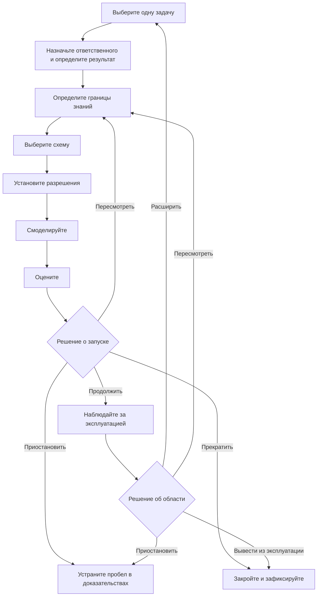

Дорожная карта внедрения AI-агента должна провести одну задачу с четкими границами через ряд контрольных точек на основе доказательств. В каждой точке назначенный ответственный решает, продолжить работу, пересмотреть ее, приостановить или прекратить. Выход в эксплуатацию не завершает план. Дорожная карта также должна определить мониторинг, переопределение действий и решений человеком, восстановление, вывод из эксплуатации и доказательства, необходимые до расширения области работы агента.

Такая структура полезнее фиксированного календаря на 30, 60 или 90 дней. Календарь показывает, когда команда надеется перейти дальше. Контрольная точка фиксирует, что команда должна знать до такого перехода.

## Краткий обзор дорожной карты

Последовательность состоит из девяти этапов:

1. Выберите одну ограниченную задачу.
2. Назначьте ответственного, определите пользователей, результат и исходный уровень.
3. Определите границы знаний и данных.
4. Выберите схему работы агента, только если она нужна для задачи.
5. Установите границы для инструментов, разрешений и решений человека.
6. Смоделируйте работу и сценарии сбоев.
7. Оцените результаты по заранее объявленным критериям.
8. Примите подотчетное решение о запуске.
9. Наблюдайте за эксплуатацией и решайте, нужно ли пересмотреть, расширить, приостановить или вывести решение из эксплуатации.

**Альтернативный текст диаграммы:** Дорожная карта начинается с одной задачи, ответственного и результата, границ знаний, подходящей схемы и разрешений. Моделирование и оценка приводят к решению о запуске. Решение может перевести систему в контролируемую эксплуатацию, вернуть ее на пересмотр, приостановить работу из-за недостающих доказательств или прекратить ее. Позже доказательства из эксплуатации служат основой для отдельного решения о расширении, пересмотре, приостановке или выводе из эксплуатации.

## Начните с состояний доказательств, а не с формулировок об уверенности

Команды часто используют слова *готово*, *безопасно* и *работает*, не договорившись об их значении. Вместо этого используйте в плане явные состояния доказательств:

| Состояние доказательства | Значение | Чего оно не означает |
|---|---|---|
| `UNKNOWN` | Команда собрала недостаточно доказательств, чтобы оценить утверждение. | Неудачу, нулевой спрос или разрешение строить предположения. |
| `ASSERTED` | Человек, поставщик, документ или агент выдвинул утверждение, а источник зафиксирован. | Независимое подтверждение. |
| `OBSERVED` | Команда зафиксировала поведение в конкретном тесте или рабочем контексте. | Что поведение сохранится за пределами этого контекста. |
| `VERIFIED` | Результат проверен по заранее объявленному методу и правилу приемки. | Что все риски устранены или система надежна во всех случаях. |
| `ACCEPTED` | Ответственный за решение изучил доступные доказательства и принял остаточный риск для указанной области и периода. | Постоянное одобрение или доказательство правильности решения. |
| `REJECTED` | Доказательства не соответствуют объявленному критерию или остаточный риск не принят. | Что идею нельзя пересмотреть или проверить в другой области. |

Состояние доказательства относится к конкретному утверждению. Утверждение «агент выполнил 47 из 50 тестовых случаев в наборе v3» может иметь состояние `OBSERVED`. Утверждение «агент готов ко всем финансовым задачам» не может унаследовать это состояние.

## Девять этапов внедрения

### 1. Выберите одну ограниченную задачу

Начните с задачи, у которой есть понятное начало, результат, ответственный и получатель. Так же тщательно зафиксируйте, что находится за пределами задачи, как и то, что входит в нее.

До выбора агента выясните, требует ли работа адаптивных решений, изменения порядка инструментов или интерпретации неполных входных данных. Актуальное руководство Microsoft по бизнес-планированию рекомендует использовать обычный код или негенеративные системы для структурированных и предсказуемых задач, которым не нужна агентная сложность. Оно также рекомендует приостанавливать сценарии использования, если их риски или меры защиты неясны ([Microsoft, Business plan for AI agents](https://learn.microsoft.com/en-us/azure/cloud-adoption-framework/ai-agents/business-strategy-plan)).

- **Входные доказательства:** Названы реальная задача и затрагиваемая группа пользователей.
- **Выходные доказательства:** Зафиксированы границы задачи, исключенные действия, альтернатива без AI и причина, по которой агент может подойти.
- **Условие остановки:** Задачу нельзя отделить от нескольких процессов с серьезными последствиями, либо никто не может определить приемлемый результат.
- **Ответственный за восстановление:** Ответственный за бизнес-процесс.
- **Решение человека:** Принять границы задачи либо выбрать более узкую задачу или решение без агента.

### 2. Назначьте ответственного, определите пользователей, результат и исходный уровень

Назовите человека или роль, отвечающую за бизнес-результат. Отделите эту роль от людей, которые создают и эксплуатируют решение, проверяют риски и получают результат. В небольшой команде один человек может выполнять несколько ролей, но обязанности все равно должны быть видимыми.

Зафиксируйте, как задача выполняется сейчас. Исходный уровень может включать долю завершенных задач, нагрузку на проверяющих, частоту исправлений, затраченное время, стоимость или другой показатель, связанный с задачей. Если надежного исходного уровня нет, укажите `UNKNOWN`; не превращайте отсутствие данных в ноль. Microsoft и OpenAI рекомендуют определить критерии успеха и текущую точку сравнения до того, как результаты будут использоваться для обоснования расширения ([Microsoft, Define success metrics](https://learn.microsoft.com/en-us/azure/cloud-adoption-framework/ai-agents/business-strategy-plan#define-success-metrics); [OpenAI, A business leader's guide to working with agents](https://cdn.openai.com/business-guides-and-resources/a-business-leaders-guide-to-working-with-agents.pdf)).

- **Входные доказательства:** Ограниченная задача принята.
- **Выходные доказательства:** Зафиксированы ответственный за бизнес-результат, пользователи, получатель результата, исходный уровень, желаемый результат и дата проверки.
- **Условие остановки:** Желаемый результат нельзя измерить или оценить либо не определены затрагиваемые пользователи.
- **Ответственный за восстановление:** Ответственный за бизнес-результат совместно с ответственным за измерение.
- **Решение человека:** Принять результат и метод измерения до начала разработки.

### 3. Определите границы знаний и данных

Перечислите каждый источник, который может использовать агент, его владельца, требования к актуальности и порядок действий при противоречии источников. Зафиксируйте запрещенные данные, ограничения на хранение и порядок действий при отсутствии или устаревании ответа. Папка, поисковый индекс или длинная инструкция сами по себе не доказывают правильность знаний.

NIST AI Risk Management Framework предлагает командам документировать назначение, пользователей, контекст, ограничения, надзор, сторонние компоненты и возможные последствия. В нем также указано, что управление рисками должно быть непрерывным, а не одноразовой проверкой по списку ([NIST, AI RMF Core](https://airc.nist.gov/airmf-resources/airmf/5-sec-core/)).

- **Входные доказательства:** Поля ответственного, пользователей и результата заполнены.
- **Выходные доказательства:** Зафиксированы разрешенные источники, запрещенные входные данные, правила актуальности и разрешения противоречий, а также ответственный за знания.
- **Условие остановки:** Для критически важного источника неизвестны права, владелец, актуальность или чувствительность данных.
- **Ответственный за восстановление:** Ответственный за знания совместно с соответствующим ответственным за конфиденциальность, юридические вопросы или безопасность, если этого требует источник.
- **Решение человека:** Принять границы данных и неустраненные ограничения для этой области тестирования.

### 4. Выберите схему

Выберите наименее сложную схему, способную выполнить ограниченную задачу. Может быть достаточно детерминированного рабочего процесса. Если для работы нужен агент, начните с одного агента, кроме случаев, когда разделение необходимо из-за разных обязанностей, границ безопасности или передачи работы.

Руководство OpenAI по созданию агентов рекомендует подбирать оркестрацию под реальную сложность и начинать с одного агента, переходя при необходимости к многоагентным схемам ([OpenAI, A practical guide to building agents](https://cdn.openai.com/business-guides-and-resources/a-practical-guide-to-building-agents.pdf)).

- **Входные доказательства:** Границы знаний и данных определены явно.
- **Выходные доказательства:** Зафиксированы выбранная схема, отклоненные альтернативы, список инструментов, передачи работы и ожидаемые виды сбоев.
- **Условие остановки:** Предлагаемая схема добавляет участников или инструменты без причины, связанной с задачей, либо детерминированная альтернатива не рассмотрена.
- **Ответственный за восстановление:** Технический ответственный.
- **Решение человека:** Принять схему и ее эксплуатационные затраты для ограниченного теста.

### 5. Установите границы разрешений и решений

Перечислите каждое действие инструмента отдельно. Укажите, читает оно данные или записывает их, какую учетную запись использует, к каким данным имеет доступ, обратимо ли оно и каковы максимальные последствия ошибки. Широкое обозначение вроде «доступ к CRM» скрывает решение, которое должен принять проверяющий.

Руководство OpenAI предлагает оценивать инструменты по доступу на чтение или запись, обратимости, разрешениям и финансовым последствиям. Для действий с серьезными последствиями оно рекомендует более строгие проверки или вмешательство человека. Защитные ограничения составляют лишь один уровень и должны дополняться аутентификацией, авторизацией, контролем доступа и обычными мерами безопасности программного обеспечения. Эти меры не доказывают безопасность системы ([OpenAI, Guardrails and human intervention](https://cdn.openai.com/business-guides-and-resources/a-practical-guide-to-building-agents.pdf)).

Используйте три границы решений:

- **Решает агент:** Действия с небольшими последствиями, которые обратимы и находятся в пределах утвержденной задачи и разрешений.
- **Решает правило:** Детерминированные ограничения, такие как проверка схемы, пределы повторных попыток, списки разрешений и лимиты расходов, которые останавливают или перенаправляют работу, не интерпретируя бизнес-риск.
- **Решает человек:** Принятие запуска и остаточного риска, доступ к чувствительным или регулируемым данным, действия с серьезными последствиями или необратимые действия, исключения из политик, закрытие инцидента и расширение области или разрешений.

Ответственная организация сама классифицирует реальные действия по этим группам. Это руководство не дает юридической классификации, классификации по безопасности или соответствию требованиям для конкретного внедрения.

- **Входные доказательства:** Схема и перечень инструментов готовы.
- **Выходные доказательства:** Зафиксированы минимально необходимые права, классы действий, точки одобрения, пределы повторных попыток, механизмы остановки, требования к журналированию и ответственный за отзыв доступа.
- **Условие остановки:** Неизвестны учетная запись инструмента, доступные ему данные, эффект записи, обратимость или способ отзыва доступа.
- **Ответственный за восстановление:** Технический ответственный и ответственный за разрешения.
- **Решение человека:** Предоставить ограниченные разрешения и принять каждое действие, отнесенное к решениям агента или детерминированным правилам.

### 6. Смоделируйте работу и сценарии сбоев

Проверьте задачу от начала до конца в контролируемой среде. Включите обычные случаи, неоднозначные входные данные, устаревшие или противоречивые знания, отказ в разрешениях, недоступность инструментов, неверно сформированные результаты, риск повторной записи и момент, когда человек должен взять работу на себя. Проверяйте самый трудный шаг, а не тратьте весь пилотный проект на простые примеры.

Зафиксируйте набор входных данных, среду, версии, ожидаемый и фактический результат, проверяющего и все известные отличия от рабочей среды. Моделирование дает доказательства только для проверенных условий. Оно не подтверждает характеристики за их пределами.

- **Входные доказательства:** Границы разрешений и решений одобрены для моделирования.
- **Выходные доказательства:** Зафиксированы тестовые случаи, результаты, сбои, неопределенность, поведение при вмешательстве и результаты восстановления.
- **Условие остановки:** Критический сбой невозможно локализовать, запись может повториться без подтверждения либо команда не может восстановить последовательность действий агента.
- **Ответственный за восстановление:** Ответственный за тестирование совместно с ответственным за инструмент или инцидент.
- **Решение человека:** Принять доказательства моделирования как достаточные для формальной оценки либо вернуть систему на пересмотр.

### 7. Оцените по объявленным критериям

Оцените результат по критериям, записанным до запуска теста. Включите правильность и полноту задачи, соблюдение политик, поведение инструментов, качество вмешательства, восстановление и бизнес-показатель, выбранный на этапе 2. Сохраните в записи неудачные и неопределенные случаи.

NIST указывает, что методы оценки, показатели, условия тестирования, неопределенность и ограничения должны быть задокументированы, а системы следует тестировать до внедрения и во время эксплуатации. Фреймворк также отделяет измерение от последующего решения о продолжении ([NIST, AI RMF Core, Measure and Manage](https://airc.nist.gov/airmf-resources/airmf/5-sec-core/)).

- **Входные доказательства:** Записи моделирования достаточно полны, чтобы воспроизвести или проверить тест.
- **Выходные доказательства:** Для каждого критерия приемки указаны результат, состояние доказательства, ограничение и проверяющий.
- **Условие остановки:** Критический критерий не выполнен, метод тестирования не подтверждает заявленное утверждение либо существенная неопределенность скрыта в совокупной оценке.
- **Ответственный за восстановление:** Ответственный за оценку.
- **Решение человека:** Принять или отклонить результат оценки для точной предлагаемой области запуска.

### 8. Примите решение о запуске

Подготовьте доказательства для ответственного за решение. В записи о решении должны быть указаны версия, область, пользователи, разрешения, известные ограничения, неустраненные риски, план мониторинга, способ отката или остановки, дата проверки и использованные доказательства.

Используйте одно из четырех решений:

- `PROCEED`: Доказательства соответствуют объявленным критериям, а ответственный принимает остаточный риск для указанной области и периода проверки.
- `REVISE`: Устранимые пробелы имеют ответственных, запланирована еще одна ограниченная оценка.
- `PAUSE`: Недоступны критически важная зависимость, разрешение, проверяющий или элемент доказательств.
- `STOP`: Сценарий использования, схема агента или остаточный риск неприемлемы для предполагаемого контекста.

Функция Manage в NIST предусматривает определение того, достигает ли система своей цели и следует ли продолжать разработку или внедрение. Это управленческое решение, основанное на доказательствах, а не оценка, которую агент присваивает себе ([NIST, Manage 1.1](https://airc.nist.gov/airmf-resources/airmf/5-sec-core/)).

- **Входные доказательства:** Результаты оценки и план эксплуатации готовы.
- **Выходные доказательства:** Названный ответственный подписывает одно решение для фиксированной версии, фиксированной области и фиксированного периода проверки.
- **Условие остановки:** Нет ответственного за решение, способа остановки, маршрута обработки инцидентов или принятого заявления об остаточном риске.
- **Ответственный за восстановление:** Ответственный за запуск.
- **Решение человека:** Само решение о запуске. Автоматизированная контрольная точка может собрать доказательства или применить ранее установленное правило, но не может незаметно расширить утвержденную область.

### 9. Наблюдайте за эксплуатацией и решайте, что делать дальше

Отслеживайте результаты задач, неудачные действия и действия, переопределенные человеком, объем вмешательств, ошибки разрешений, актуальность источников, отзывы пользователей, инциденты, время восстановления, затраты и бизнес-показатель. Определите, кто читает каждый сигнал и какой порог требует действий.

Microsoft рекомендует поэтапное расширение на основе наблюдаемой ценности, а не технической доступности, а также непрерывное управление жизненным циклом. NIST включает мониторинг, обжалование и переопределение решений, вывод из эксплуатации, реагирование на инциденты, восстановление и управление изменениями в планирование после внедрения ([Microsoft, Manage AI agents across your organization](https://learn.microsoft.com/en-us/azure/cloud-adoption-framework/ai-agents/integrate-manage-operate); [NIST, Manage 4.1](https://airc.nist.gov/airmf-resources/airmf/5-sec-core/)).

- **Входные доказательства:** Существует решение о запуске для определенной области.
- **Выходные доказательства:** За период проверки собрано достаточно наблюдаемых доказательств для нового решения, а неизвестные данные оставлены видимыми.
- **Условие остановки:** Критическое отклонение, неожиданный доступ, нелокализованные записи, отсутствие аудиторских доказательств, нарушение порога либо утрата способа остановки и восстановления.
- **Ответственный за восстановление:** Ответственный за эксплуатацию совместно с ответственным за инцидент.
- **Решение человека:** Продолжить без изменений, пересмотреть, сузить, приостановить, расширить или вывести из эксплуатации. Расширение создает новую ограниченную задачу и возвращает процесс к этапу 1.

## Многоразовая форма планирования AI-агента

Скопируйте эту форму для одной задачи. Не заменяйте отсутствующие доказательства оптимистичными предположениями.

### Идентификация и область

| Поле | Запись |
|---|---|
| Идентификатор и версия формы планирования | |
| Название задачи | |
| Предполагаемые пользователи и получатель результата | |
| Включенные действия | |
| Исключенные действия | |
| Рассмотренная альтернатива без AI | |
| Ответственный за бизнес-результат | |
| Технический ответственный | |
| Ответственный за знания и данные | |
| Ответственный за разрешения | |
| Ответственный за оценку | |
| Ответственный за эксплуатацию и восстановление | |

### Результат и доказательства

| Поле | Запись | Состояние доказательства | Источник или метод | Дата проверки |
|---|---|---|---|---|
| Текущий исходный уровень | | | | |
| Желаемый результат | | | | |
| Ценность для пользователей | | | | |
| Техническая осуществимость | | | | |
| Известные риски и последствия | | | | |
| Неизмеренные или неустраненные риски | | `UNKNOWN` | | |

### Знания, схема и разрешения

| Поле | Запись |
|---|---|
| Разрешенные источники знаний и правила актуальности | |
| Запрещенные данные и способы использования | |
| Поведение при противоречии или отсутствии знаний | |
| Выбранная схема и отклоненные альтернативы | |
| Инструменты и идентификаторы учетных записей | |
| Действия чтения, разрешенные агенту | |
| Действия записи, разрешенные агенту | |
| Детерминированные ограничения и аварийные пороги | |
| Действия, требующие одобрения человека | |
| Пределы повторных попыток, расходов и действий | |
| Способ отзыва доступа и остановки | |

### Контрольные точки этапов

| Этап | Входные доказательства | Выходные доказательства | Условие остановки | Ответственный за восстановление | Следующее решение |
|---|---|---|---|---|---|
| Выбрать задачу | | | | | |
| Назначить ответственного и определить результат | | | | | |
| Определить знания | | | | | |
| Выбрать схему | | | | | |
| Установить разрешения | | | | | |
| Смоделировать | | | | | |
| Оценить | | | | | |
| Одобрить запуск | | | | | |
| Наблюдать и проверять | | | | | |

### Оценка и решение о запуске

| Поле | Запись |
|---|---|
| Тестовая выборка, среда и версии | |
| Объявленные критерии и пороговые значения | |
| Фактические результаты, сбои и неопределенность | |
| Результат вмешательства и восстановления | |
| Решение | `PROCEED`, `REVISE`, `PAUSE` или `STOP` |
| Ответственный за решение и дата | |
| Принятая область и остаточный риск | |
| Мониторинг и маршрут обработки инцидентов | |
| Период проверки | |
| Условия расширения, пересмотра, приостановки и вывода из эксплуатации | |

## Перед расширением

Расширение требует нового решения и не происходит автоматически после выхода в эксплуатацию. Если задача позволяет, требуйте доказательства более чем за один рабочий цикл. Проверьте, остается ли результат полезным, понятны ли вмешательства и исправления и по-прежнему ли подходят исходные границы разрешений и данных.

Не расширяйте область, если основным доказательством служат единичный пример, заявление поставщика, один успешный запуск или совокупная оценка, скрывающая критические сбои. Не расширяйте ее лишь потому, что реализация технически может обращаться к большему числу инструментов. Расширяйте только после того, как ответственный примет доказательства, а новая область получит собственные границы, тесты, условия остановки и план восстановления.

## Следующий шаг

Используйте форму планирования, чтобы определить одну задачу, затем сопоставьте ее с доступными схемами агентов и рабочих процессов. Если разрешения, ответственный за остаточный риск или решение о запуске все еще неясны, до создания пути к эксплуатации перейдите к [модели управления AI-агентами, на английском языке](/en/governance).

## Метод, авторство и ограничения

**Кто:** Организационный автор — Toone Content. Издатель — Hexagonal.io. Редакционная ответственность и порядок работы с источниками описаны в [редакционной политике, на английском языке](/en/editorial-policy). С вопросами и запросами на исправления можно [напрямую связаться с Toone, на английском языке](/en/contact). Эта прямая ссылка является запасным маршрутом на английском языке. Не заявляется, что она работает: сначала Technical должен реализовать доступную общедоступную страницу `/en/contact` и подтвердить публичный ответ со статусом `200`.

**Как:** Это руководство объединяет актуальные первичные материалы Microsoft, NIST и OpenAI в последовательность планирования и многоразовую форму. Автоматизированная помощь использовалась для сбора, сопоставления и структурирования источников. Утверждения из источников сверены со связанными материалами, а редакционный синтез Toone обозначен как таковой. NIST AI RMF используется как добровольное контекстное руководство, а не как сертификация или доказательство соответствия требованиям, безопасности, надежности, конфиденциальности или пригодности агента. Не заявляется о клиентском внедрении или практическом развертывании Toone. Граница проверки: Content Editor — ответственная роль редакционной проверки; этот материал с организационным авторством не заявляет о проверке названным человеком, специалистом по предметной области, продукту, праву, конфиденциальности, безопасности или внедрению.

**Зачем:** Руководство помогает операторам и руководителям функциональных команд принимать ограниченные решения о внедрении с видимыми доказательствами, ответственными, условиями остановки и путями восстановления. Это не юридическая консультация и не рекомендация по безопасности, конфиденциальности или соответствию требованиям. Руководство не доказывает, что агент безопасен, надежен или подходит для конкретного внедрения. Такие выводы должны делать ответственные люди на основе доказательств для данного контекста.

## Источники

- Microsoft Learn, [Business plan for AI agents](https://learn.microsoft.com/en-us/azure/cloud-adoption-framework/ai-agents/business-strategy-plan), дата обращения: 13 августа 2026 года.
- Microsoft Learn, [Organizational readiness for AI agents](https://learn.microsoft.com/en-us/azure/cloud-adoption-framework/ai-agents/organization-people-readiness-plan), обновлено 4 декабря 2025 года.
- Microsoft Learn, [Manage AI agents across your organization](https://learn.microsoft.com/en-us/azure/cloud-adoption-framework/ai-agents/integrate-manage-operate), обновлено 4 декабря 2025 года.
- NIST AI Resource Center, [AI Risk Management Framework Core](https://airc.nist.gov/airmf-resources/airmf/5-sec-core/), фрагмент AI RMF 1.0; на странице указано, что готовится новая редакция.
- NIST, [Artificial Intelligence Risk Management Framework: Generative Artificial Intelligence Profile](https://www.nist.gov/publications/artificial-intelligence-risk-management-framework-generative-artificial-intelligence), опубликовано 26 июля 2024 года; страница обновлена 8 апреля 2026 года.
- OpenAI, [A business leader's guide to working with agents](https://cdn.openai.com/business-guides-and-resources/a-business-leaders-guide-to-working-with-agents.pdf), PDF, дата обращения: 13 августа 2026 года.
- OpenAI, [A practical guide to building agents](https://cdn.openai.com/business-guides-and-resources/a-practical-guide-to-building-agents.pdf), PDF, дата обращения: 13 августа 2026 года.

## Примечания Content по реализации

- Отображайте форму планирования как доступные HTML-таблицы, а не как изображение.
- Отображайте диаграмму дорожной карты в доступном для сканирования поисковыми системами виде и сохраняйте описательный альтернативный текст.
- Показывайте авторство `Toone Content` и соответствующую идентичность автора в `Article`.
- Используйте только точные структурированные данные `Article` и `BreadcrumbList`.
- Не добавляйте разметку FAQ, если нет видимого подходящего раздела FAQ и актуального технического решения.
- Кандидаты на внутренние ссылки, кроме действующих английских маршрутов управления и редакционной политики, остаются условными до проверки пригодности целевых маршрутов при сборке.
- `/en/contact` остается зависимостью от Technical. При сборке нельзя считать этот маршрут действующим или заменять английскую запасную ссылку русским маршрутом без публичной проверки.
- Одобренная концепция измерения — использование формы планирования без персональных данных с последующим переходом к выбору или управлению после G3. Исходного уровня страницы пока нет, и неизвестный спрос нельзя записывать как нулевой.
